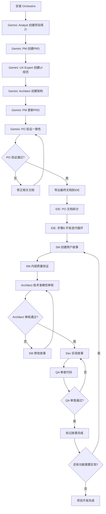

# Orchestrix 标准工作流程指南

本指南详细介绍 Orchestrix 的核心工作流程，确保项目从构思到交付的每个环节都严谨、高效。

## 🎯 流程概述

Orchestrix 采用八步渐进式工作流程，通过专业化代理协作完成复杂项目：

1. **Analyst** → 创建项目简介 (`project-brief.md`)
2. **PM** → 创建产品需求文档 (`prd.md`)
3. **UX-Expert** → 创建UI/UX规范 (`front-end-spec.md`)
4. **Architect** → 创建架构文档 (`architecture.md`)
5. **PM** → 根据架构建议更新PRD
6. **PO** → 验证所有工件一致性和完整性
7. **PO** → 拆分文档进行IDE开发
8. **开发迭代循环** → SM创建故事 → Architect审核 → Dev开发 → QA检查 → 循环直到项目完成

## 📋 详细工作流程

### 准备阶段：环境配置

1. **在项目中安装 Orchestrix**：

   ```bash
   npx orchestrix install
   ```

   - 选择 "完整安装"
   - 选择您的 IDE (Cursor、Claude Code、Windsurf、Trae、Roo Code 或 GitHub Copilot)

2. **验证安装**：
   - `.orchestrix-core/` 文件夹及所有智能体已创建
   - IDE 专用集成文件已创建
   - 所有智能体命令/规则/模式可用

### 第一阶段：需求分析与规划 (Web界面 - 推荐Gemini)

使用 Google Gemini 进行团队协作规划：

#### Web界面协作流程（以 Google Gemini 为例）

**1. 打开 Google Gems 平台**  
访问 [Google Gems](https://gemini.google.com/gems/view)。

**2. 新建团队 Gem**

- 点击“创建新 Gem”
- 填写标题与描述（如：“Orchestrix 全栈团队协作”）

**3. 配置 Orchestrix 团队**

- 在项目目录下找到 `dist/teams/team-fullstack.txt`
- 复制该文件全部内容
- 粘贴到 Gem 的团队设置区域，完成团队智能体加载

**4. 分工协作，开展需求分析与规划**

- **业务分析师**：负责需求收集与市场调研
- **产品经理**：梳理功能清单，确定优先级
- **架构师**：制定技术方案与系统架构
- **UX 专家**：设计用户体验与界面规范

> 建议：在 Gem 对话中，分别以 `/analyst`、`/pm`、`/architect`、`/ux-expert` 等命令切换角色，逐步推进项目规划，具体步骤如下所示。

#### 步骤 1: 分析师 (Analyst) - 创建项目简介

**目标**：建立项目基础和背景理解

**Gemini 会话示例**：

```text
/analyst 我想开发一个 [项目类型] 应用，核心目的是 [具体目标]。
请帮我创建详细的项目简介，包括市场调研和竞品分析。
```

**输出文件**：`project-brief.md`
**包含内容**：

- 项目背景和目标
- 目标用户画像
- 市场调研结果
- 竞品分析
- 项目范围定义

**可选任务**：

- 头脑风暴会议
- 深度市场研究
- 用户访谈规划

#### 步骤 2: 产品经理 (PM) - 创建产品需求文档

**目标**：将项目简介转换为详细的产品需求

**输入文件**：`project-brief.md`

**Gemini 会话示例**：

```text
/pm 基于刚才的项目简介，请创建全面的产品需求文档（PRD）。
重点关注功能优先级和业务逻辑。
```

**输出文件**：`prd.md`
**包含内容**：

- 产品概述和目标
- 功能需求清单
- 用户故事和场景
- 优先级矩阵
- 业务逻辑和规则
- 成功指标定义

#### 步骤 3: 用户体验专家 (UX-Expert) - 创建UI/UX规范

**目标**：设计用户界面和交互体验

**输入文件**：`prd.md`

**Gemini 会话示例**：

```text
/ux-expert 基于PRD文档，请创建详细的UI/UX规范。
包括用户界面设计和交互流程。
```

**输出文件**：`front-end-spec.md`
**包含内容**：

- 用户界面设计规范
- 交互流程图
- 用户体验设计原则
- 页面布局和组件规范
- 响应式设计要求

**可选任务**：

- 生成AI UI提示
- 创建原型设计
- 可用性测试规划

#### 步骤 4: 架构师 (Architect) - 创建全栈架构文档

**目标**：设计技术架构和系统结构

**输入文件**：`prd.md`, `front-end-spec.md`

**Gemini 会话示例**：

```text
/architect 基于PRD和UI/UX规范，设计可扩展的技术架构。
请考虑性能、安全性和可维护性。
```

**输出文件**：`architecture.md`
**包含内容**：

- 系统架构设计
- 技术栈选择和论证
- 数据库设计
- API设计规范
- 部署和基础设施规划
- 安全策略
- 性能优化方案

**可选任务**：

- 技术可行性研究
- UI结构审查和优化建议
- 第三方服务集成评估

#### 步骤 5: 产品经理 (PM) - 根据架构建议更新PRD

**目标**：确保需求与技术可行性对齐

**输入文件**：`architecture.md` (架构师的建议和约束)

**Gemini 会话示例**：

```text
/pm 基于架构师的技术设计和建议，请更新PRD文档。
确保功能需求与技术实现保持一致。
```

**输出文件**：更新的 `prd.md`
**更新内容**：

- 根据技术约束调整功能范围
- 重新评估优先级
- 更新实现时间线
- 确认技术依赖关系
- 调整成功指标（如需要）

---

### 第二阶段：质量保证与一致性验证

#### 步骤 6: 产品负责人 (PO) - 验证所有工件一致性

**目标**：确保所有规划文档协调一致

**输入文件**：

- `prd.md` (更新版)
- `front-end-spec.md`
- `architecture.md`

**Gemini 会话示例**：

```text
/po 请执行跨文档质量检查，验证PRD、UI规范和架构文档的一致性。
使用质量检查清单进行全面审核。

*execute-checklist po-master-checklist
```

**验证标准**：

- **一致性检查**：确保PRD、架构文档、UI规范三者协调统一
- **完整性验证**：所有功能需求都有对应的技术实现方案
- **可行性确认**：技术架构支持所有产品功能
- **依赖关系审核**：识别并解决文档间的冲突
- **交付标准确认**：确认所有工件符合质量要求

**结果评估**：

- ✅ **通过**：所有文档一致，可进入开发阶段
- ❌ **不通过**：返回相关代理修正文档，重新验证

---

### 第三阶段：开发准备与迭代交付

#### 步骤 7: 产品负责人 (PO) - 拆分文档进行IDE开发

**目标**：将大型文档分解为可管理的开发单元

**执行环境**：切换到 IDE (Cursor、Claude Code等)

**操作步骤**：

1. **保存最终文档到项目**：
   - 将通过验证的文档保存到项目 `docs/` 目录
   - `docs/prd.md`
   - `docs/front-end-spec.md`
   - `docs/architecture.md`

2. **加载 orchestrix-master 代理**：

   ```
   # 根据IDE选择语法
   @po  # Cursor/Windsurf/Trae
   /po  # Claude Code
   ```

3. **执行文档拆分**：
   ```
   *shard-doc docs/prd.md prd
   *shard-doc docs/architecture.md architecture
   *shard-doc docs/front-end-spec.md frontend
   ```

**输出结果**：

- `docs/prd/` - 细分的PRD章节
- `docs/architecture/` - 细分的架构章节
- `docs/frontend/` - 细分的前端规范章节

---

#### 步骤 8: 开发迭代循环

**目标**：通过持续迭代完成所有用户故事的开发、审核和交付

**循环流程图**：

```
┌─────────────────┐
│   SM 创建故事   │ ← 开始新迭代
│  (Scrum Master) │
└─────────┬───────┘
          │
          ▼
┌─────────────────┐
│ Architect 审核  │ ← 技术准确性验证
│    (Architect)  │
└─────────┬───────┘
          │
          ▼
┌─────────────────┐
│   Dev 开发故事  │ ← 功能实现
│   (Developer)   │
└─────────┬───────┘
          │
          ▼
┌─────────────────┐
│   QA 质量检查   │ ← 代码质量验证
│      (QA)       │
└─────────┬───────┘
          │
          ▼
┌─────────────────┐
│   故事完成？    │
└─────────┬───────┘
          │
    ┌─────┴─────┐
    ▼           ▼
   是           否
    │           │
    ▼           ▼
┌─────────┐ ┌─────────┐
│ 项目完成 │ │ 下一个故事 │
│  结束   │ │  循环   │
└─────────┘ └─────────┘
```

**详细执行步骤**：

**A. 故事创建 (Scrum Master)**：

1. **开始新的IDE对话**
2. **加载 SM 代理**：`@sm`
3. **执行故事创建**：`*create` (运行 create-next-story 任务)
4. **执行内部质量验证**：
   - 技术细节提取检查清单验证（≥80%完成率）
   - Story质量评分验证（≥7/10分通过）
   - `*validate` 命令进行质量验证
5. **生成用户故事**：检查 `docs/stories/` 目录

**B. 故事技术审核 (Architect)**：

1. **开始新的IDE对话**
2. **加载 Architect 代理**：`@architect`
3. **执行技术审核**：`*review-story <story_id>`
4. **审核结果处理**：
   - **APPROVED**：故事可进入开发
   - **REQUIRES_REVISION**：返回SM Agent修改
   - **BLOCKED**：需要架构层面解决
5. **质量门控验证**：确保≥7/10分技术准确性评分

**C. 故事实现 (Developer)**：

1. **开始新的IDE对话**
2. **加载 Dev 代理**：`@dev`
3. **选择要实现的故事**：代理会询问具体故事
4. **执行开发任务**：按照故事要求实现功能
5. **完成实现**：提交代码并更新状态为 "Done"

**D. 质量审查 (QA)**：

1. **开始新的IDE对话**
2. **加载 QA 代理**：`@qa`
3. **执行代码审查**：检查代码质量和功能完整性
4. **提供反馈**：审查通过或要求修改

**迭代管理 (Scrum Master)**：

- **监控开发进度**
- **协调团队协作**：解决阻碍和依赖
- **准备下一个迭代**：当当前故事完成后，开始下一个故事创建循环

**循环终止条件**：

- 所有史诗故事都已完成
- 所有功能都已实现并通过测试
- 项目达到可交付状态

## 🛠️ IDE 专用语法参考

### 代理加载语法：

| IDE                | 语法          | 示例                                   |
| ------------------ | ------------- | -------------------------------------- |
| **Claude Code**    | `/agent-name` | `/orchestrix-master`                   |
| **Cursor**         | `@agent-name` | `@orchestrix-master`                   |
| **Windsurf**       | `@agent-name` | `@orchestrix-master`                   |
| **Trae**           | `@agent-name` | `@orchestrix-master`                   |
| **Roo Code**       | 模式选择器    | `orchestrix-orchestrix-master`         |
| **GitHub Copilot** | 聊天模式      | `⌃⌘I` (Mac) / `Ctrl+Alt+I` (Win/Linux) |

### 命令执行语法：

| 环境       | 代理切换      | 命令执行          | 示例                      |
| ---------- | ------------- | ----------------- | ------------------------- |
| **Web UI** | `/agent-name` | `command params`  | `/pm create-doc prd`      |
| **IDE**    | `@agent-name` | `*command params` | `@pm` → `*create-doc prd` |

### 对话管理建议：

- **Claude Code、Cursor、Windsurf、Trae**：切换代理时开始新对话
- **Roo Code**：在同一对话中切换模式
- **专注原则**：每个对话一个代理、一个主要任务

## 📊 质量保证检查点

### 关键验证节点：

1. **项目简介完成后** → Analyst自检
2. **PRD初版完成后** → PM自检
3. **UI规范完成后** → UX-Expert自检
4. **架构文档完成后** → Architect自检
5. **PRD更新完成后** → PM确认与架构对齐
6. **PO跨文档验证** → 整体一致性检查 ⭐ **关键节点**
7. **文档拆分完成后** → Orchestrix-Master确认结构
8. **每个故事创建后** → SM Agent严谨性验证 ⭐ **关键节点**
   - 技术细节提取检查清单验证（≥80%完成率）
   - Story质量评分验证（≥7/10分通过）
9. **每个故事技术审核后** → Architect Agent技术准确性审核 ⭐ **关键节点**
   - 技术准确性评分（≥7/10分通过）
   - 零Critical技术问题
   - 完整的架构对齐验证
10. **每个故事开发完成后** → Dev + QA验证

### 质量标准：

- **完整性**：所有必需内容都已包含
- **一致性**：文档间没有冲突或矛盾
- **可行性**：技术方案可以支持产品需求
- **可测试性**：功能需求可以被验证和测试
- **可维护性**：代码和架构便于长期维护
- **技术准确性**：Story中技术细节与架构文档完全一致
- **架构合规性**：所有技术实现方案符合既定架构原则
- **质量门控严格性**：严格执行量化评分标准和通过阈值

## 🎯 成功要素

1. **严格遵循步骤顺序** - 不跳过任何验证环节
2. **充分利用专业代理** - 让每个代理专注自己的专业领域
3. **重视PO验证环节** - 这是质量保证的关键节点
4. **保持文档同步** - 确保所有更改都反映在相关文档中
5. **迭代式改进** - 在开发过程中持续优化和调整
6. **严格执行SM Agent质量门控** - 确保Story创建的严谨性
7. **充分利用Architect Agent技术审核** - 第二层质量保证的关键环节
8. **坚持量化质量标准** - 严格执行≥7/10分的通过标准

## 🚀 完整流程图



---

🎯 **这个工作流程确保了从需求分析到最终交付的每个环节都有明确的责任方、标准化的输出物和严格的质量控制。**
