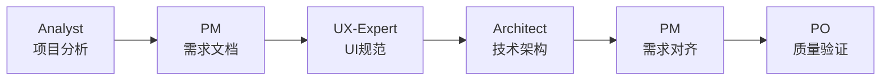
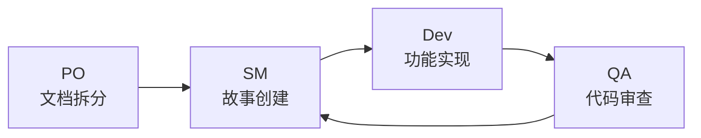

# Orchestrix - 专业化AI代理协作框架

**像交响乐指挥家一样协调专业化AI代理，通过标准化工作流程完成复杂项目开发。**

## 核心特性

🎯 **专业化协作** - 9个专业AI代理分工明确，协同作业  
📋 **标准化流程** - 严格的9步工作流程，确保项目质量  
🌐 **双环境支持** - Web界面规划 + IDE环境开发  
🧩 **模块化扩展** - 丰富的扩展包系统，覆盖多个专业领域

## 快速开始

### 一键安装

```bash
npx orchestrix install
```

自动检测并配置你的开发环境：**Cursor** | **VS Code** | **Windsurf** | **Trae** | **Roo**

### 2分钟快速体验

1. **下载团队配置**: [全栈开发团队](dist/teams/team-fullstack.txt)
2. **上传至AI平台**: ChatGPT、Claude、Gemini 任选其一
3. **开始协作**: 输入 `*help` 查看可用命令

## 核心代理

### 规划阶段团队

| 代理角色      | 专业领域             | 核心输出            |
| ------------- | -------------------- | ------------------- |
| **Analyst**   | 需求分析、市场调研   | `project-brief.md`  |
| **PM**        | 产品管理、需求规范   | `prd.md`            |
| **UX-Expert** | 用户体验设计         | `front-end-spec.md` |
| **Architect** | 技术架构设计         | `architecture.md`   |
| **PO**        | 质量保证、一致性验证 | 质量检查报告        |

### 开发阶段团队

| 代理角色         | 专业领域 | 核心职责               |
| ---------------- | -------- | ---------------------- |
| **Scrum Master** | 敏捷管理 | 用户故事创建、迭代管理 |
| **Dev**          | 代码实现 | 功能开发、技术实现     |
| **QA**           | 质量控制 | 代码审查、测试验证     |

## 标准工作流程

### 阶段一：需求规划（Web界面推荐）



### 阶段二：迭代开发（IDE环境推荐）



**关键原则：**

- ✅ **严格顺序** - 按9步流程执行，不跳过验证环节
- ✅ **角色专注** - 每个代理专注自己的专业领域
- ✅ **文档驱动** - 所有开发基于详细的规划文档
- ✅ **质量优先** - PO验证是关键质量控制点

## 使用模式

### 🌐 Web界面模式

**适用场景**: 项目规划、需求分析、架构设计  
**推荐平台**: ChatGPT、Claude、Gemini  
**核心价值**: 快速启动、协作讨论、高层决策

### 💻 IDE开发模式

**适用场景**: 代码实现、文件管理、持续开发  
**支持工具**: Cursor、VS Code、Windsurf、Trae、Roo  
**核心价值**: 深度集成、文件操作、版本控制

## 项目类型支持

### 🚀 Greenfield 开发

**全新项目开发** - 完整9步流程，从零构建  
**优势**: 标准化规划、质量保证、可扩展架构

### 🔧 Brownfield 开发

**现有项目改进** - 兼容现有系统的增量开发  
**特色**: 安全集成、渐进改进、向后兼容

## 扩展包生态

| 扩展包            | 专业领域       | 核心代理               |
| ----------------- | -------------- | ---------------------- |
| 🎮 **游戏开发包** | Phaser游戏开发 | 游戏设计师、关卡设计师 |
| ☁️ **基础设施包** | DevOps、云架构 | 云架构师、安全专家     |
| ✍️ **内容创作包** | 写作、创意     | 内容策划、编辑专家     |

[查看所有扩展包](docs/05-扩展包系统.md)

## 命令参考

### Web界面命令

```bash
*help          # 查看帮助信息
*analyst       # 切换到需求分析师
*pm            # 切换到产品经理
*architect     # 切换到架构师
*kb-mode       # 启用知识库模式
```

### CLI命令

```bash
npx orchestrix install    # 安装或更新框架
npx orchestrix status     # 查看安装状态
npx orchestrix list       # 列出所有可用代理
```

### IDE代理调用

| IDE                 | 语法          | 示例            |
| ------------------- | ------------- | --------------- |
| **Cursor/Windsurf** | `@agent-name` | `@pm`, `@dev`   |
| **Claude Code**     | `/agent-name` | `/pm`, `/dev`   |
| **Roo Code**        | 模式选择      | `orchestrix-pm` |

## 文档资源

📚 **完整指南**

- [用户指南](docs/01-用户指南.md) - 快速上手和基础操作
- [核心架构](docs/02-核心架构.md) - 技术架构和系统设计
- [工作流程指南](docs/03-工作流程指南.md) - 详细的9步工作流程
- [Brownfield开发](docs/04-Brownfield%20开发指南.md) - 现有项目改进指南
- [扩展包系统](docs/05-扩展包系统.md) - 模块化扩展机制

🎯 **设计哲学**

- [设计哲学](docs/00-设计哲学.md) - 核心设计理念与架构原则

## 许可证

MIT License - 详见 [LICENSE](LICENSE)

---

<sub>🎼 为专业AI代理协作而设计 | ❤️ 服务全球开发者社区</sub>
