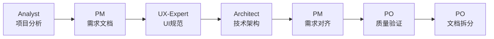
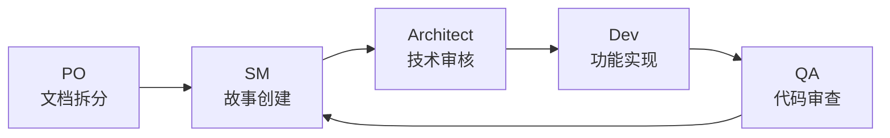

# Orchestrix - 专业化AI代理协作框架

**像交响乐指挥家一样协调专业化AI代理，通过标准化工作流程完成复杂项目开发。**

---

## 核心理念：设计哲学

Orchestrix 的成功在于 **专业化代理的协调配合** 和 **标准化流程的严格执行**，通过协调而非控制，实现复杂项目的高质量交付。

### 三大设计原则

- **协调胜过控制 (Coordination over Control)**: 代理通过协作达成目标，专业化分工确保每个代理发挥最大价值。
- **专业化胜过泛化 (Specialization over Generalization)**: 每个代理专注特定领域的深度专业能力，明确的角色界限避免职责重叠。
- **标准化胜过随意 (Standardization over Randomness)**: 规范化的工作流程确保可重复性，标准化的输出格式便于协作。

> 📚 深入了解 [Orchestrix 设计哲学](docs/00-设计哲学.md)。

---

## 核心特性

- 🎯 **专业化协作**: 10个专业AI代理各司其职，协同完成从规划到开发的全过程。
- 📋 **标准化流程**: 严格的10步工作流程，覆盖需求、设计、开发、测试全链路，确保项目质量。
- 🌐 **双环境支持**: Web界面用于宏观规划与决策，IDE环境专注于编码实现，无缝衔接。
- 🧩 **模块化扩展**: 丰富的扩展包系统，可按需引入游戏开发、基础设施等专业能力。
- 🚀 **项目类型支持**: 同时支持从零开始的 **Greenfield** 开发和基于现有代码的 **Brownfield** 改进。

---

## 快速开始

### 1. 一键安装

```bash
npx orchestrix install
```

此命令将自动检测并为您配置本地开发环境，支持 **Cursor, VS Code, Windsurf, Trae, Roo** 等主流IDE。

### 2. 两分钟快速体验

1.  **下载团队配置**: [全栈开发团队](dist/teams/team-fullstack.txt)
2.  **上传至AI平台**: 在您选择的AI平台（如ChatGPT, Claude, Gemini）中上传该文件。
3.  **开始协作**: 输入 `*help` 查看可用命令，然后通过 `*analyst` 启动项目。

> 📘 查看完整的 [用户指南](docs/01-用户指南.md) 了解更多操作细节。

---

## 标准工作流程

Orchestrix 的工作流程分为两个主要阶段，确保从宏观规划到微观实现的平稳过渡。

### 阶段一：需求与规划 (Web界面推荐)



### 阶段二：迭代开发 (IDE环境推荐)



> 流程细节请参考 [工作流程指南](docs/03-工作流程指南.md)。

---

## 核心代理团队

### 规划团队

| 代理角色      | 专业领域             | 核心输出            |
| ------------- | -------------------- | ------------------- |
| **Analyst**   | 需求分析、市场调研   | `project-brief.md`  |
| **PM**        | 产品管理、需求规范   | `prd.md`            |
| **UX-Expert** | 用户体验设计         | `front-end-spec.md` |
| **Architect** | 技术架构设计         | `architecture.md`   |
| **PO**        | 质量保证、一致性验证 | 质量检查报告        |

### 开发团队

| 代理角色         | 专业领域 | 核心职责               |
| ---------------- | -------- | ---------------------- |
| **Scrum Master** | 敏捷管理 | 用户故事创建、迭代管理 |
| **Dev**          | 代码实现 | 功能开发、技术实现     |
| **QA**           | 质量控制 | 代码审查、测试验证     |

---

## 命令参考

### Web界面命令

```bash
*help          # 查看帮助信息
*analyst       # 切换到需求分析师
*pm            # 切换到产品经理
*architect     # 切换到架构师
*kb-mode       # 启用知识库模式
```

### CLI命令

```bash
npx orchestrix install    # 安装或更新框架
npx orchestrix status     # 查看安装状态
npx orchestrix list       # 列出所有可用代理
```

### IDE代理调用

| IDE                 | 语法          | 示例            |
| ------------------- | ------------- | --------------- |
| **Cursor/Windsurf** | `@agent-name` | `@pm`, `@dev`   |
| **Claude Code**     | `/agent-name` | `/pm`, `/dev`   |
| **Roo Code**        | 模式选择      | `orchestrix-pm` |

---

## 文档资源

- 📚 **[用户指南](docs/01-用户指南.md)**: 快速上手和基础操作。
- 🏗️ **[核心架构](docs/02-核心架构.md)**: 了解技术架构和系统设计。
- 🔄 **[工作流程指南](docs/03-工作流程指南.md)**: 详细的10步工作流程。
- 🔧 **[Brownfield开发](docs/04-Brownfield%20开发指南.md)**: 现有项目改进指南。
- 🧩 **[扩展包系统](docs/06-扩展包系统.md)**: 探索模块化扩展机制。
- 🎯 **[设计哲学](docs/00-设计哲学.md)**: 理解核心设计理念与架构原则。

---

## 许可证

MIT License - 详见 [LICENSE](LICENSE)

---

<sub>🎼 为专业AI代理协作而设计 | ❤️ 服务全球开发者社区</sub>
