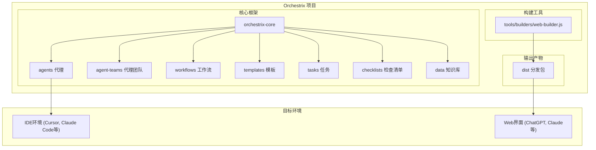
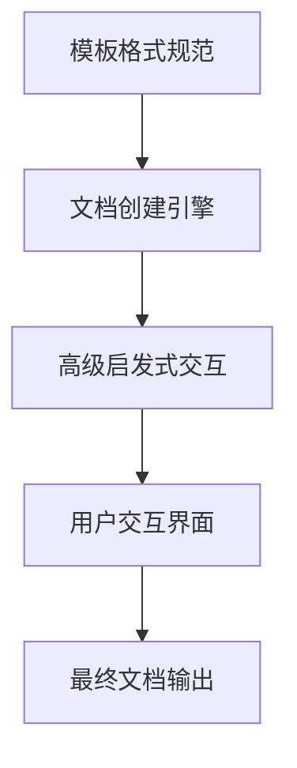
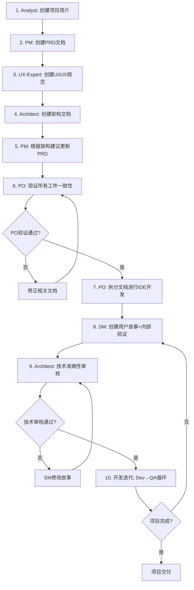
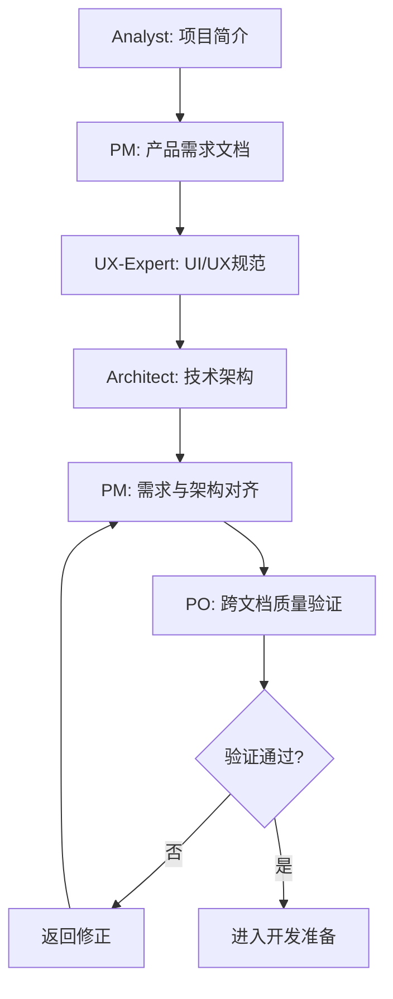
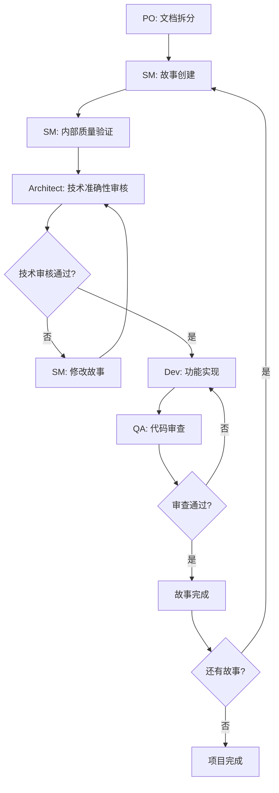

# Orchestrix 核心架构

通用AI代理框架的技术架构与系统设计

## 架构概述

Orchestrix 是一个模块化的AI代理协作框架，通过结构化的提示工程和工作流管理，实现专业化AI代理的无缝协作。

### 设计目标

- 🎯 **专业化协作** - 多个AI代理专业分工，协同完成复杂任务
- 🔄 **敏捷开发** - 支持完整的软件开发生命周期管理
- 🌐 **平台无关** - 同时支持Web界面和IDE环境
- 🧩 **模块化扩展** - 通过扩展包支持任意领域

## 系统架构



## 核心组件

### 1. 代理系统 (orchestrix-core/agents/)

**功能：** 定义专业化AI代理的角色、能力和依赖关系

**结构：**

- 每个`.md`文件定义一个代理
- YAML头部包含元数据和配置
- 明确的角色定位和专业能力
- 依赖的任务、模板和知识库

**示例代理：**

- `orchestrix-master.md` - 通用专家代理
- `pm.md` - 产品经理代理
- `dev.md` - 开发工程师代理

### 2. 代理团队 (orchestrix-core/agent-teams/)

**功能：** 预定义的代理组合，用于特定场景

**类型：**

- `team-fullstack.yaml` - 全栈开发团队
- `team-no-ui.yaml` - 后端开发团队
- `team-all.yaml` - 完整代理集合

### 3. 工作流系统 (orchestrix-core/workflows/)

**功能：** 定义标准化的项目执行流程

**特点：**

- 阶段性任务划分
- 角色协作序列
- 交付物规范
- 流程可视化

### 4. 模板引擎 (orchestrix-core/templates/)

**功能：** 标准化文档输出格式

**核心特性：**

- YAML格式定义
- 变量替换支持
- 条件逻辑处理
- 多级嵌套结构

### 5. 任务系统 (orchestrix-core/tasks/)

**功能：** 可重用的操作指令集

**设计原则：**

- 单一职责
- 步骤明确
- 参数化配置
- 模块化组合

### 6. 质量保证 (orchestrix-core/checklists/)

**功能：** 标准化的质量检查清单

**应用场景：**

- 代码审查
- 文档验证
- 架构评估
- 交付确认

### 7. 知识库 (orchestrix-core/data/)

**功能：** 共享的知识和配置信息

**核心文件：**

- `orchestrix-kb.md` - 框架知识库
- `technical-preferences.md` - 技术偏好配置
- `brainstorming-techniques.md` - 头脑风暴方法

## 双环境架构

### Web界面模式

**适用场景：** 规划阶段、需求分析、架构设计

**工作原理：**

1. 构建工具将多个组件打包成单一文件
2. 用户上传到AI平台（ChatGPT、Claude等）
3. AI获得完整上下文，支持角色切换

**优势：**

- 快速开始，无需安装
- 支持协作式讨论
- 适合非技术用户

### IDE开发模式

**适用场景：** 代码实现、项目管理、持续开发

**工作原理：**

1. 安装器将组件部署到项目目录
2. IDE插件直接加载对应代理
3. 与项目文件深度集成

**优势：**

- 与开发环境紧密集成
- 支持文件操作和版本控制
- 适合专业开发者

## 构建系统

### Web构建器 (web-builder.js)

**功能：** 将模块化组件打包为Web可用的单一文件

**流程：**

1. **依赖解析** - 分析代理和团队的依赖关系
2. **内容聚合** - 收集所有相关文件内容
3. **格式统一** - 标准化文件路径和分隔符
4. **打包输出** - 生成单一的`.txt`文件

### 安装器 (installer/)

**功能：** 管理IDE环境的部署和配置

**特性：**

- 自动检测项目结构
- 多IDE支持配置
- 增量更新机制
- 扩展包管理

## 模板处理系统

### 三层架构



**1. 模板格式规范**

- 定义YAML模板语法
- 支持变量替换和条件逻辑
- 提供标准化处理规则

**2. 文档创建引擎**

- 协调模板选择和用户交互
- 管理生成模式（增量/快速）
- 执行验证和格式化

**3. 高级启发式交互**

- 提供10种结构化头脑风暴方法
- 支持章节级审查和改进
- 嵌入式智能处理指令

## 扩展架构

### 扩展包系统

**设计原则：**

- 核心保持精简
- 领域特化扩展
- 独立开发和维护
- 组合使用支持

**扩展包结构：**

```
expansion-pack/
├── config.yaml          # 扩展包配置
├── agents/              # 专业代理
├── templates/           # 领域模板
├── tasks/               # 专门任务
└── data/                # 领域知识
```

### 技术偏好系统

**功能：** 个性化技术选择和偏好管理

**特点：**

- 跨项目复用
- 自动应用推荐
- 学习和进化
- 团队共享支持

## 工作流引擎

### 标准十步工作流程

Orchestrix 采用严格的十步工作流程，确保项目从构思到交付的系统性和一致性：



### 规划工作流 (步骤1-6)

**阶段一：需求分析与设计**



**核心输出物**：

- `project-brief.md` - 项目背景和市场分析
- `prd.md` - 产品需求文档（含更新版本）
- `front-end-spec.md` - UI/UX设计规范
- `architecture.md` - 完整技术架构

**质量保证机制**：

- 每个代理完成后的自我检查
- PM与Architect之间的需求-技术对齐
- PO执行的跨文档一致性验证（关键节点）

### 开发工作流 (步骤7-10)

**阶段二：文档管理与开发实施**



**迭代开发机制**：

- **文档驱动**：基于拆分后的需求文档进行开发
- **故事导向**：每个开发周期专注单一用户故事
- **质量闭环**：Dev→QA→修复的质量保证循环
- **进度透明**：清晰的故事状态追踪（Draft→Approved→Done）

### 关键控制点

**1. 架构-需求对齐 (步骤5)**

- PM必须根据Architect的技术约束和建议更新PRD
- 确保产品需求在技术上可行且优化

**2. PO质量验证 (步骤6)**

- 所有规划文档的一致性检查
- 功能-技术-设计三者的协调验证
- 项目可执行性的最终确认

**3. 文档拆分管理 (步骤7)**

- 将大型文档分解为开发友好的小单元
- 保持信息完整性和可追溯性
- 为IDE开发环境优化文档结构

### 代理协作模式

**Web界面阶段 (步骤1-6)**：

- 支持多代理协同讨论
- 便于快速迭代和调整
- 适合高层决策和创意工作

**IDE开发阶段 (步骤7-10)**：

- 与开发工具深度集成
- 支持文件操作和版本控制
- 适合技术实施和代码管理

### 质量保证体系

**五层质量控制**：

1. **代理级**：每个代理完成任务后的自我验证
2. **跨代理级**：PM-Architect之间的需求-技术对齐
3. **系统级**：PO执行的整体一致性和完整性检查
4. **Story创建严谨性层**：SM Agent内部质量保证+Architect Agent技术审核
   - SM Agent强制性技术提取验证（≥80%完成率+≥7/10分）
   - Architect Agent技术准确性专业审核（≥7/10分通过）
5. **开发级**：Dev-QA循环的代码质量保证

**标准化检查清单**：

- 完整性：所有必需内容都已包含
- 一致性：文档间没有冲突或矛盾
- 可行性：技术方案支持产品需求
- 可测试性：功能需求可被验证
- 可维护性：长期可持续的技术架构
- 技术准确性：Story技术细节与架构文档完全一致
- 架构合规性：技术实现方案符合既定架构原则

## 性能优化

### 上下文管理

- **最小化加载** - 按需加载依赖资源
- **分层缓存** - 多级缓存机制
- **增量更新** - 仅更新变更内容

### 构建优化

- **依赖去重** - 避免重复内容
- **压缩打包** - 优化文件大小
- **并行处理** - 多任务并发执行

## 安全与稳定性

### 版本管理

- **语义化版本** - 清晰的版本演进
- **向后兼容** - 保护用户投资
- **升级路径** - 平滑的迁移机制

### 错误处理

- **优雅降级** - 部分功能失效时保持可用
- **详细日志** - 完整的操作追踪
- **用户友好** - 清晰的错误提示

---

🏗️ **架构设计确保Orchestrix在保持简单易用的同时，具备企业级的扩展性和稳定性**

📚 **更多技术细节请参考 [01-用户指南](01-用户指南.md) 和 [00-指导设计理念]00-设计理念.md)**
