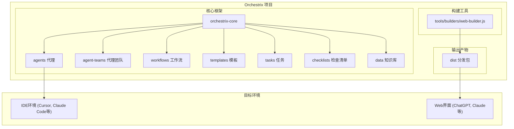
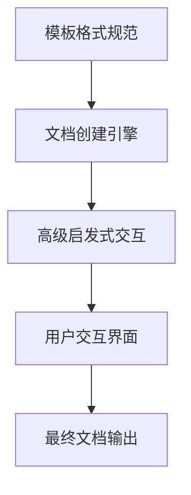
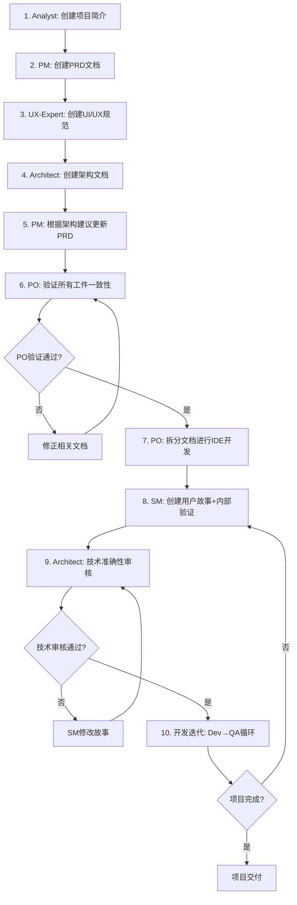
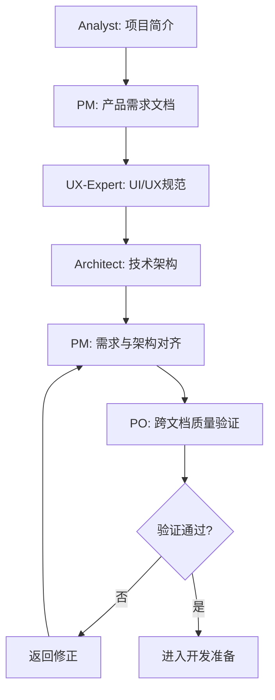
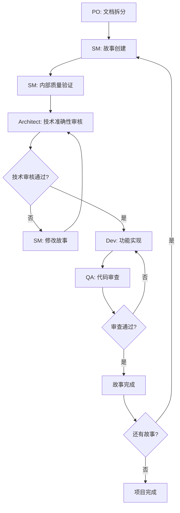
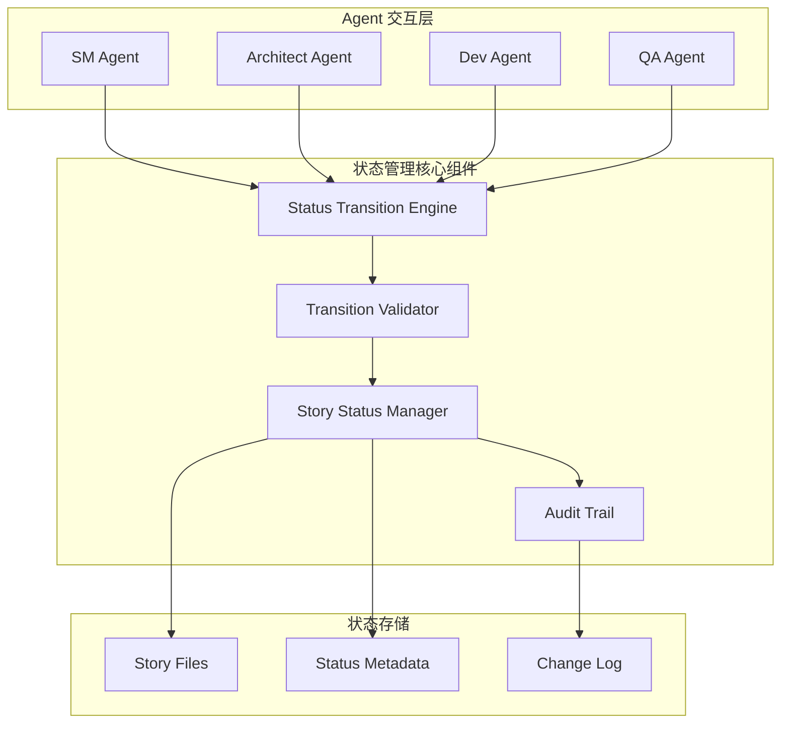
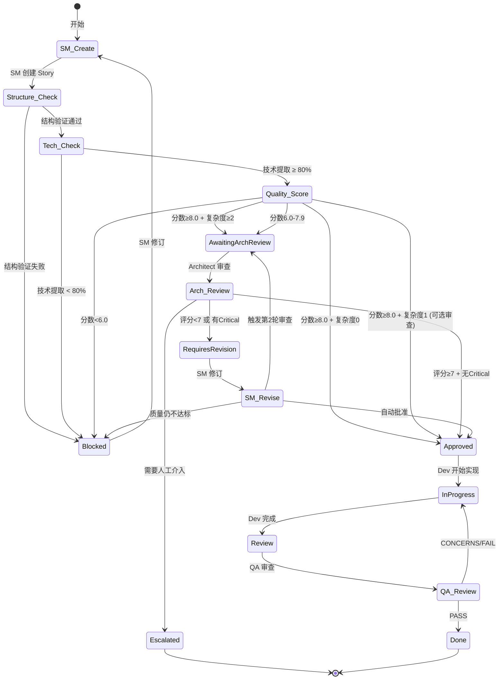
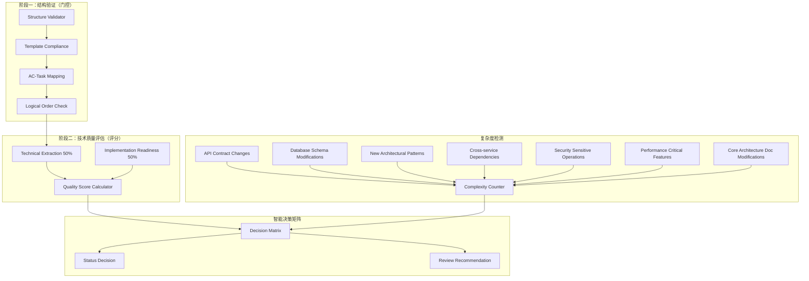

# Orchestrix 核心架构

通用AI代理框架的技术架构与系统设计

## 架构概述

Orchestrix 是一个模块化的AI代理协作框架，通过结构化的提示工程和工作流管理，实现专业化AI代理的无缝协作。

### 设计目标

- 🎯 **专业化协作** - 多个AI代理专业分工，协同完成复杂任务
- 🔄 **敏捷开发** - 支持完整的软件开发生命周期管理
- 🌐 **平台无关** - 同时支持Web界面和IDE环境
- 🧩 **模块化扩展** - 通过扩展包支持任意领域

## 系统架构



## 核心组件

### 1. 代理系统 (orchestrix-core/agents/)

**功能：** 定义专业化AI代理的角色、能力和依赖关系

**双文件架构：**

- **源文件 (\*.src.yaml)** - 人类可读的配置源码
  - 包含完整的 agent 定义
  - 支持 YAML 引用和模块化
  - 便于维护和版本控制
- **编译文件 (\*.yaml)** - 运行时使用的扁平化配置
  - 由 `tools/compile-agents.js` 自动生成
  - 解析所有引用，生成完整配置
  - 优化 token 使用

**内容分层原则：**

- **Agent 文件职责**：身份信息、工具列表、命令入口、3-5条核心原则
- **不应包含**：详细执行步骤、重复的 task 内容、长篇 workflow 规则

**示例代理：**

- `sm.src.yaml` / `sm.yaml` - Scrum Master 代理
- `architect.src.yaml` / `architect.yaml` - 架构师代理
- `dev.src.yaml` / `dev.yaml` - 开发工程师代理
- `qa.src.yaml` / `qa.yaml` - QA 代理

### 2. 代理团队 (orchestrix-core/agent-teams/)

**功能：** 预定义的代理组合，用于特定场景

**类型：**

- `team-fullstack.yaml` - 全栈开发团队
- `team-no-ui.yaml` - 后端开发团队
- `team-all.yaml` - 完整代理集合

### 3. 工作流系统 (orchestrix-core/workflows/)

**功能：** 定义标准化的项目执行流程

**特点：**

- 阶段性任务划分
- 角色协作序列
- 交付物规范
- 流程可视化

### 4. 模板引擎 (orchestrix-core/templates/)

**功能：** 标准化文档输出格式

**核心特性：**

- YAML格式定义
- 变量替换支持
- 条件逻辑处理
- 多级嵌套结构

**使用原则：**

- Task 文件仅引用 template，不重复描述输出格式
- 通过引用减少 token 消耗

### 5. 任务系统 (orchestrix-core/tasks/)

**功能：** 可重用的操作指令集

**设计原则：**

- 单一职责
- 步骤明确
- 参数化配置
- 模块化组合

**内容分层原则：**

- **Task 文件职责**：完整的 step-by-step 流程、输入/输出规范、决策点和条件逻辑、错误处理流程
- **不应包含**：Agent 身份信息、重复 checklist 的验证项、决策逻辑的具体规则(应在 data/decisions/ 中)

**公共工具任务 (tasks/utils/)：**

- `load-architecture-context.md` - 统一的架构文档读取逻辑
- `validate-status-transition.md` - 标准化的状态验证
- `execute-checklist.md` - 通用的 checklist 执行引擎

### 6. 质量保证 (orchestrix-core/checklists/)

**功能：** 标准化的质量检查清单

**三种类型：**

1. **validation/** - 验证型 (必须100%通过，Gate机制)
   - 二元结果 (Pass/Fail)
   - 失败则 HALT
   - 示例：`sm-technical-extraction.md`

2. **assessment/** - 评估型 (计算分数)
   - 评分结果 (0-10)
   - 可以部分通过
   - 示例：`sm-story-quality.md`, `architect-technical-review.md`

3. **completion/** - 完成度型 (确认完成)
   - 百分比结果
   - 可以有 N/A 项
   - 示例：`story-dod.md`

**内容分层原则：**

- **Checklist 文件职责**：结构化的验证项列表、通过/失败标准、评分逻辑、LLM 执行指令
- **不应包含**：执行流程(应在 task 中)、决策逻辑(应在 data/decisions/ 中)

**执行引擎：**

- 通过 `execute-checklist.md` 统一执行
- 支持三种类型的不同处理逻辑
- 返回结构化结果供决策使用

### 7. 知识库与决策系统 (orchestrix-core/data/)

**功能：** 共享的知识、配置和决策规则

**目录结构：**

```
data/
├── config/                              # 静态配置
│   └── qa-review-standards.yaml        # QA 审查标准
│
├── decisions/                           # 动态决策逻辑
│   ├── README.md                        # 决策系统文档
│   ├── sm-story-status.yaml            # Story 状态决策
│   ├── sm-architect-review-needed.yaml # 架构审查决策
│   ├── sm-test-design-level.yaml       # 测试设计级别
│   ├── architect-review-result.yaml    # 架构审查结果
│   ├── dev-block-story.yaml            # Dev 阻塞决策
│   ├── dev-escalate-architect.yaml     # Dev 升级决策
│   ├── qa-gate-decision.yaml           # QA 门控决策
│   └── ...                              # 其他决策规则
│
├── agent-capabilities-registry.md       # Agent 能力注册表
├── brainstorming-techniques.md          # 头脑风暴方法
├── contract-driven-phases.md            # 合约驱动开发阶段
├── elicitation-methods.md               # 需求引导方法
├── orchestrix-kb.md                     # 框架知识库
├── story-status-transitions.yaml        # 状态转换规则
├── technical-preferences.md             # 技术偏好配置
├── test-levels-framework.md             # 测试级别框架
└── test-priorities-matrix.md            # 测试优先级矩阵
```

**设计原则：**

- **config/** - 静态配置，直接读取，很少变化
- **decisions/** - 动态决策逻辑，通过 `make-decision.md` 处理
- **根目录** - 核心系统文件，频繁访问，跨领域关注

**决策系统集中化：**

- 所有决策逻辑统一在 `data/decisions/` 中定义
- Task 和 Checklist 不包含决策规则，只调用决策
- 通过 `make-decision.md` 统一执行决策逻辑

## 双环境架构

### Web界面模式

**适用场景：** 规划阶段、需求分析、架构设计

**工作原理：**

1. 构建工具将多个组件打包成单一文件
2. 用户上传到AI平台（ChatGPT、Claude等）
3. AI获得完整上下文，支持角色切换

**优势：**

- 快速开始，无需安装
- 支持协作式讨论
- 适合非技术用户

### IDE开发模式

**适用场景：** 代码实现、项目管理、持续开发

**工作原理：**

1. 安装器将组件部署到项目目录
2. IDE插件直接加载对应代理
3. 与项目文件深度集成

**优势：**

- 与开发环境紧密集成
- 支持文件操作和版本控制
- 适合专业开发者

## 构建系统

### Agent 编译器 (tools/compile-agents.js)

**功能：** 将源文件编译为运行时配置

**流程：**

1. **读取源文件** - 加载 `*.src.yaml` 文件
2. **解析引用** - 处理 `!include` 和 `!ref` 指令
3. **内容合并** - 将引用的文件内容内联
4. **生成输出** - 生成扁平化的 `*.yaml` 文件

**优势：**

- 源文件保持模块化和可维护性
- 运行时文件优化 token 使用
- 支持公共配置复用

### Web构建器 (tools/builders/web-builder.js)

**功能：** 将模块化组件打包为Web可用的单一文件

**流程：**

1. **依赖解析** - 分析代理和团队的依赖关系
2. **内容聚合** - 收集所有相关文件内容
3. **格式统一** - 标准化文件路径和分隔符
4. **打包输出** - 生成单一的`.txt`文件

### 安装器 (tools/installer/)

**功能：** 管理IDE环境的部署和配置

**特性：**

- 自动检测项目结构
- 多IDE支持配置
- 增量更新机制
- 扩展包管理
- 集成 agent 编译流程

## 模板处理系统

### 三层架构



**1. 模板格式规范**

- 定义YAML模板语法
- 支持变量替换和条件逻辑
- 提供标准化处理规则

**2. 文档创建引擎**

- 协调模板选择和用户交互
- 管理生成模式（增量/快速）
- 执行验证和格式化

**3. 高级启发式交互**

- 提供10种结构化头脑风暴方法
- 支持章节级审查和改进
- 嵌入式智能处理指令

## 扩展架构

### 扩展包系统

**设计原则：**

- 核心保持精简
- 领域特化扩展
- 独立开发和维护
- 组合使用支持

**扩展包结构：**

```
expansion-pack/
├── config.yaml          # 扩展包配置
├── agents/              # 专业代理
├── templates/           # 领域模板
├── tasks/               # 专门任务
└── data/                # 领域知识
```

### 技术偏好系统

**功能：** 个性化技术选择和偏好管理

**特点：**

- 跨项目复用
- 自动应用推荐
- 学习和进化
- 团队共享支持

## 工作流引擎

### 标准八步工作流程

Orchestrix 采用严格的八步工作流程，确保项目从构思到交付的系统性和一致性：



### 规划工作流 (步骤1-6)

**阶段一：需求分析与设计**



**核心输出物**：

- `project-brief.md` - 项目背景和市场分析
- `prd.md` - 产品需求文档（含更新版本）
- `front-end-spec.md` - UI/UX设计规范
- `architecture.md` - 完整技术架构

**质量保证机制**：

- 每个代理完成后的自我检查
- PM与Architect之间的需求-技术对齐
- PO执行的跨文档一致性验证（关键节点）

### 开发工作流 (步骤7-8)

**阶段二：文档管理与开发实施**



**迭代开发机制**：

- **文档驱动**：基于拆分后的需求文档进行开发
- **故事导向**：每个开发周期专注单一用户故事
- **质量闭环**：Architect审核 → Dev实现 → QA验证 的完整质量保证循环
- **进度透明**：清晰的故事状态追踪（Draft→Approved→Done）

### 关键控制点

**1. 架构-需求对齐 (步骤5)**

- PM必须根据Architect的技术约束和建议更新PRD
- 确保产品需求在技术上可行且优化

**2. PO质量验证 (步骤6)**

- 所有规划文档的一致性检查
- 功能-技术-设计三者的协调验证
- 项目可执行性的最终确认

**3. 文档拆分管理 (步骤7)**

- 将大型文档分解为开发友好的小单元
- 保持信息完整性和可追溯性
- 为IDE开发环境优化文档结构

### 代理协作模式

**Web界面阶段 (步骤1-6)**：

- 支持多代理协同讨论
- 便于快速迭代和调整
- 适合高层决策和创意工作

**IDE开发阶段 (步骤7-8)**：

- 与开发工具深度集成
- 支持文件操作和版本控制
- 适合技术实施和代码管理

### 质量保证体系

**五层质量控制**：

1. **代理级**：每个代理完成任务后的自我验证
2. **跨代理级**：PM-Architect之间的需求-技术对齐
3. **系统级**：PO执行的整体一致性和完整性检查
4. **Story创建严谨性层**：SM Agent内部质量保证+Architect Agent技术审核
   - SM Agent强制性技术提取验证（≥80%完成率+≥7/10分）
   - Architect Agent技术准确性专业审核（≥7/10分通过）
5. **开发级**：Dev-QA循环的代码质量保证

**标准化检查清单**：

- 完整性：所有必需内容都已包含
- 一致性：文档间没有冲突或矛盾
- 可行性：技术方案支持产品需求
- 可测试性：功能需求可被验证
- 可维护性：长期可持续的技术架构
- 技术准确性：Story技术细节与架构文档完全一致
- 架构合规性：技术实现方案符合既定架构原则

## 状态管理系统

### 架构概述

Orchestrix 采用状态驱动的工作流管理，通过明确的 Story 状态来指示当前阶段、负责人和下一步行动。状态管理系统确保 SM、Architect、Dev、QA 四个代理之间的清晰交接，避免无限循环和职责模糊。

**核心特性：**

- 8个明确定义的状态
- 基于质量评估的自动状态转换
- 审查轮次限制机制 (Architect 最多2轮，QA 最多3轮)
- 状态转换规则定义在 `data/story-status-transitions.yaml`



### 状态定义

**八个核心状态**：

- **Blocked**：Story 质量不达标，需要 SM 修订
- **AwaitingArchReview**：等待 Architect 技术审查
- **RequiresRevision**：Architect 审查发现问题，需要 SM 修订
- **Approved**：Story 已批准，可以开始开发
- **InProgress**：Dev 正在实现功能或修复 QA 发现的问题
- **Review**：等待 QA 审查
- **Done**：Story 已完成
- **Escalated**：需要人工介入决策

### 状态转换规则



### 权限控制

每个状态明确定义了负责的 Agent 和允许的操作：

- **Blocked** → 只有 SM 可以修改和重新提交
- **AwaitingArchReview** → 只有 Architect 可以执行审查
- **RequiresRevision** → 只有 SM 可以执行修订
- **Approved** → 只有 Dev 可以开始实现
- **InProgress** → Dev 负责实现和修复
- **Review** → 只有 QA 可以执行审查
- **Done** → 不允许修改
- **Escalated** → 需要人工介入

## 质量评估系统

### 两阶段评估架构

Orchestrix 采用两阶段质量评估机制，确保 Story 在进入开发前达到高质量标准。

**评估流程：**

1. **阶段一：结构验证** (门控条件，必须100%通过)
2. **阶段二：技术质量评估** (评分系统，0-10分)
3. **复杂度检测** (7个指标)
4. **智能决策矩阵** (基于分数和复杂度自动决策)

**实现位置：**

- 评估逻辑：`checklists/assessment/sm-story-quality.md`
- 决策规则：`data/decisions/sm-story-status.yaml`
- 执行任务：`tasks/create-next-story.md`



### 阶段一：结构验证（门控条件）

**必须100%通过的验证项**：

1. 所有必需的模板部分都存在
2. 没有未填充的占位符（{{variables}}）
3. Story 遵循标准模板结构
4. 所有 AC 都有对应的 Tasks/Subtasks
5. Task-AC 映射明确（例如 "Task 1 (AC: 1, 3)"）
6. Tasks 逻辑覆盖所有 AC 要求
7. Tasks 遵循逻辑实现顺序
8. 没有循环依赖
9. Frontend-first 策略正确应用（如果启用）

**失败处理**：如果结构验证完成率 < 100%，立即设置状态为 `Blocked`，跳过后续评估。

### 阶段二：技术质量评估（评分系统）

**评分组成（0-10分）**：

- **技术提取质量（50%权重）**：
  - 架构信息完整性
  - 技术偏好对齐
  - 源引用验证
  - **硬性要求**：完成率必须 ≥ 80%，否则强制 `Blocked`

- **实现就绪度（50%权重）**：
  - Dev Notes 质量
  - 测试策略
  - 开发者可实现性

### 复杂度检测系统

**七个复杂度指标**：

1. API 契约变更
2. 数据库模式修改
3. 新架构模式
4. 跨服务依赖
5. 安全敏感操作
6. 性能关键特性
7. 核心架构文档修改

### 智能决策矩阵

基于技术质量分数和复杂度指标数量的组合决策：

| 技术质量分数 | 复杂度指标 | 状态决策           | Architect 审查 |
| ------------ | ---------- | ------------------ | -------------- |
| ≥ 8.0        | 0          | Approved           | NOT_NEEDED     |
| ≥ 8.0        | 1          | Approved           | OPTIONAL       |
| ≥ 8.0        | ≥ 2        | AwaitingArchReview | RECOMMENDED    |
| 6.0-7.9      | 任何       | AwaitingArchReview | RECOMMENDED    |
| < 6.0        | 任何       | Blocked            | N/A            |

### 审查轮次控制

**Architect 审查**：

- 最多2轮审查
- 第2轮后如仍需修订，询问用户决策
- 支持自动批准条件检查（满足条件可跳过第2轮）
- 决策规则：`data/decisions/architect-review-result.yaml`

**QA 审查**：

- 最多3轮审查，渐进式通过标准
- 第1轮：严格标准（所有 AC 满足、全面测试、无 Critical/High 问题）
- 第2轮：适度标准（问题减少≥50%、无 High 问题）
- 第3轮：务实标准（无 Critical 问题、可接受技术债务）
- 决策规则：`data/decisions/qa-gate-decision.yaml`

**避免无限循环：**

- 轮次限制确保流程收敛
- 超限后提供人工决策选项
- 自动批准机制提高效率

### Agent Handoff 消息系统

**标准化交接格式**：

```
Next: [Agent名称] 请执行命令 `[命令名称] [参数]`
```

**消息映射示例**：

- SM → Architect：`Next: Architect 请执行命令 'review-story {story_id}'`
- Architect → Dev：`Next: Dev 请执行命令 'implement-story {story_id}'`
- Dev → QA：`Next: QA 请执行命令 'review {story_id}'`
- QA → Dev：`Next: Dev 请执行命令 'review-qa {story_id}'`

## 性能优化

### 上下文管理

- **最小化加载** - 按需加载依赖资源
- **分层缓存** - 多级缓存机制
- **增量更新** - 仅更新变更内容

### 构建优化

- **依赖去重** - 避免重复内容
- **压缩打包** - 优化文件大小
- **并行处理** - 多任务并发执行

## 安全与稳定性

### 版本管理

- **语义化版本** - 清晰的版本演进
- **向后兼容** - 保护用户投资
- **升级路径** - 平滑的迁移机制

### 错误处理

- **优雅降级** - 部分功能失效时保持可用
- **详细日志** - 完整的操作追踪
- **用户友好** - 清晰的错误提示

---

🏗️ **架构设计确保Orchestrix在保持简单易用的同时，具备企业级的扩展性和稳定性**

📚 **更多技术细节请参考 [01-用户指南](01-用户指南.md) 和 [00-指导设计理念]00-设计理念.md)**
