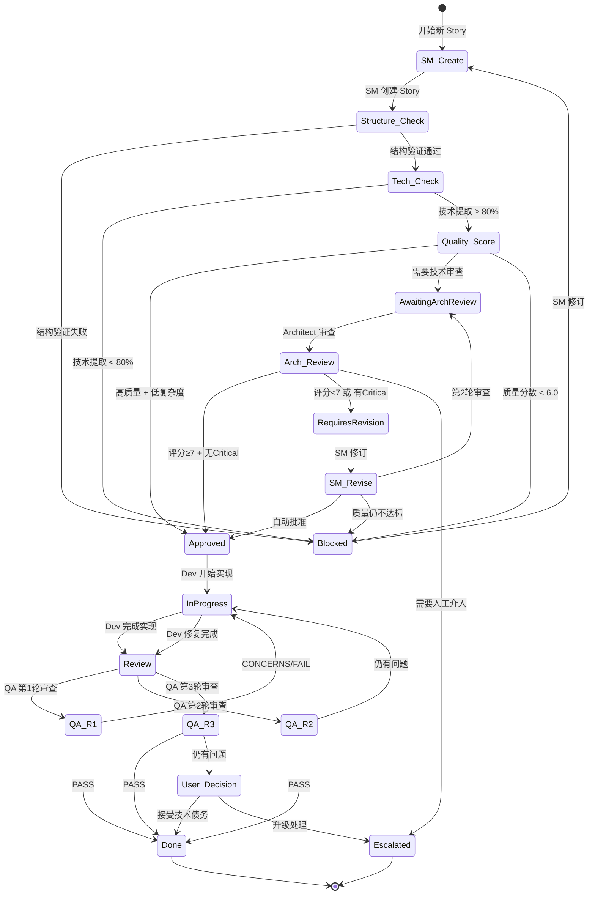
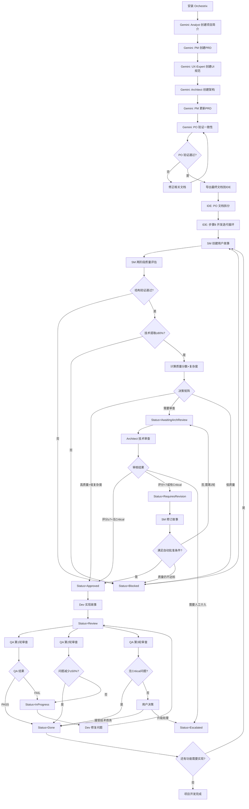

# Orchestrix 标准工作流程指南

本指南详细介绍 Orchestrix 的核心工作流程，确保项目从构思到交付的每个环节都严谨、高效。

## 🎯 流程概述

Orchestrix 采用八步渐进式工作流程，通过专业化代理协作完成复杂项目：

1. **Analyst** → 创建项目简介 (`project-brief.md`)
2. **PM** → 创建产品需求文档 (`prd.md`)
3. **UX-Expert** → 创建UI/UX规范 (`front-end-spec.md`)
4. **Architect** → 创建架构文档 (`architecture.md`)
5. **PM** → 根据架构建议更新PRD
6. **PO** → 验证所有工件一致性和完整性
7. **PO** → 拆分文档进行IDE开发
8. **开发迭代循环** → SM创建故事 → Architect审核 → Dev开发 → QA检查 → 循环直到项目完成

## 📋 详细工作流程

### 准备阶段：环境配置

1. **在项目中安装 Orchestrix**：

   ```bash
   npx orchestrix install
   ```

   - 选择 "完整安装"
   - 选择您的 IDE (Cursor、Claude Code、Windsurf、Trae、Roo Code 或 GitHub Copilot)

2. **验证安装**：
   - `.orchestrix-core/` 文件夹及所有智能体已创建
   - IDE 专用集成文件已创建
   - 所有智能体命令/规则/模式可用

### 第一阶段：需求分析与规划 (Web界面 - 推荐Gemini)

使用 Google Gemini 进行团队协作规划：

#### Web界面协作流程（以 Google Gemini 为例）

**1. 打开 Google Gems 平台**  
访问 [Google Gems](https://gemini.google.com/gems/view)。

**2. 新建团队 Gem**

- 点击“创建新 Gem”
- 填写标题与描述（如：“Orchestrix 全栈团队协作”）

**3. 配置 Orchestrix 团队**

- 在项目目录下找到 `dist/teams/team-fullstack.txt`
- 复制该文件全部内容
- 粘贴到 Gem 的团队设置区域，完成团队智能体加载

**4. 分工协作，开展需求分析与规划**

- **业务分析师**：负责需求收集与市场调研
- **产品经理**：梳理功能清单，确定优先级
- **架构师**：制定技术方案与系统架构
- **UX 专家**：设计用户体验与界面规范

> 建议：在 Gem 对话中，分别以 `/analyst`、`/pm`、`/architect`、`/ux-expert` 等命令切换角色，逐步推进项目规划，具体步骤如下所示。

#### 步骤 1: 分析师 (Analyst) - 创建项目简介

**目标**：建立项目基础和背景理解

**Gemini 会话示例**：

```text
/analyst 我想开发一个 [项目类型] 应用，核心目的是 [具体目标]。
请帮我创建详细的项目简介，包括市场调研和竞品分析。
```

**输出文件**：`project-brief.md`
**包含内容**：

- 项目背景和目标
- 目标用户画像
- 市场调研结果
- 竞品分析
- 项目范围定义

**可选任务**：

- 头脑风暴会议
- 深度市场研究
- 用户访谈规划

#### 步骤 2: 产品经理 (PM) - 创建产品需求文档

**目标**：将项目简介转换为详细的产品需求

**输入文件**：`project-brief.md`

**Gemini 会话示例**：

```text
/pm 基于刚才的项目简介，请创建全面的产品需求文档（PRD）。
重点关注功能优先级和业务逻辑。
```

**输出文件**：`prd.md`
**包含内容**：

- 产品概述和目标
- 功能需求清单
- 用户故事和场景
- 优先级矩阵
- 业务逻辑和规则
- 成功指标定义

#### 步骤 3: 用户体验专家 (UX-Expert) - 创建UI/UX规范

**目标**：设计用户界面和交互体验

**输入文件**：`prd.md`

**Gemini 会话示例**：

```text
/ux-expert 基于PRD文档，请创建详细的UI/UX规范。
包括用户界面设计和交互流程。
```

**输出文件**：`front-end-spec.md`
**包含内容**：

- 用户界面设计规范
- 交互流程图
- 用户体验设计原则
- 页面布局和组件规范
- 响应式设计要求

**可选任务**：

- 生成AI UI提示
- 创建原型设计
- 可用性测试规划

#### 步骤 4: 架构师 (Architect) - 创建全栈架构文档

**目标**：设计技术架构和系统结构

**输入文件**：`prd.md`, `front-end-spec.md`

**Gemini 会话示例**：

```text
/architect 基于PRD和UI/UX规范，设计可扩展的技术架构。
请考虑性能、安全性和可维护性。
```

**输出文件**：`architecture.md`
**包含内容**：

- 系统架构设计
- 技术栈选择和论证
- 数据库设计
- API设计规范
- 部署和基础设施规划
- 安全策略
- 性能优化方案

**可选任务**：

- 技术可行性研究
- UI结构审查和优化建议
- 第三方服务集成评估

#### 步骤 5: 产品经理 (PM) - 根据架构建议更新PRD

**目标**：确保需求与技术可行性对齐

**输入文件**：`architecture.md` (架构师的建议和约束)

**Gemini 会话示例**：

```text
/pm 基于架构师的技术设计和建议，请更新PRD文档。
确保功能需求与技术实现保持一致。
```

**输出文件**：更新的 `prd.md`
**更新内容**：

- 根据技术约束调整功能范围
- 重新评估优先级
- 更新实现时间线
- 确认技术依赖关系
- 调整成功指标（如需要）

---

### 第二阶段：质量保证与一致性验证

#### 步骤 6: 产品负责人 (PO) - 验证所有工件一致性

**目标**：确保所有规划文档协调一致

**输入文件**：

- `prd.md` (更新版)
- `front-end-spec.md`
- `architecture.md`

**Gemini 会话示例**：

```text
/po 请执行跨文档质量检查，验证PRD、UI规范和架构文档的一致性。
使用质量检查清单进行全面审核。

*execute-checklist po-master-checklist
```

**验证标准**：

- **一致性检查**：确保PRD、架构文档、UI规范三者协调统一
- **完整性验证**：所有功能需求都有对应的技术实现方案
- **可行性确认**：技术架构支持所有产品功能
- **依赖关系审核**：识别并解决文档间的冲突
- **交付标准确认**：确认所有工件符合质量要求

**结果评估**：

- ✅ **通过**：所有文档一致，可进入开发阶段
- ❌ **不通过**：返回相关代理修正文档，重新验证

---

### 第三阶段：开发准备与迭代交付

#### 步骤 7: 产品负责人 (PO) - 拆分文档进行IDE开发

**目标**：将大型文档分解为可管理的开发单元

**执行环境**：切换到 IDE (Cursor、Claude Code等)

**操作步骤**：

1. **保存最终文档到项目**：
   - 将通过验证的文档保存到项目 `docs/` 目录
   - `docs/prd.md`
   - `docs/front-end-spec.md`
   - `docs/architecture.md`

2. **加载 orchestrix-master 代理**：

   ```
   # 根据IDE选择语法
   @po  # Cursor/Windsurf/Trae
   /po  # Claude Code
   ```

3. **执行文档拆分**：
   ```
   *shard-doc docs/prd.md prd
   *shard-doc docs/architecture.md architecture
   *shard-doc docs/front-end-spec.md frontend
   ```

**输出结果**：

- `docs/prd/` - 细分的PRD章节
- `docs/architecture/` - 细分的架构章节
- `docs/frontend/` - 细分的前端规范章节

---

#### 步骤 8: 开发迭代循环

**目标**：通过持续迭代完成所有用户故事的开发、审核和交付

**状态驱动的工作流**：

Orchestrix 使用明确的状态管理系统来驱动整个开发流程。每个 Story 的状态清晰地指示当前阶段、负责人和下一步行动。

**Story 状态定义**：

| 状态                 | 含义                         | 负责人    | 下一步行动                   |
| -------------------- | ---------------------------- | --------- | ---------------------------- |
| `Blocked`            | Story 质量不达标，需要修订   | SM        | SM 修订 Story 并重新质量检查 |
| `AwaitingArchReview` | 等待 Architect 技术审查      | Architect | Architect 执行技术审查       |
| `RequiresRevision`   | Architect 发现问题，需要修订 | SM        | SM 基于反馈修订 Story        |
| `Approved`           | Story 已批准，可以开始开发   | Dev       | Dev 开始实现功能             |
| `InProgress`         | Dev 正在实现或修复问题       | Dev       | Dev 完成实现或修复           |
| `Review`             | 等待 QA 审查                 | QA        | QA 执行代码审查和测试        |
| `Done`               | Story 已完成                 | -         | 无（Story 完成）             |
| `Escalated`          | 需要人工介入决策             | Human     | 人工评估和决策               |

**状态转换流程图**：



**详细执行步骤与 Agent 交接点**：

**A. 故事创建 (Scrum Master)：**

1. **开始新的IDE对话**
2. **加载 SM 代理**：
   ```
   @sm      # Cursor/Windsurf/Trae
   /sm      # Claude Code
   ```
3. **运行 \*help 查看命令**
4. **执行故事创建**：

   ```
   *draft
   ```

   此命令自动执行以下步骤：
   - 识别下一个故事 ID
   - 从 Epic 加载需求
   - 加载架构上下文
   - 填充 Story 模板
   - 自动执行两阶段质量评估
   - 应用智能决策矩阵
   - 输出 Handoff 消息

5. **两阶段质量评估**（自动执行）：

   **阶段一：结构验证**（门控条件，必须100%通过）
   - 模板完整性验证
   - AC-Task 映射检查
   - 逻辑顺序验证
   - **失败 → Status = `Blocked`**

   **阶段二：技术质量评估**（仅在阶段一通过后）
   - 技术提取完成率：必须 ≥ 80%（硬性要求）
   - 技术质量评分：0-10分
   - 复杂度指标检测：0-7个指标
   - **提取率 < 80% → Status = `Blocked`**

6. **智能决策矩阵**（自动应用）：

   | 质量评分 | 复杂度指标 | 决策                           |
   | -------- | ---------- | ------------------------------ |
   | ≥ 8.0    | 0          | Status = `Approved`            |
   | ≥ 8.0    | 1          | Status = `Approved` (可选审查) |
   | ≥ 8.0    | ≥ 2        | Status = `AwaitingArchReview`  |
   | 6.0-7.9  | 任何       | Status = `AwaitingArchReview`  |
   | < 6.0    | 任何       | Status = `Blocked`             |

7. **生成的文件**：
   - Story 文件：`docs/stories/{epic}.{story}.story.md`
   - 包含完整的 Story 内容、Dev Notes、Tasks、质量评估结果

**🔄 SM → Architect 交接点**：

- **触发条件**：Story Status = `AwaitingArchReview`
- **Handoff 消息**：
  ```
  Next: Architect 请执行命令 `*review-story {story_id}`
  ```
- **交接内容**：Story 文件、质量评估元数据、复杂度指标

**🔄 SM → Dev 交接点**（直接批准场景）：

- **触发条件**：Story Status = `Approved`（高质量 + 低复杂度）
- **Handoff 消息**：
  ```
  Next: Dev 请执行命令 `*develop-story {story_id}`
  ```
- **交接内容**：已批准的 Story 文件

---

**B. 故事技术审核 (Architect)：**

1. **开始新的IDE对话**
2. **加载 Architect 代理**：
   ```
   @architect      # Cursor/Windsurf/Trae
   /architect      # Claude Code
   ```
3. **运行 \*help 查看命令**
4. **执行技术审核**：

   ```
   *review-story {story_id}
   ```

   此命令自动执行以下步骤：
   - 加载 Story 文件
   - 根据 Story 类型加载相关架构文档
   - 验证技术组件对齐
   - 计算技术准确性评分
   - 生成详细审查报告
   - 检查 Test Design Level
   - 更新 Story 状态
   - 输出 Handoff 消息

5. **技术准确性评分**（总计10分）：

   | 评分维度       | 分值 |
   | -------------- | ---- |
   | 架构模式合规性 | 3分  |
   | 系统集成分析   | 2分  |
   | 可扩展性和性能 | 2分  |
   | 安全架构       | 2分  |
   | 技术可行性     | 1分  |

   **通过标准：≥ 7/10**

6. **Test Design Level 路由**：

   审查通过后（评分 ≥ 7 且无 Critical 问题）：
   - 如果 `test_design_level = Simple`
     - **Status = `Approved`**
   - 如果 `test_design_level ∈ {Standard, Comprehensive}`
     - **Status = `AwaitingTestDesign`**

7. **审核结果处理**：

   | 审核结果                     | 状态转换                          |
   | ---------------------------- | --------------------------------- |
   | 评分 ≥ 7 + 无 Critical       | `Approved` / `AwaitingTestDesign` |
   | 评分 < 7 或 有 Critical 问题 | `RequiresRevision`                |
   | 需要人工介入                 | `Escalated`                       |

8. **审查轮次管理**：
   - **最多 2 轮审查**
   - 第2轮后如仍不通过：询问用户决策
   - 避免无限循环

**🔄 Architect → Dev 交接点**：

- **触发条件**：Story Status = `Approved` (测试设计级别 = Simple)
- **Handoff 消息**：
  ```
  Next: Dev 请执行命令 `*develop-story {story_id}`
  ```
- **交接内容**：已批准的 Story 文件、审查报告

**🔄 Architect → QA 交接点**：

- **触发条件**：Story Status = `AwaitingTestDesign` (测试设计级别 = Standard/Comprehensive)
- **Handoff 消息**：
  ```
  Next: QA 请执行命令 `*test-design {story_id}`
  ```
- **交接内容**：审查通过的 Story 文件、需要详细测试设计

**🔄 Architect → SM 交接点**：

- **触发条件**：Story Status = `RequiresRevision`
- **Handoff 消息**：
  ```
  Next: SM 请执行命令 `*revise`
  ```
- **交接内容**：审查反馈、问题列表、修订建议

---

**B2. 故事修订 (Scrum Master)：**

1. **开始新的IDE对话**（或继续原对话）
2. **加载 SM 代理**：
   ```
   @sm      # Cursor/Windsurf/Trae
   /sm      # Claude Code
   ```
3. **执行修订任务**：

   ```
   *revise
   ```

   此命令自动执行以下步骤：
   - 读取 Architect 审查反馈
   - 提取 Decision、Key Concerns、Recommendations
   - 更新 Dev Notes
   - 调整 Tasks（如需要）
   - 更新架构引用
   - 重新质量检查
   - 应用智能决策逻辑
   - 输出 Handoff 消息

4. **智能决策逻辑**（自动应用）：

   **自动批准条件**（满足所有条件则跳过第2轮审查）：
   - ✅ 所有 Critical 问题已解决
   - ✅ 质量分数提升 ≥ 2 分
   - ✅ 最终分数 ≥ 8.0
   - ✅ 仅有 Minor 问题修订
   - **→ Status = `Approved`**

   **触发第2轮审查**：
   - 有 Critical 问题修订
   - **→ Status = `AwaitingArchReview`**

   **询问用户**：
   - 有 Medium 问题修订 且 分数 ≥ 7.0
   - **→ 用户决定是否触发第2轮审查**

**🔄 SM → Dev 交接点**（自动批准）：

- **触发条件**：修订后 Status = `Approved`
- **Handoff 消息**：
  ```
  Next: Dev 请执行命令 `*develop-story {story_id}`
  ```

**🔄 SM → Architect 交接点**（第2轮审查）：

- **触发条件**：修订后 Status = `AwaitingArchReview`
- **Handoff 消息**：
  ```
  Next: Architect 请执行命令 `*review-story {story_id}` (第2轮审查)
  ```

---

**C. 故事实现 (Developer)：**

1. **开始新的IDE对话**
2. **加载 Dev 代理**：
   ```
   @dev      # Cursor/Windsurf/Trae
   /dev      # Claude Code
   ```
3. **运行 \*help 查看命令**
4. **执行故事实现**：

   ```
   *develop-story {story_id}
   ```

   此命令自动执行以下步骤：
   - 加载 Story 文件和项目标准
   - 创建/恢复 Dev Log
   - 按 Tasks 顺序实现（TDD 流程）
   - 编写测试（必须先写测试再实现）
   - 执行 DoD 检查清单
   - 更新 Dev Agent Record
   - 更新 File List
   - 记录 Change Log
   - Status = `Review`
   - 输出 Handoff 消息

5. **TDD 工作流**：
   - **RED** → 先写失败的测试
   - **GREEN** → 实现最小代码让测试通过
   - **REFACTOR** → 优化代码保持测试绿色

6. **完成标准**：
   - ✅ 所有 Tasks/Subtasks 标记 [x]
   - ✅ 所有验证 + 回归测试通过
   - ✅ Dev Log 完整含 Final Summary
   - ✅ Dev Agent Record 更新
   - ✅ File List 完整
   - ✅ DoD 检查清单执行
   - ✅ Story Status = `Review`

**🔄 Dev → QA 交接点**：

- **触发条件**：Story Status = `Review`
- **Handoff 消息**：

  ```
  ✅ IMPLEMENTATION COMPLETE
  Story: {id} → Status: Review
  Tasks: {done}/{total} | Tests: {count} | Files: {count}
  Dev Log: {path} | DoD: 

  🎯 HANDOFF TO QA:
  *review {story_id}
  ```

- **交接内容**：实现的代码、测试、Dev Agent Record、Dev Log

---

**D. 质量审查 (QA)：**

1. **开始新的IDE对话**
2. **加载 QA 代理**：
   ```
   @qa      # Cursor/Windsurf/Trae
   /qa      # Claude Code
   ```
3. **运行 \*help 查看命令**
4. **执行代码审查**：

   ```
   *review {story_id}
   ```

   此命令自动执行以下步骤：
   - 初始化审查轮次（读取/增加 review_round）
   - 执行风险评估
   - 全面分析（需求跟踪、代码质量、测试架构、NFR）
   - 验证标准和 AC
   - 创建详细审查报告
   - 更新 Story QA 元数据
   - 创建 QA Gate 文件
   - 更新 Story 状态
   - 输出 Handoff 消息

5. **渐进式审查标准**（最多 3 轮）：

   **第 1 轮 - 严格标准**：
   - ✅ 所有 AC 必须满足
   - ✅ 全面测试覆盖
   - ✅ 无 Critical/High 问题
   - **PASS → Status = `Done`**
   - **FAIL → Status = `InProgress`**

   **第 2 轮 - 适度标准**：
   - ✅ 问题减少 ≥ 50%
   - ✅ 无 High Severity 问题
   - ✅ 所有 Critical 问题已解决
   - **PASS → Status = `Done`**
   - **FAIL → Status = `InProgress`**

   **第 3 轮 - 务实标准**：
   - ✅ 无 Critical 问题
   - ✅ 可接受的技术债务
   - **PASS → Status = `Done`**（记录技术债务）
   - **仍有问题 → 询问用户决策**

6. **生成的文件**：
   - 详细审查报告：`docs/qa/reviews/{story_id}-qa-r{round}.md`
   - QA Gate 文件：`docs/qa/gates/{story_id}-gate-{round}.yml`

7. **其他可用命令**：
   - `*test-design {story_id}` - 创建全面测试场景
   - `*risk-profile {story_id}` - 生成风险评估矩阵
   - `*gate {story_id}` - 单独创建/更新质量门决策

**🔄 QA → Dev 交接点**：

- **触发条件**：Story Status = `InProgress`（QA 发现问题）
- **Handoff 消息**：

  ```
  ❌ QA REVIEW ROUND {round} - CONCERNS/FAIL
  Story: {id} → Status: InProgress
  Gate: {gate_result}
  Issues: {total} ({Critical}/{High}/{Medium}/{Low})

  Top Issues:
  {list_top_issues}

  🔧 HANDOFF TO DEV:
  *review-qa {story_id}
  ```

- **交接内容**：QA Gate 文件、问题列表、修复建议

**🔄 QA → 完成**：

- **触发条件**：Story Status = `Done`
- **Handoff 消息**：

  ```
  ✅ QA REVIEW ROUND {round} - PASS
  Story: {id} → Status: Done
  Gate: PASS
  Quality Score: {score}/100

  🎉 Story 已完成！
  ```

---

**D2. 问题修复 (Developer)：**

1. **继续或开始新的IDE对话**
2. **加载 Dev 代理**：
   ```
   @dev      # Cursor/Windsurf/Trae
   /dev      # Claude Code
   ```
3. **执行修复任务**：

   ```
   *review-qa {story_id}
   ```

   此命令自动执行以下步骤：
   - 读取 QA Gate 文件
   - 提取问题列表和优先级
   - 按优先级修复（High → Medium → Low）
   - 更新代码和测试
   - 记录修复内容到 Dev Log
   - Status = `Review`
   - 输出 Handoff 消息

4. **修复原则**：
   - 优先级驱动：Critical → High → Medium → Low
   - 修复后必须执行测试验证
   - 记录每个问题的修复方法

**🔄 Dev → QA 交接点**（修复后）：

- **触发条件**：修复后 Status = `Review`
- **Handoff 消息**：

  ```
  🔧 FIXES COMPLETE
  Story: {id} → Status: Review (Round {round})
  Issues Fixed: {count} ({Critical}/{High}/{Medium}/{Low})

  🎯 HANDOFF TO QA:
  *review {story_id}
  ```

- **交接内容**：修复的代码、更新的测试、修复记录

---

**迭代管理 (Scrum Master)**：

- **监控开发进度**：跟踪 Story 状态
- **协调团队协作**：解决阻碍和依赖
- **准备下一个迭代**：当当前 Story 完成后，开始下一个 Story 创建循环
- **处理 Blocked 状态**：修订质量不达标的 Story

**循环终止条件**：

- 所有史诗故事都已完成（Status = `Done`）
- 所有功能都已实现并通过测试
- 项目达到可交付状态

## Agent Handoff 机制

### 多窗口协作工作流

Orchestrix 支持在不同的 IDE 窗口或对话中运行不同的 Agent，实现真正的并行协作：

**推荐工作方式**：

1. **窗口1 - SM Agent**：负责创建和修订 Story
2. **窗口2 - Architect Agent**：负责技术审查
3. **窗口3 - Dev Agent**：负责功能实现和问题修复
4. **窗口4 - QA Agent**：负责质量审查

**Handoff 消息格式**：

每个 Agent 完成任务后，会输出简洁的 handoff 消息，指示下一个负责的 Agent 和需要执行的命令：

```
Next: [Agent名称] 请执行命令 `[命令名称] [参数]`
```

**示例工作流**：

```
# 窗口1 - SM 创建 Story
@sm
*create

# SM 输出：
# Next: Architect 请执行命令 `review-story story-001`

# 窗口2 - Architect 审查
@architect
*review-story story-001

# Architect 输出：
# Next: Dev 请执行命令 `implement-story story-001`

# 窗口3 - Dev 实现
@dev
*implement-story story-001

# Dev 输出：
# Next: QA 请执行命令 `review story-001`

# 窗口4 - QA 审查
@qa
*review story-001

# QA 输出（如果有问题）：
# Next: Dev 请执行命令 `review-qa story-001`

# 窗口3 - Dev 修复
@dev
*review-qa story-001

# Dev 输出：
# Next: QA 请执行命令 `review story-001`

# 窗口4 - QA 再次审查
@qa
*review story-001

# QA 输出（通过）：
# Story 已完成！
```

**Handoff 消息的优势**：

- ✅ **清晰明确**：无需猜测下一步该做什么
- ✅ **快速执行**：直接复制命令到对应窗口
- ✅ **并行协作**：不同 Agent 可以同时工作在不同 Story 上
- ✅ **状态驱动**：Story 状态自动指示当前阶段

**特殊状态的 Handoff**：

- **Blocked**：`Story 被阻塞，需要 SM 修订后重新提交`
- **Escalated**：`Story 已升级，需要人工介入决策`
- **Done**：`Story 已完成！`

---

## 🛠️ IDE 专用语法参考

### 代理加载语法：

| IDE                | 语法          | 示例                                   |
| ------------------ | ------------- | -------------------------------------- |
| **Claude Code**    | `/agent-name` | `/orchestrix-master`                   |
| **Cursor**         | `@agent-name` | `@orchestrix-master`                   |
| **Windsurf**       | `@agent-name` | `@orchestrix-master`                   |
| **Trae**           | `@agent-name` | `@orchestrix-master`                   |
| **Roo Code**       | 模式选择器    | `orchestrix-orchestrix-master`         |
| **GitHub Copilot** | 聊天模式      | `⌃⌘I` (Mac) / `Ctrl+Alt+I` (Win/Linux) |

### 命令执行语法：

| 环境       | 代理切换      | 命令执行          | 示例                      |
| ---------- | ------------- | ----------------- | ------------------------- |
| **Web UI** | `/agent-name` | `command params`  | `/pm create-doc prd`      |
| **IDE**    | `@agent-name` | `*command params` | `@pm` → `*create-doc prd` |

### 对话管理建议：

- **Claude Code、Cursor、Windsurf、Trae**：切换代理时开始新对话
- **Roo Code**：在同一对话中切换模式
- **专注原则**：每个对话一个代理、一个主要任务

## 📊 质量保证检查点

### 关键验证节点：

1. **项目简介完成后** → Analyst自检
2. **PRD初版完成后** → PM自检
3. **UI规范完成后** → UX-Expert自检
4. **架构文档完成后** → Architect自检
5. **PRD更新完成后** → PM确认与架构对齐
6. **PO跨文档验证** → 整体一致性检查 ⭐ **关键节点**
7. **文档拆分完成后** → Orchestrix-Master确认结构
8. **每个故事创建后** → SM Agent 两阶段质量评估 ⭐ **关键节点**
   - **阶段一：结构验证**（门控条件，必须100%通过）
     - 模板完整性、AC-Task 映射、逻辑顺序等
     - 失败 → Status = `Blocked`
   - **阶段二：技术质量评估**（仅在结构验证通过后）
     - 技术提取完成率（≥80%，硬性要求）
     - 技术质量评分（0-10分）
     - 复杂度指标检测（0-7个）
   - **智能决策矩阵**：
     - 高质量 + 低复杂度 → `Approved`（直接开发）
     - 高质量 + 高复杂度 → `AwaitingArchReview`
     - 中等质量 → `AwaitingArchReview`
     - 低质量 → `Blocked`
9. **每个故事技术审核后** → Architect Agent 技术准确性审核 ⭐ **关键节点**
   - 技术准确性评分（≥7/10分通过）
   - 零 Critical 技术问题
   - 完整的架构对齐验证
   - 最多2轮审查，避免无限循环
   - 自动批准机制：满足条件可跳过第2轮审查
10. **每个故事开发完成后** → Dev + QA 验证
    - QA 渐进式审查标准（最多3轮）
    - 第1轮：严格标准
    - 第2轮：适度标准（问题减少≥50%）
    - 第3轮：务实标准（无 Critical 问题）

### 质量标准：

**文档阶段**：

- **完整性**：所有必需内容都已包含
- **一致性**：文档间没有冲突或矛盾
- **可行性**：技术方案可以支持产品需求
- **可测试性**：功能需求可以被验证和测试
- **可维护性**：代码和架构便于长期维护

**Story 创建阶段**：

- **结构完整性**：100%通过结构验证（门控条件）
- **技术提取充分性**：≥80%技术提取完成率（硬性要求）
- **技术质量分数**：
  - ≥8.0 分：高质量，可能直接批准
  - 6.0-7.9 分：中等质量，建议审查
  - <6.0 分：低质量，必须修订
- **复杂度评估**：检测7个复杂度指标，决定是否需要审查

**Architect 审查阶段**：

- **技术准确性**：≥7/10 分通过
- **Critical 问题**：零 Critical 问题
- **架构合规性**：所有技术实现方案符合既定架构原则
- **审查轮次限制**：最多2轮，避免无限循环

**QA 审查阶段**：

- **第1轮**：严格标准（所有 AC 满足、全面测试、无 Critical/High 问题）
- **第2轮**：适度标准（问题减少≥50%、无 High 问题）
- **第3轮**：务实标准（无 Critical 问题、可接受技术债务）
- **审查轮次限制**：最多3轮，避免无限循环

**状态驱动质量保证**：

- 每个状态都有明确的质量标准和负责人
- 状态转换自动验证前置条件
- Handoff 消息确保清晰的交接点

## 🎯 成功要素

1. **严格遵循步骤顺序** - 不跳过任何验证环节
2. **充分利用专业代理** - 让每个代理专注自己的专业领域
3. **重视PO验证环节** - 这是质量保证的关键节点
4. **保持文档同步** - 确保所有更改都反映在相关文档中
5. **迭代式改进** - 在开发过程中持续优化和调整
6. **严格执行两阶段质量评估** - 结构验证（门控）+ 技术质量评估（评分）
7. **充分利用智能决策矩阵** - 基于质量分数和复杂度指标自动决策
8. **遵守审查轮次限制** - Architect 最多2轮，QA 最多3轮，避免无限循环
9. **利用自动批准机制** - 满足条件时跳过不必要的审查，提高效率
10. **使用多窗口协作** - 不同 Agent 在不同窗口并行工作
11. **关注 Handoff 消息** - 清晰的交接点确保流程顺畅
12. **状态驱动工作流** - 通过 Story 状态明确当前阶段和负责人

## 🚀 完整流程图



---

## 📊 工作流程优化亮点

### 状态驱动的协作

- **8个明确状态**：每个状态都有清晰的含义、负责人和下一步行动
- **自动状态转换**：基于质量评估和审查结果自动设置状态
- **状态验证机制**：防止非法状态转换，确保流程正确性

### 两阶段质量评估

- **阶段一：结构验证**（门控条件）
  - 必须100%通过才能继续
  - 确保 Story 基础结构完整
- **阶段二：技术质量评估**（评分系统）
  - 技术提取（50%权重）+ 实现就绪度（50%权重）
  - 技术提取完成率 ≥80% 硬性要求
  - 复杂度指标检测（0-7个）

### 智能决策矩阵

基于**质量分数**和**复杂度指标**自动决策：

| 质量分数 | 复杂度指标 | 决策                            |
| -------- | ---------- | ------------------------------- |
| ≥8.0     | 0          | `Approved` - 直接开发           |
| ≥8.0     | 1          | `Approved` - 可选审查           |
| ≥8.0     | ≥2         | `AwaitingArchReview` - 建议审查 |
| 6.0-7.9  | 任何       | `AwaitingArchReview` - 建议审查 |
| <6.0     | 任何       | `Blocked` - 必须修订            |

### 审查轮次限制

- **Architect 审查**：最多2轮
  - 自动批准机制：满足条件可跳过第2轮
  - 超限后询问用户决策
- **QA 审查**：最多3轮
  - 渐进式通过标准（严格 → 适度 → 务实）
  - 第3轮后可接受技术债务

### Agent Handoff 机制

- **标准化消息格式**：`Next: [Agent] 请执行命令 '[command] [params]'`
- **多窗口协作**：不同 Agent 在不同窗口并行工作
- **清晰的交接点**：每个 Agent 完成后明确指示下一步

### 效率提升

- ✅ **减少无限循环**：审查轮次限制 + 自动批准机制
- ✅ **提高自动化程度**：智能决策矩阵 + 状态自动转换
- ✅ **降低沟通成本**：Handoff 消息 + 状态驱动
- ✅ **保证质量标准**：两阶段评估 + 渐进式审查

---

🎯 **这个工作流程确保了从需求分析到最终交付的每个环节都有明确的责任方、标准化的输出物和严格的质量控制，同时通过智能决策和审查轮次限制避免了无限循环，显著提升了开发效率。**
