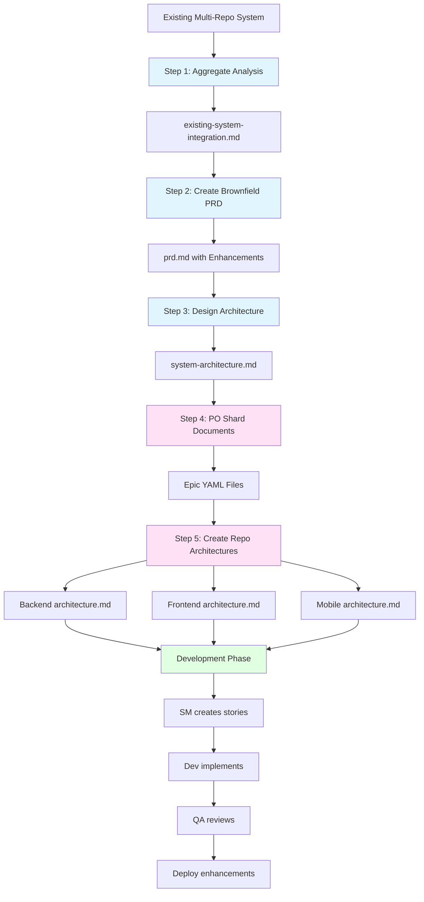

# Multi-Repository Brownfield Enhancement Guide

> **Multi-Repository Brownfield Enhancement**: Adding significant features or improvements to an existing multi-repository system.

This guide walks you through the Orchestrix workflow for planning and implementing substantial enhancements to existing multi-repository projects.

---

## 🎉 What's New in Phase 1 (v8.1.1+)

**Critical Fixes & Improvements**:

1. ✅ **`repository_id` Field Required** - Now required in `implementation_repos[]` for proper Epic-to-Repository mapping
2. ✅ **Multi-Repo Config Validator** - New tool: `node tools/utils/validate-multi-repo-config.js <product-repo-path>`
3. ✅ **Smart Dependency Checker** - Fixed path resolution bugs, supports complex repository names
4. ✅ **Repository Type Checks** - PO shard now blocks execution in wrong repository types
5. ✅ **Clearer Documentation** - Deprecated legacy workflows, improved guidance

**Breaking Changes**: None (backward compatible via fallback mode)

**Migration**: If you have existing `implementation_repos` configured, add `repository_id` field to each entry (see Step 2 configuration example below).

---

## 📋 Table of Contents

- [When to Use This Guide](#when-to-use-this-guide)
- [Overview](#overview)
- [Prerequisites](#prerequisites)
- [The 3-Step Multi-Repo Enhancement Workflow](#the-3-step-multi-repo-enhancement-workflow)
  - [Step 1: Aggregate System Analysis](#step-1-aggregate-system-analysis)
  - [Step 2: Define Enhancement Requirements](#step-2-define-enhancement-requirements)
  - [Step 3: Design Enhanced System Architecture](#step-3-design-enhanced-system-architecture)
- [After Architecture: Development Phase](#after-architecture-development-phase)
- [Document Roles Explained](#document-roles-explained)
- [Best Practices](#best-practices)
- [Example Scenario](#example-scenario)

---

## When to Use This Guide

Use this guide when you want to add **significant features** or make **substantial improvements** to an existing **multi-repository system**:

✅ **Use this workflow when**:

- You have multiple existing repositories (backend, frontend, mobile, etc.)
- Enhancement requires coordination across repositories
- Architectural planning across multiple repos is needed
- You need to understand cross-repository integration before making changes
- Changes affect API contracts between repositories

❌ **Use other workflows when**:

- Single repository project → Use [BROWNFIELD_ENHANCEMENT_GUIDE.md](./BROWNFIELD_ENHANCEMENT_GUIDE.md)
- New multi-repo project → Use [MULTI_REPO_GREENFIELD_GUIDE.md](./MULTI_REPO_GREENFIELD_GUIDE.md)
- Simple changes (1-2 stories) → Use `@po *create-epic` directly

---

## Overview

### Key Philosophy

**Multi-Repository Brownfield Enhancement follows a principled 3-step approach**:

1. **Understand Reality**: Aggregate analysis from all repositories to understand the current integrated system
2. **Define Goals**: Specify what enhancements to build based on cross-repository understanding
3. **Design Future**: Create improved system architecture that coordinates all repositories

### Why 3 Documents?

| Document                              | Purpose                      | Describes                  | Scope        |
| ------------------------------------- | ---------------------------- | -------------------------- | ------------ |
| `existing-system-integration.md`      | **Understand current state** | What EXISTS (cross-repo)   | System-level |
| `prd.md`                              | **Define what to build**     | What to ADD/CHANGE         | System-level |
| `architecture/system-architecture.md` | **Guide implementation**     | HOW to build it (improved) | System-level |

**Critical Insight**: Multi-repository projects require understanding the **integration** between repositories, not just individual repository analysis.

### Workflow Diagram



**Legend**: 🔵 Planning | 🔴 Sharding | 🟢 Development

---

## Prerequisites

**Existing System**:

- ✅ Multiple existing repositories (at least 2: e.g., backend + frontend)
- ✅ Each repository has working code
- ✅ Repositories integrate with each other (via APIs, shared data, etc.)

**Project Setup**:

- ✅ Product repository exists or will be created
- ✅ Understanding of what enhancement you want to build

**Tools**:

- 🌐 Web interface (Gemini 1M+ context) - **Highly Recommended** for analyzing multiple repos
- 💻 IDE (Claude Code, Cursor, etc.) - Acceptable but challenging with large context

---

## The 3-Step Multi-Repo Enhancement Workflow

### Step 1: Aggregate System Analysis

**Goal**: Create a unified understanding of the current multi-repository system integration.

#### 1.0: Install Orchestrix in Each Implementation Repository

**⚠️ IMPORTANT**: Each implementation repository needs Orchestrix installed before analysis.

**In each implementation repository**:

```bash
# Backend repo
cd my-app-backend
npx orchestrix install

# Frontend repo
cd ../my-app-web
npx orchestrix install

# Mobile repo
cd ../my-app-ios
npx orchestrix install
```

**Configure Each Repository**:

After installation, edit each repository's `core-config.yaml`:

**⚠️ CRITICAL**: You **MUST** change `project.mode` to `multi-repo` and set `multi_repo.role` in each implementation repository!

**Backend** (`my-app-backend/core-config.yaml`):

```yaml
project:
  name: My App Backend # Include repo type for clarity
  mode: multi-repo # ⚠️ MUST CHANGE from default 'monolith'

  multi_repo:
    role: backend # ⚠️ Set role to backend
    product_repo_path: "" # Will configure in Step 5
```

**Frontend** (`my-app-web/core-config.yaml`):

```yaml
project:
  name: My App Web
  mode: multi-repo # ⚠️ MUST CHANGE from default 'monolith'

  multi_repo:
    role: frontend # ⚠️ Set role to frontend
    product_repo_path: "" # Will configure in Step 5
```

**Native Mobile** (`my-app-ios/core-config.yaml`):

```yaml
project:
  name: My App iOS
  mode: multi-repo # ⚠️ MUST CHANGE from default 'monolith'

  multi_repo:
    role: ios # ⚠️ Set role (use 'ios' for native iOS, 'android' for native Android)
    product_repo_path: "" # Will configure in Step 5
```

**Cross-Platform Mobile** (if using Flutter/React Native):

```yaml
project:
  name: My App Mobile
  mode: multi-repo # ⚠️ MUST CHANGE from default 'monolith'

  multi_repo:
    role: mobile # ⚠️ Use 'mobile' for Flutter/React Native
    product_repo_path: "" # Will configure in Step 5
```

**💡 Configuration Tips**:

- `project.name`: Descriptive name (used in docs, not for logic)
- `project.mode`: **REQUIRED** - Use `multi-repo` for multi-repository projects
- `multi_repo.role`: **REQUIRED** - See table below for complete list
- `product_repo_path`: Leave empty for now, configure later (Step 5)

**Complete Role Reference**:

| Role        | Use Case                                | Example                         |
| ----------- | --------------------------------------- | ------------------------------- |
| `backend`   | Backend/API implementation              | Node.js, Java, Python API       |
| `frontend`  | Web frontend implementation             | React, Vue, Angular             |
| `ios`       | iOS native implementation               | Swift/SwiftUI                   |
| `android`   | Android native implementation           | Kotlin/Java                     |
| `mobile` ⭐ | **Cross-platform mobile**               | **Flutter/React Native**        |
| `shared`    | Shared library (optional)               | Common utilities across repos   |
| `admin`     | Admin dashboard (optional)              | Separate admin UI from main web |
| `product`   | Product repo (use in Product repo only) | Multi-repo coordinator          |

**Important Notes**:

- For **Flutter or React Native**, use `role: mobile` (not `ios` or `android`)
- For **native iOS**, use `role: ios`
- For **native Android**, use `role: android`
- The `product` role is only for Product repos, not implementation repos

#### 1.1: Analyze Each Implementation Repository

**In each implementation repository**:

```bash
cd my-app-backend
@architect *document-project
# Output: docs/existing-system-analysis.md
```

```bash
cd my-app-web
@architect *document-project
# Output: docs/existing-system-analysis.md
```

```bash
cd my-app-ios
@architect *document-project
# Output: docs/existing-system-analysis.md
```

**What This Does**:

- Analyzes current tech stack and architecture
- Documents existing APIs (backend provides, frontend consumes)
- Identifies technical debt
- Records current coding standards

**Output**: Each repository has `docs/existing-system-analysis.md`

#### 1.2: Create Product Repository (if not exists)

```bash
cd /path/to/projects
mkdir my-app-product
cd my-app-product
git init
npx orchestrix install
```

#### 1.3: Configure Implementation Repositories

**Step 1: Set Project Type**

Edit `core-config.yaml` in Product repository:

```yaml
project:
  name: My App
  mode: multi-repo # ⚠️ MUST be 'multi-repo'

  multi_repo:
    role: product # ⚠️ MUST be 'product' for Product repository
```

**Step 2: Configure Implementation Repositories**

In the same `core-config.yaml`, configure the `implementation_repos` section under `multi_repo`:

```yaml
project:
  mode: multi-repo
  multi_repo:
    role: product

    # Define implementation repositories
    implementation_repos:
      - repository_id: my-app-backend # ⚠️ REQUIRED: Unique ID (must match Epic YAML)
        path: ../my-app-backend # Relative or absolute path
        type: backend # Repository type
      - repository_id: my-app-web
        path: ../my-app-web
        type: frontend
      - repository_id: my-app-ios
        path: ../my-app-ios
        type: ios # Native iOS (Swift/SwiftUI)
      - repository_id: my-app-android
        path: ../my-app-android
        type: android # Native Android (Kotlin/Java)
      # OR for cross-platform mobile:
      # - repository_id: my-app-mobile
      #   path: ../my-app-mobile
      #   type: mobile # Flutter/React Native
```

**⚠️ NEW in Phase 1**: The `repository_id` field is now **required** for proper Epic-to-Repository mapping. This must match the `repository` field in Epic YAML files.

**Repository Types**:

- `backend`: Backend/API
- `frontend`: Web frontend
- `ios`: Native iOS (Swift)
- `android`: Native Android (Kotlin/Java)
- **`mobile`**: **Cross-platform (Flutter/React Native)** ⭐
- `shared`: Shared library (optional)
- `admin`: Admin dashboard (optional, if separate from main web)

**💡 Role Selection Guide**:

- **Native iOS app**: Use `role: ios`
- **Native Android app**: Use `role: android`
- **Flutter app**: Use `role: mobile` (single repo for both platforms)
- **React Native app**: Use `role: mobile` (single repo for both platforms)

**💡 Path Tips**:

- Paths are relative to Product repository
- Use `../` to go up one directory
- Example: If Product repo is at `/projects/my-app-product` and backend is at `/projects/my-app-backend`, use `../my-app-backend`

#### 1.4: Aggregate System Analysis

**In Product repository**:

```bash
@architect *aggregate-system-analysis
```

**What This Does**:

- Reads `existing-system-analysis.md` from each implementation repo
- Analyzes cross-repository integration
- Identifies API contracts (who provides, who consumes)
- Detects API alignment issues
- Documents system-level technical debt
- Highlights integration gaps

**Output**: `docs/existing-system-integration.md`

**Example Output Sections**:

```markdown
## Repository Topology

| Repository     | Type     | Responsibility | Tech Stack           |
| -------------- | -------- | -------------- | -------------------- |
| my-app-backend | backend  | REST APIs      | Node.js 20 + Express |
| my-app-web     | frontend | Web UI         | React 18 + Next.js   |
| my-app-ios     | ios      | iOS app        | Swift 5 + SwiftUI    |

## Cross-Repository API Contracts

**Backend Provides** (11 endpoints):

- POST /api/auth/login
- GET /api/tasks
- ...

**Frontend Consumes** (9 endpoints):

- ✅ POST /api/auth/login (aligned)
- ❌ GET /api/hardware/config (backend doesn't provide!)

**API Alignment**: 82% (9/11 aligned)

## Technical Debt (System-Level)

1. Backend provides unused APIs
2. Frontend token storage uses localStorage (XSS risk)
3. No API documentation (OpenAPI spec missing)
```

**Key Benefit**: You now have a complete picture of your multi-repository system integration.

---

### Step 2: Define Enhancement Requirements

**Goal**: Define WHAT to build based on your understanding of the existing integrated system.

**Agent**: `@pm`
**Command**: `*create-doc brownfield-prd`
**Output**: `docs/prd.md`

**Prerequisites**:

- ✅ **REQUIRED**: `docs/existing-system-integration.md` (from Step 1)

#### How It Works

**In Product repository**:

```bash
@pm *create-doc brownfield-prd
```

**Automatic Mode Detection**:

- PM checks `core-config.yaml` for `implementation_repos` key
- If present → **Multi-Repo Mode**: Reads `docs/existing-system-integration.md`
- If absent → Single-Repo Mode: Reads `docs/existing-system-analysis.md`

**What PM Will Do**:

1. Load existing system integration analysis
2. Ask about enhancement goals
3. Understand cross-repository constraints
4. Define requirements that respect existing integration patterns
5. Plan enhancement scope across repositories
6. Generate PRD

**Example Interaction**:

```
PM: I've loaded the existing system integration analysis. I see:
  - 3 repositories: backend (Node.js), web (React), ios (Swift)
  - 11 backend APIs, 9 consumed by clients
  - Technical debt: No OpenAPI spec, localStorage XSS risk

What enhancement do you want to build?

User: I want to add AI-powered recommendations across all platforms

PM: Based on your existing system, I recommend:
  - Backend: New /api/recommendations endpoint
  - Web: Recommendation component in React
  - iOS: Recommendation view in SwiftUI
  - Addresses technical debt by adding OpenAPI spec for new API

This requires changes in all 3 repositories. Shall I proceed?
```

**Output**: `docs/prd.md` with multi-repository enhancement plan

**PRD Includes**:

- Enhancement goals (based on existing system understanding)
- Functional requirements (FR1, FR2, ...)
- Non-functional requirements (NFR1, NFR2, ...)
- **Compatibility requirements** (CR1, CR2, ...) - Critical for brownfield
- **Repository impact assessment** (which repos need changes)
- Epic and story structure (cross-repository coordination)

---

### Step 3: Design Enhanced System Architecture

**Goal**: Design HOW to build the enhancement with **improved standards** across all repositories.

**Agent**: `@architect`
**Command**: `*create-system-architecture`
**Output**: `docs/architecture/system-architecture.md`

**Prerequisites**:

- ✅ **REQUIRED**: `docs/prd.md` (from Step 2)
- ✅ **REQUIRED**: `docs/existing-system-integration.md` (from Step 1)

#### How It Works

**In Product repository**:

```bash
@architect *create-system-architecture
```

**Automatic Mode Detection**:

- Architect checks for `existing-system-integration.md`
- If present → **Brownfield Multi-Repo Mode**
- Otherwise → Greenfield Mode

**What Architect Will Do**:

1. Load PRD and existing system integration analysis
2. Understand current repository topology and integration patterns
3. Design enhanced system architecture that:
   - **Respects existing constraints** (tech stacks, deployment)
   - **Improves upon poor practices** (adds OpenAPI, fixes security issues)
   - **Maintains compatibility** where necessary
   - **Coordinates across repositories**
4. Define improved integration patterns
5. Generate system architecture document

**Output**: `docs/architecture/system-architecture.md`

**Key Sections**:

```markdown
## Repository Topology (Enhanced)

| Repository     | Type     | New Responsibilities  | Tech Stack           | Status   |
| -------------- | -------- | --------------------- | -------------------- | -------- |
| my-app-backend | backend  | + Recommendations API | Node.js 20 + Express | Enhanced |
| my-app-web     | frontend | + Recommendation UI   | React 18 + Next.js   | Enhanced |
| my-app-ios     | ios      | + Recommendation View | Swift 5 + SwiftUI    | Enhanced |

## API Contracts Summary (New + Improved)

**New APIs**:

- GET /api/recommendations (with OpenAPI spec ✅)
- POST /api/recommendations/feedback

**Improved APIs**:

- All existing APIs now have OpenAPI spec

## Integration Strategy (Improved)

**Authentication**: JWT (existing, maintained)
**Data Format**: JSON + ISO 8601 (existing, maintained)
**API Documentation**: OpenAPI 3.0 (NEW - improvement!)
**Token Storage**:

- Web: HttpOnly cookies (IMPROVED from localStorage)
- iOS: Keychain (existing, maintained)

## Deployment Architecture (Enhanced)

[Defines deployment strategy for enhancements]

## Cross-Cutting Concerns (Improved)

[Defines improved security, performance, observability]
```

**Key Benefit**: You now have a coordinated architecture that improves upon the existing system while maintaining compatibility.

---

## After Architecture: Development Phase

Once you have the enhanced system architecture, proceed with standard Orchestrix development workflow:

### Step 4: Shard System Documents (Product Repo Only)

**Agent**: `@po`
**Command**: `*shard`
**Location**: **Product repository** (not implementation repos)

```bash
# In Product repository
@po *shard
```

**What This Does**:

- ✅ Shards `docs/prd.md` → `docs/prd/epic-*.yaml` (multi-repo format)
- ✅ Shards `docs/architecture/system-architecture.md` → Multiple system-level architecture files
- ⚠️ **Does NOT** shard implementation repository architectures (those are sharded separately in each repo)

**Important Clarifications**:

1. **What gets sharded here**: Only **system-level** documents in Product repo
2. **What does NOT get sharded**: Implementation repository architectures (backend/frontend/mobile)
3. **Why separate**: System architecture coordinates all repos; implementation architectures detail execution
4. **Timing**: Run this **after** creating system-architecture.md, **before** creating implementation architectures

**Output** (in Product repo):

```
docs/
├── prd/
│   ├── epic-1.yaml           # ⭐ Multi-repo epic format (cross-repo dependencies)
│   └── epic-2.yaml
└── architecture/
    ├── 00-system-overview.md      # ⭐ System-level coordination docs
    ├── 01-repository-topology.md  # Which repos exist, how they relate
    ├── 02-api-contracts.md        # Cross-repo API contracts
    ├── 03-integration-strategy.md # Auth, data formats, error handling
    ├── 04-deployment.md           # Deployment coordination
    └── 05-cross-cutting-concerns.md # Security, performance, observability
```

**Next**: Create detailed implementation architectures for each repository (Step 5)

### Step 5: Create Repository-Specific Architectures

**For each implementation repository**, configure Product repo link and create detailed architecture:

#### Step 5.1: Configure Product Repo Link (Each Repo)

**⚠️ REQUIRED**: Before creating implementation architectures, link each repo to Product repo.

**Backend Repository** (`my-app-backend/core-config.yaml`):

```yaml
project:
  name: My App Backend
  mode: multi-repo

  multi_repo:
    role: backend
    product_repo_path: ../my-app-product # ⚠️ Relative path to Product repo
```

**Frontend Repository** (`my-app-web/core-config.yaml`):

```yaml
project:
  name: My App Web
  mode: multi-repo

  multi_repo:
    role: frontend
    product_repo_path: ../my-app-product
```

**Mobile Repository** (`my-app-ios/core-config.yaml`):

```yaml
project:
  name: My App iOS
  mode: multi-repo

  multi_repo:
    role: ios
    product_repo_path: ../my-app-product
```

**💡 Path Configuration**:

- Use **relative path** from implementation repo to Product repo
- Example: If repos are siblings (`/projects/my-app-backend` and `/projects/my-app-product`), use `../my-app-product`
- Verify with: `ls $PRODUCT_REPO_PATH` should show Product repo contents

#### Step 5.2: Create Implementation Architectures

**Backend Repository**:

```bash
cd my-app-backend
@architect *create-backend-architecture
# Reads: ../my-app-product/docs/architecture/system-architecture.md
# Output: docs/architecture.md (backend-specific)
```

**Frontend Repository**:

```bash
cd my-app-web
@architect *create-frontend-architecture
# Reads: ../my-app-product/docs/architecture/system-architecture.md
# Output: docs/architecture.md (frontend-specific)
```

**Mobile Repository**:

```bash
cd my-app-ios
@architect *create-mobile-architecture
# Reads: ../my-app-product/docs/architecture/system-architecture.md
# Output: docs/architecture.md (ios-specific)
```

**What This Does**:

- Reads system-architecture.md from Product repo (via `product_repo.path`)
- Extracts relevant parts for this specific repository
- Generates detailed implementation architecture
- Includes improved coding standards from Step 3

#### Step 5.3: Shard Implementation Architectures (Each Repo)

**After creating implementation architectures**, shard them in each repository:

#### In Backend Repository:

```bash
cd my-app-backend

# Shard backend architecture
@po *shard
# Output: docs/architecture/*.md (backend-specific sections)
```

#### In Frontend Repository:

```bash
cd my-app-web

# Shard frontend architecture
@po *shard
# Output: docs/architecture/*.md (frontend-specific sections)
```

#### In Mobile Repository:

```bash
cd my-app-ios

# Shard mobile architecture
@po *shard
# Output: docs/architecture/*.md (ios-specific sections)
```

**What Gets Sharded**:

```
# Backend repo after sharding
docs/architecture/
├── 00-architecture-overview.md
├── 01-tech-stack.md
├── 02-source-tree.md
├── 03-coding-standards.md        # ⭐ Dev auto-loads
├── 04-component-architecture.md  # Controllers, services, repos
├── 05-database-schema.md         # Tables, relationships
├── 06-api-endpoints.md           # Detailed API specs
└── 07-testing-strategy.md

# Frontend repo after sharding
docs/architecture/
├── 00-architecture-overview.md
├── 01-tech-stack.md
├── 02-source-tree.md
├── 03-coding-standards.md        # ⭐ Dev auto-loads
├── 04-component-architecture.md  # React components, state
├── 05-routing.md                 # Routes, navigation
├── 06-api-integration.md         # API client, hooks
└── 07-testing-strategy.md
```

**Why This Step Matters**:

- Dev agents **automatically load** sharded architecture files (especially `coding-standards.md`, `tech-stack.md`, `source-tree.md`)
- Makes architecture easier to consume (smaller files)
- Each repository has its own detailed implementation guidance

### Step 6: Create Stories

**In Product repository** (for cross-repository coordination):

```bash
@sm *create-next-story
```

**Or in each implementation repository** (for repository-specific stories):

```bash
cd my-app-backend
@sm *create-next-story

cd my-app-web
@sm *create-next-story
```

SM will create stories based on epics, respecting repository boundaries.

### Step 7: Implement and Review

**Standard Dev/QA Cycle** (in each implementation repository):

```bash
# In my-app-backend
@dev *implement {story_id}
@qa *review {story_id}

# In my-app-web
@dev *implement {story_id}
@qa *review {story_id}
```

**Critical**: Dev agents automatically load the **improved** architecture from each repository's `docs/architecture/` (sharded files).

---

## Document Roles Explained

### 📄 `existing-system-integration.md` (Product Repo)

**Role**: System-level integration analysis
**Path**: Product repo `docs/existing-system-integration.md`
**Content**: Current state of multi-repository integration (as-is)
**Sharded?**: ❌ No (intermediate analysis document)
**Dev Loads?**: ❌ No
**Used By**: PM (Step 2), Architect (Step 3)
**Scope**: System-wide (all repositories)

**Example Content**:

- Repository Topology (which repos exist, what they do)
- Cross-Repository API Contracts (API alignment analysis)
- Integration Patterns (auth, data formats, error handling)
- Technical Debt (system-level issues)
- Deployment Architecture (current state)

### 📄 `existing-system-analysis.md` (Implementation Repos)

**Role**: Individual repository analysis
**Path**: Each implementation repo `docs/existing-system-analysis.md`
**Content**: Current state of single repository (as-is)
**Sharded?**: ❌ No
**Dev Loads?**: ❌ No
**Used By**: Architect (for aggregation in Step 1)
**Scope**: Single repository

**Example Content** (from backend repo):

- Tech Stack: Node.js 20, Express 4, PostgreSQL 15
- APIs Provided: 11 endpoints (listed)
- Technical Debt: No tests, no API docs
- Coding Standards: No linter, inconsistent naming

### 📄 `prd.md` (Product Repo)

**Role**: Requirements document
**Path**: Product repo `docs/prd.md`
**Content**: What to build (multi-repository enhancement plan)
**Sharded?**: ✅ Yes → `docs/prd/epic-*.yaml`
**Dev Loads?**: ❌ No (PO and SM use it)
**Used By**: Architect (Step 3), PO (sharding), SM (story creation)
**Scope**: System-wide

**Example Content**:

- Enhancement goals (AI recommendations)
- Functional requirements (FR1, FR2, ...)
- Repository impact assessment (backend + web + ios)
- Epics and stories (cross-repository coordination)

### 📄 `architecture/system-architecture.md` (Product Repo)

**Role**: **Final system-level architecture** with improvements
**Path**: Product repo `docs/architecture/system-architecture.md`
**Content**: How to build enhancement (improved, coordinated)
**Sharded?**: ✅ Yes → Multiple files
**Dev Loads?**: ❌ No (used to generate repo-specific architectures)
**Used By**: Architect (for creating repo-specific architectures)
**Scope**: System-wide coordination

**Example Content**:

- Repository Topology (enhanced)
- API Contracts Summary (new + improved)
- Integration Strategy (improved patterns)
- Deployment Architecture (enhanced)
- Cross-Cutting Concerns (improved security, performance)

### 📄 `architecture.md` (Implementation Repos)

**Role**: Detailed implementation architecture for specific repository
**Path**: Each implementation repo `docs/architecture.md`
**Content**: How to implement changes in THIS repository
**Sharded?**: ✅ Yes → `docs/architecture/*.md`
**Dev Loads?**: ✅ **YES** (Dev automatically loads sharded files)
**Used By**: Dev (implementation), QA (review)
**Scope**: Single repository

**Example Content** (backend repo):

- Tech Stack (for this repo)
- API Endpoints (detailed request/response schemas)
- Database Schema (tables, relationships)
- Component Architecture (controllers, services, repositories)
- Improved Coding Standards (ESLint, tests, OpenAPI)

**Key Difference**: System architecture coordinates; implementation architecture details execution.

---

## Best Practices

### 1. Always Follow the 3-Step Sequence

```
Step 1 (System Analysis) → Step 2 (PRD) → Step 3 (System Architecture)
```

**Why**: Each step depends on previous steps. Skipping breaks the workflow.

### 2. Use Web Interface for Step 1

**Recommendation**: Use Gemini (1M+ tokens) or Claude Web for Step 1 (aggregation).

**Why**: Analyzing multiple repositories requires large context window.

### 3. Be Honest in Step 1

Document reality, not aspirations:

- ✅ "API alignment: 60% (6/10 APIs unused)" (honest)
- ❌ "API alignment: Perfect" (wishful thinking)

### 4. Improve in Step 3

Use Step 3 to define better standards:

- Existing: "No API docs" → Architecture: "OpenAPI 3.0 spec for all APIs"
- Existing: "localStorage tokens" → Architecture: "HttpOnly cookies"
- Existing: "No integration tests" → Architecture: "Cross-repo integration test suite"

### 5. Coordinate Deployment

Plan deployment order across repositories:

```markdown
## Deployment Strategy (in system-architecture.md)

**Deployment Order**:

1. Backend: Deploy new /api/recommendations endpoint (backward compatible)
2. Web: Deploy recommendation UI (consumes new API)
3. iOS: Deploy recommendation view (consumes new API)

**Rollback Strategy**: Backend API is backward compatible, can rollback clients independently
```

### 6. Maintain API Compatibility

Define API versioning strategy:

```markdown
## API Versioning (in system-architecture.md)

**Strategy**: Additive changes only (v1 maintained for backward compatibility)

- v1 endpoints: Existing, maintained
- v2 endpoints: New recommendations API
```

---

## Example Scenario

### Scenario: Adding AI Recommendations to E-Commerce System

**Existing System**:

- `ecommerce-backend` (Node.js + Express + PostgreSQL)
- `ecommerce-web` (React + Next.js)
- `ecommerce-ios` (Swift + SwiftUI)

**Enhancement Goal**: Add AI-powered product recommendations

**Workflow**:

#### Step 1: System Analysis

```bash
# Install Orchestrix in each repo
cd ecommerce-backend
npx orchestrix install
# Edit core-config.yaml: mode: multi-repo, role: backend, product_repo_path: ""
@architect *document-project

cd ../ecommerce-web
npx orchestrix install
# Edit core-config.yaml: mode: multi-repo, role: frontend, product_repo_path: ""
@architect *document-project

cd ../ecommerce-ios
npx orchestrix install
# Edit core-config.yaml: mode: multi-repo, role: ios, product_repo_path: ""
@architect *document-project

# Create Product repo
cd ..
mkdir ecommerce-product
cd ecommerce-product
npx orchestrix install

# Configure
cat > core-config.yaml << EOF
project:
  name: E-Commerce Platform
  mode: multi-repo
  multi_repo:
    role: product
    implementation_repos:
      - repository_id: ecommerce-backend
        path: ../ecommerce-backend
        type: backend
      - repository_id: ecommerce-web
        path: ../ecommerce-web
        type: frontend
      - repository_id: ecommerce-ios
        path: ../ecommerce-ios
        type: ios
EOF

# Aggregate
@architect *aggregate-system-analysis
# Output: docs/existing-system-integration.md
```

**Result**: You discover:

- Backend provides 23 APIs
- Web consumes 20 APIs (3 unused)
- iOS consumes 18 APIs (5 unused)
- No API documentation
- Web uses localStorage (security issue)

#### Step 2: Define PRD

```bash
@pm *create-doc brownfield-prd
```

**PM asks**: "What enhancement?"

**You answer**: "Add AI recommendations"

**PM generates PRD**:

```markdown
## Epic 1: AI Recommendations (Cross-Repository)

**Repository Impact**:

- Backend: New ML service + API endpoints
- Web: Recommendation components
- iOS: Recommendation views

**Stories**:

- 1.1 (Backend): Design recommendations API (OpenAPI spec ✅)
- 1.2 (Backend): Implement ML recommendation service
- 1.3 (Web): Create recommendation component
- 1.4 (iOS): Create recommendation view
- 1.5 (Integration): End-to-end integration test

**Improvements** (addresses technical debt):

- Add OpenAPI spec for all APIs
- Migrate Web from localStorage to HttpOnly cookies
```

#### Step 3: System Architecture

```bash
@architect *create-system-architecture
```

**Architect generates**:

```markdown
## API Contracts Summary (Enhanced)

**New Endpoints**:

- GET /api/v2/recommendations (with OpenAPI spec)
- POST /api/v2/recommendations/feedback

**Improved Endpoints**:

- All v1 endpoints now have OpenAPI spec (improvement)

## Integration Strategy (Improved)

**Token Storage**:

- Web: HttpOnly cookies (IMPROVED from localStorage ✅)
- iOS: Keychain (maintained)

## Coding Standards (Improved)

**Backend**:

- NEW: OpenAPI spec for all endpoints
- NEW: Integration test coverage ≥ 80%

**Web**:

- NEW: Security: No localStorage for tokens
- Maintained: React + TypeScript
```

#### Step 4-7: Implementation

```bash
# Shard system docs (in Product repo)
@po *shard

# Configure product_repo.path in each implementation repo
cd ../ecommerce-backend
# Edit core-config.yaml:
#   mode: multi-repo
#   multi_repo:
#     role: backend
#     product_repo_path: ../ecommerce-product
@architect *create-backend-architecture
@po *shard  # Shard backend architecture

cd ../ecommerce-web
# Edit core-config.yaml:
#   mode: multi-repo
#   multi_repo:
#     role: frontend
#     product_repo_path: ../ecommerce-product
@architect *create-frontend-architecture
@po *shard  # Shard frontend architecture

cd ../ecommerce-ios
# Edit core-config.yaml:
#   mode: multi-repo
#   multi_repo:
#     role: ios
#     product_repo_path: ../ecommerce-product
@architect *create-mobile-architecture
@po *shard  # Shard mobile architecture

# Create stories and implement
cd ../ecommerce-backend
@sm *create-next-story
@dev *implement 1.1
@qa *review 1.1
```

**Result**: AI recommendations deployed across all platforms with improved integration standards!

---

## Related Guides

- **Single-Repository Brownfield**: See [BROWNFIELD_ENHANCEMENT_GUIDE.md](./BROWNFIELD_ENHANCEMENT_GUIDE.md)
- **Multi-Repository Greenfield**: See [MULTI_REPO_GREENFIELD_GUIDE.md](./MULTI_REPO_GREENFIELD_GUIDE.md)
- **General Brownfield**: See [04-Brownfield 开发指南.md](./04-Brownfield%20开发指南.md)

---

**🎉 Ready to enhance your multi-repo system? Start with Step 1: Analyze each repository with `@architect *document-project`**
