# 🎯 Smart Locker 项目 - Brownfield Multi-Repo 配置指南

> **版本**: v1.0 | **适用于**: Orchestrix v10.3.0+ | **最后更新**: 2025-11-15

---

## 📊 项目结构概览

```
/Users/dorayo/Codes/smart-locker/
├── smart-locker-product/    # Product Repo (规划/协调)
├── java-server/             # Backend Repo (Java 微服务)
├── locker_app/             # Android Repo (柜子一体机)
└── web-admin/              # Frontend Repo (Web 管理后台)
```

**关键特征**:

- ✅ 多仓库（Multi-Repo）模式
- ✅ 现有系统（Brownfield）增强
- ✅ 跨仓库协调需求

---

## ⚠️ 重要前提条件

在开始之前，请确保：

1. **Node.js 版本**: ≥ 20.0.0 (`node --version`)
2. **网络环境**: 可访问 npm registry
3. **仓库状态**: 所有仓库代码已提交（避免冲突）
4. **时间预估**: 完整配置约需 30-45 分钟

---

## 📋 Phase 1: 仓库配置（10 分钟）

### Step 1.1: 安装 Orchestrix 到各实现仓库

**⚠️ CRITICAL**: 必须先在各实现仓库安装 Orchestrix，再创建 Product Repo。

#### 在 Backend 仓库安装

```bash
cd /Users/dorayo/Codes/smart-locker/java-server

# 安装 Orchestrix
npx orchestrix@latest install

# 验证安装
ls -la .orchestrix-core/core-config.yaml
```

#### 在 Android 仓库安装

```bash
cd /Users/dorayo/Codes/smart-locker/locker_app

# 安装 Orchestrix
npx orchestrix@latest install

# 验证安装
ls -la .orchestrix-core/core-config.yaml
```

#### 在 Web 仓库安装

```bash
cd /Users/dorayo/Codes/smart-locker/web-admin

# 安装 Orchestrix
npx orchestrix@latest install

# 验证安装
ls -la .orchestrix-core/core-config.yaml
```

**安装后验证**:

```bash
# 检查三个仓库都已安装
ls /Users/dorayo/Codes/smart-locker/java-server/.orchestrix-core/core-config.yaml
ls /Users/dorayo/Codes/smart-locker/locker_app/.orchestrix-core/core-config.yaml
ls /Users/dorayo/Codes/smart-locker/web-admin/.orchestrix-core/core-config.yaml
```

---

### Step 1.2: 配置各实现仓库为 Multi-Repo 模式

**⚠️ CRITICAL**: 默认安装后是 `monolith` 模式，**必须**手动修改为 `multi-repo` 模式！

#### Backend 配置 (java-server)

```bash
cd /Users/dorayo/Codes/smart-locker/java-server
vi .orchestrix-core/core-config.yaml
```

**修改内容**:

```yaml
project:
  name: Smart Locker Backend # 描述性名称
  mode: multi-repo # ⚠️ 从 monolith 改为 multi-repo

  multi_repo:
    role: backend # ⚠️ 设置为 backend
    repository_id: smart-locker-backend # 唯一标识符
    product_repo_path: "" # 暂时留空，Step 3 配置
    auto_filter_stories: false
    assigned_stories: []
```

#### Android 配置 (locker_app)

```bash
cd /Users/dorayo/Codes/smart-locker/locker_app
vi .orchestrix-core/core-config.yaml
```

**修改内容**:

```yaml
project:
  name: Smart Locker Android App
  mode: multi-repo # ⚠️ 从 monolith 改为 multi-repo

  multi_repo:
    role: android # ⚠️ 设置为 android
    repository_id: smart-locker-android
    product_repo_path: "" # 暂时留空，Step 3 配置
    auto_filter_stories: false
    assigned_stories: []
```

#### Web 配置 (web-admin)

```bash
cd /Users/dorayo/Codes/smart-locker/web-admin
vi .orchestrix-core/core-config.yaml
```

**修改内容**:

```yaml
project:
  name: Smart Locker Web Admin
  mode: multi-repo # ⚠️ 从 monolith 改为 multi-repo

  multi_repo:
    role: frontend # ⚠️ 设置为 frontend
    repository_id: smart-locker-web
    product_repo_path: "" # 暂时留空，Step 3 配置
    auto_filter_stories: false
    assigned_stories: []
```

**配置后验证**:

```bash
# 检查 Backend
grep "mode:" /Users/dorayo/Codes/smart-locker/java-server/.orchestrix-core/core-config.yaml
# 应输出: mode: multi-repo

# 检查 Android
grep "mode:" /Users/dorayo/Codes/smart-locker/locker_app/.orchestrix-core/core-config.yaml
# 应输出: mode: multi-repo

# 检查 Web
grep "mode:" /Users/dorayo/Codes/smart-locker/web-admin/.orchestrix-core/core-config.yaml
# 应输出: mode: multi-repo
```

---

### Step 1.3: 创建并配置 Product Repo

#### 创建 Product Repo

```bash
cd /Users/dorayo/Codes/smart-locker

# 创建 Product Repo 目录
mkdir smart-locker-product
cd smart-locker-product

# 初始化 Git
git init

# 安装 Orchestrix
npx orchestrix@latest install
```

#### 配置 Product Repo

```bash
vi .orchestrix-core/core-config.yaml
```

**完整配置内容**:

```yaml
project:
  name: Smart Locker System
  mode: multi-repo # ⚠️ MUST be multi-repo

  multi_repo:
    role: product # ⚠️ MUST be product
    repository_id: "" # Product repo 通常不需要

    # 配置所有实现仓库
    implementation_repos:
      - repository_id: smart-locker-backend # ⚠️ 必须与实现仓库的 repository_id 一致
        path: ../java-server # 相对路径
        type: backend

      - repository_id: smart-locker-android
        path: ../locker_app
        type: android

      - repository_id: smart-locker-web
        path: ../web-admin
        type: frontend

# 保持其他配置默认
prd:
  prdFile: docs/prd.md
  prdSharded: false
  prdShardedLocation: docs/prd

architecture:
  architectureFile: docs/system-architecture.md
  architectureSharded: false
  architectureShardedLocation: docs/architecture
  storyReviewsLocation: docs/architecture/story-reviews

devStoryLocation: docs/stories
```

**配置验证**:

```bash
cd /Users/dorayo/Codes/smart-locker/smart-locker-product

# 验证配置语法
yq eval '.' .orchestrix-core/core-config.yaml

# 验证路径
ls -ld ../java-server ../locker_app ../web-admin
# 应显示三个目录
```

---

## 📋 Phase 2: 系统分析（10-15 分钟）

### Step 2.1: 分析各实现仓库

**推荐环境**: 使用 Gemini Web (1M+ 上下文) 或 Claude Web

#### 分析 Backend (java-server)

```bash
cd /Users/dorayo/Codes/smart-locker/java-server

# 使用 Architect agent 分析现有代码
@architect *document-project
```

**Architect 会做什么**:

- 扫描 Java 代码结构（Spring Boot 项目）
- 识别现有 REST API 端点
- 分析数据库模型（JPA entities）
- 记录现有技术栈（Java, Spring Boot, MySQL 等）
- 识别技术债务

**输出**: `docs/existing-system-analysis.md`

**验证输出**:

```bash
ls -la docs/existing-system-analysis.md
# 文件应存在且大小 > 0
```

#### 分析 Android (locker_app)

```bash
cd /Users/dorayo/Codes/smart-locker/locker_app

# 使用 Architect agent 分析
@architect *document-project
```

**Architect 会分析**:

- Android 项目结构（Activities, Fragments, ViewModels）
- API 调用（消费的后端接口）
- 本地存储（SQLite, SharedPreferences）
- 现有技术栈（Kotlin/Java, Android SDK, 第三方库）

**输出**: `docs/existing-system-analysis.md`

#### 分析 Web (web-admin)

```bash
cd /Users/dorayo/Codes/smart-locker/web-admin

# 使用 Architect agent 分析
@architect *document-project
```

**Architect 会分析**:

- 前端框架（React, Vue, Angular 等）
- API 调用（消费的后端接口）
- 路由结构
- 状态管理
- 现有技术栈

**输出**: `docs/existing-system-analysis.md`

---

### Step 2.2: 聚合系统分析（Product Repo）

**⚠️ IMPORTANT**: 必须在 **Product Repo** 执行此步骤！

```bash
cd /Users/dorayo/Codes/smart-locker/smart-locker-product

# 聚合所有实现仓库的分析
@architect *aggregate-system-analysis
```

**Architect 会做什么**:

1. 读取三个实现仓库的 `docs/existing-system-analysis.md`
2. 提取跨仓库集成信息：
   - Backend 提供的 API 列表
   - Android 消费的 API 列表
   - Web 消费的 API 列表
3. 进行 API 契约对齐分析
4. 识别跨仓库技术债务
5. 生成系统级集成分析文档

**输出**: `docs/existing-system-integration.md`

**典型输出内容**:

```markdown
## Repository Topology

| Repository  | Type     | Responsibility | Tech Stack              |
| ----------- | -------- | -------------- | ----------------------- |
| java-server | backend  | REST APIs      | Java 17 + Spring Boot 3 |
| locker_app  | android  | 柜子一体机     | Kotlin + Android SDK 33 |
| web-admin   | frontend | Web 管理后台   | React 18 + TypeScript   |

## Cross-Repository API Contracts

**Backend Provides** (23 endpoints):

- POST /api/auth/login
- GET /api/lockers
- POST /api/lockers/{id}/open
- ...

**Android Consumes** (18 endpoints):

- ✅ POST /api/auth/login
- ✅ GET /api/lockers
- ✅ POST /api/lockers/{id}/open
- ...

**Web Consumes** (15 endpoints):

- ✅ POST /api/auth/login
- ✅ GET /api/lockers
- ❌ POST /api/hardware/config (Backend 未提供!)
- ...

**API Alignment**: 85% (20/23 aligned)

## Technical Debt (System-Level)

1. **API 文档缺失**: 无 OpenAPI 规范
2. **认证不一致**: Android 使用 JWT，Web 使用 Session
3. **错误处理不统一**: 不同错误码格式
```

**验证输出**:

```bash
cat docs/existing-system-integration.md | grep "Repository Topology"
# 应显示仓库拓扑表
```

---

## 📋 Phase 3: 创建 Brownfield PRD（5-10 分钟）

### Step 3.1: 使用 PM Agent 创建 PRD

**⚠️ IMPORTANT**: 必须在 **Product Repo** 执行！

```bash
cd /Users/dorayo/Codes/smart-locker/smart-locker-product

# 使用 PM agent 创建 Brownfield PRD
@pm *create-doc brownfield-prd
```

**PM 会做什么**:

1. **自动检测模式**: 发现 `docs/existing-system-integration.md` 存在 → Multi-Repo Brownfield 模式
2. **加载系统分析**: 读取并理解现有系统集成状态
3. **与你交互**:
   - 询问增强目标（例如："添加智能推荐功能"）
   - 询问影响的仓库（Backend + Android + Web）
   - 确认需求优先级
4. **生成 PRD**: 包含跨仓库协调的增强计划

**典型交互示例**:

```
PM: 我已加载现有系统集成分析。当前系统:
  - 3 个仓库: Backend (Java), Android (Kotlin), Web (React)
  - 23 个 Backend API，API 对齐度 85%
  - 技术债: 无 API 文档、认证不一致

你想要添加什么增强功能？

User: 添加智能柜子使用分析和推荐功能

PM: 基于现有系统，我建议:
  - Backend: 新增 /api/analytics 和 /api/recommendations 端点
  - Android: 添加推荐显示界面
  - Web: 添加分析仪表板
  - 同时解决技术债: 为所有 API 添加 OpenAPI 文档

这需要修改所有 3 个仓库。是否继续？

User: 是

PM: 正在生成 PRD...
```

**输出**: `docs/prd.md`

**PRD 关键内容**:

```markdown
## Epic 1: 智能分析与推荐系统

**Epic Summary**: 添加智能柜子使用分析和推荐功能到现有系统

**Target Repositories**: backend, android, frontend

**Integration Notes**: 基于现有 REST API 架构扩展，保持向后兼容

\`\`\`yaml
epic_id: 1
title: "智能分析与推荐系统"
description: |
为现有智能柜系统添加使用分析和推荐功能。
Backend 提供新的分析和推荐 API。
Android 和 Web 消费这些 API 展示数据。

stories:

- id: "1.1"
  title: "Backend - 分析数据收集 API"
  repository_type: backend # ⚠️ 用于 SM 过滤故事
  acceptance_criteria_summary: |
  新增 POST /api/analytics/events 端点收集使用事件。
  支持批量上传。遵循现有 API 认证机制。
  添加 OpenAPI 3.0 规范文档。
  estimated_complexity: medium
  priority: P0
  provides_apis:
  - "POST /api/analytics/events"
  - "GET /api/analytics/summary"
    consumes_apis: []
    cross_repo_dependencies: []

- id: "1.2"
  title: "Backend - 推荐算法服务"
  repository_type: backend
  acceptance_criteria_summary: |
  实现基于使用数据的推荐算法。
  新增 GET /api/recommendations 端点。
  返回个性化柜子推荐。
  estimated_complexity: high
  priority: P0
  provides_apis:
  - "GET /api/recommendations"
    consumes_apis:
  - "GET /api/analytics/summary"
    cross_repo_dependencies:
  - "1.1 - 分析数据收集必须先完成"

- id: "1.3"
  title: "Android - 推荐显示界面"
  repository_type: android # ⚠️ Android repo 的 SM 只会看到这个故事
  acceptance_criteria_summary: |
  在主界面添加推荐卡片。
  调用 /api/recommendations 获取数据。
  遵循现有 UI 设计规范。
  本地缓存推荐结果。
  estimated_complexity: medium
  priority: P0
  provides_apis: []
  consumes_apis:
  - "GET /api/recommendations"
    cross_repo_dependencies:
  - "1.2 - Backend 推荐 API 必须先部署"

- id: "1.4"
  title: "Web - 分析仪表板"
  repository_type: frontend # ⚠️ Web repo 的 SM 只会看到这个故事
  acceptance_criteria_summary: |
  创建分析仪表板页面。
  调用 /api/analytics/summary 展示数据。
  使用图表库可视化数据。
  遵循现有 React 组件结构。
  estimated_complexity: medium
  priority: P1
  provides_apis: []
  consumes_apis: - "GET /api/analytics/summary"
  cross_repo_dependencies: - "1.1 - Backend 分析 API 必须先部署"
  \`\`\`
```

**验证输出**:

```bash
cat docs/prd.md | grep "epic_id:"
# 应显示 epic YAML 块
```

---

## 📋 Phase 4: 创建系统架构（5-10 分钟）

### Step 4.1: 使用 Architect 创建系统架构

**⚠️ IMPORTANT**: 必须在 **Product Repo** 执行！

```bash
cd /Users/dorayo/Codes/smart-locker/smart-locker-product

# 创建系统级架构
@architect *create-system-architecture
```

**Architect 会做什么**:

1. **自动检测模式**: 发现 `docs/existing-system-integration.md` → Brownfield Multi-Repo
2. **加载文档**:
   - `docs/prd.md` (需求)
   - `docs/existing-system-integration.md` (现状)
3. **设计架构**:
   - 尊重现有约束（Java, Kotlin, React 技术栈）
   - 改进不良实践（添加 API 文档，统一认证）
   - 定义新增功能架构
   - 协调跨仓库集成
4. **生成文档**: `docs/system-architecture.md`

**输出**: `docs/system-architecture.md`

**典型内容**:

```markdown
## Repository Topology (Enhanced)

| Repository  | Type     | New Responsibilities                     | Tech Stack              | Status   |
| ----------- | -------- | ---------------------------------------- | ----------------------- | -------- |
| java-server | backend  | + Analytics API<br>+ Recommendations API | Java 17 + Spring Boot 3 | Enhanced |
| locker_app  | android  | + Recommendation UI                      | Kotlin + Android SDK 33 | Enhanced |
| web-admin   | frontend | + Analytics Dashboard                    | React 18 + TypeScript   | Enhanced |

## API Contracts Summary (New + Improved)

**New APIs**:

- POST /api/analytics/events (with OpenAPI spec ✅)
- GET /api/analytics/summary (with OpenAPI spec ✅)
- GET /api/recommendations (with OpenAPI spec ✅)

**Improved APIs**:

- All existing APIs now have OpenAPI 3.0 spec (improvement!)

## Integration Strategy (Improved)

**Authentication**:

- Current: JWT (Backend → Android), Session (Backend → Web)
- Improved: **Unified JWT for all clients** (better consistency)

**API Documentation**:

- Current: None
- Improved: **OpenAPI 3.0 spec for all endpoints**

**Error Handling**:

- Current: Inconsistent error codes
- Improved: **RFC 7807 Problem Details for HTTP APIs**

## Deployment Architecture (Enhanced)

**Deployment Order**:

1. Backend: Deploy analytics + recommendations APIs (backward compatible)
2. Android: Deploy recommendation UI (consumes new API)
3. Web: Deploy analytics dashboard (consumes new API)

**Rollback Strategy**:

- Backend APIs are additive, can rollback clients independently
- Feature flags control new UI visibility
```

**验证输出**:

```bash
cat docs/system-architecture.md | grep "Repository Topology"
# 应显示增强后的仓库拓扑
```

---

## 📋 Phase 5: 文档分片（2 分钟）

### Step 5.1: 分片系统文档（Product Repo）

**⚠️ IMPORTANT**: 只在 **Product Repo** 分片系统级文档！

```bash
cd /Users/dorayo/Codes/smart-locker/smart-locker-product

# 分片 PRD 和 System Architecture
@po *shard
```

**PO 会做什么**:

1. 检测仓库类型: `project.mode = multi-repo` AND `role = product` → 正确
2. 分片 `docs/prd.md` → `docs/prd/*.md`（保留 epic YAML 块）
3. 分片 `docs/system-architecture.md` → `docs/architecture/*.md`
4. 更新 `core-config.yaml` 的分片状态

**输出结构**:

```
smart-locker-product/
└── docs/
    ├── prd/
    │   ├── 01-intro-analysis.md
    │   ├── 02-requirements.md
    │   ├── 03-epic-planning.md      # ⚠️ 包含 epic YAML 块
    │   └── 04-appendix.md
    └── architecture/
        ├── 00-system-overview.md
        ├── 01-repository-topology.md
        ├── 02-api-contracts.md
        ├── 03-integration-strategy.md
        ├── 04-deployment.md
        └── 05-cross-cutting-concerns.md
```

**验证输出**:

```bash
ls docs/prd/
# 应显示 4 个 md 文件

ls docs/architecture/
# 应显示 6 个 md 文件

cat docs/prd/03-epic-planning.md | grep "epic_id:"
# 应显示 epic YAML 块被保留
```

---

## 📋 Phase 6: 创建实现架构（10-15 分钟）

### Step 6.1: 配置实现仓库链接到 Product Repo

**⚠️ CRITICAL**: 必须先配置 `product_repo_path`，才能创建实现架构！

#### Backend 配置

```bash
cd /Users/dorayo/Codes/smart-locker/java-server
vi .orchestrix-core/core-config.yaml
```

**修改 `product_repo_path`**:

```yaml
project:
  name: Smart Locker Backend
  mode: multi-repo

  multi_repo:
    role: backend
    repository_id: smart-locker-backend
    product_repo_path: ../smart-locker-product # ⚠️ 设置相对路径
    auto_filter_stories: false
    assigned_stories: []
```

#### Android 配置

```bash
cd /Users/dorayo/Codes/smart-locker/locker_app
vi .orchestrix-core/core-config.yaml
```

**修改 `product_repo_path`**:

```yaml
project:
  name: Smart Locker Android App
  mode: multi-repo

  multi_repo:
    role: android
    repository_id: smart-locker-android
    product_repo_path: ../smart-locker-product # ⚠️ 设置相对路径
    auto_filter_stories: false
    assigned_stories: []
```

#### Web 配置

```bash
cd /Users/dorayo/Codes/smart-locker/web-admin
vi .orchestrix-core/core-config.yaml
```

**修改 `product_repo_path`**:

```yaml
project:
  name: Smart Locker Web Admin
  mode: multi-repo

  multi_repo:
    role: frontend
    repository_id: smart-locker-web
    product_repo_path: ../smart-locker-product # ⚠️ 设置相对路径
    auto_filter_stories: false
    assigned_stories: []
```

**验证配置**:

```bash
# 从各实现仓库验证能否访问 Product Repo
ls ../smart-locker-product/docs/architecture/
# 应显示 system-architecture 的分片文件
```

---

### Step 6.2: 创建各仓库详细架构

#### Backend Architecture

```bash
cd /Users/dorayo/Codes/smart-locker/java-server

# 创建 Backend 详细架构
@architect *create-backend-architecture
```

**Architect 会做什么**:

1. 读取 Product Repo 的 `docs/architecture/system-architecture.md`
2. 提取与 Backend 相关的部分
3. 生成 Java/Spring Boot 详细实现架构
4. 包含改进的编码标准

**输出**: `docs/architecture.md`

**典型内容**:

```markdown
## Tech Stack (Backend)

| Category  | Technology        | Version | Purpose                    |
| --------- | ----------------- | ------- | -------------------------- |
| Runtime   | Java              | 17      | Language runtime           |
| Framework | Spring Boot       | 3.x     | Application framework      |
| Database  | MySQL             | 8.0     | Persistent storage         |
| ORM       | JPA/Hibernate     | 6.x     | Object-relational mapping  |
| API Docs  | SpringDoc OpenAPI | 2.x     | **NEW: API documentation** |

## Component Architecture (Backend)

**Controllers** (REST endpoints):

- `AnalyticsController`: POST /api/analytics/events, GET /api/analytics/summary
- `RecommendationsController`: GET /api/recommendations
- Existing controllers (maintained)

**Services** (Business logic):

- `AnalyticsService`: Event processing, aggregation
- `RecommendationService`: Recommendation algorithm
- Existing services (maintained)

**Repositories** (Data access):

- `AnalyticsEventRepository`: JPA repository for events
- `UserPreferenceRepository`: User preference data
- Existing repositories (maintained)

## Database Schema (New Tables)

\`\`\`sql
CREATE TABLE analytics_events (
id BIGINT PRIMARY KEY AUTO_INCREMENT,
user_id BIGINT NOT NULL,
locker_id BIGINT NOT NULL,
event_type VARCHAR(50) NOT NULL,
event_data JSON,
created_at TIMESTAMP DEFAULT CURRENT_TIMESTAMP,
INDEX idx_user_created (user_id, created_at)
);

CREATE TABLE user_preferences (
id BIGINT PRIMARY KEY AUTO_INCREMENT,
user_id BIGINT NOT NULL UNIQUE,
preference_data JSON,
updated_at TIMESTAMP DEFAULT CURRENT_TIMESTAMP ON UPDATE CURRENT_TIMESTAMP
);
\`\`\`

## Coding Standards (Improved)

**NEW: API Documentation**:

- All endpoints MUST have SpringDoc annotations
- OpenAPI spec auto-generated at /v3/api-docs
- Swagger UI available at /swagger-ui.html

**NEW: Error Handling**:

- Use RFC 7807 Problem Details format
- Custom `ProblemDetailController` for global exception handling

**Existing Standards** (maintained):

- Java 17 features (records, sealed classes)
- Lombok for boilerplate reduction
- JUnit 5 for testing
```

---

#### Android Architecture

```bash
cd /Users/dorayo/Codes/smart-locker/locker_app

# 创建 Android 详细架构
@architect *create-mobile-architecture
```

**输出**: `docs/architecture.md`

**典型内容**:

```markdown
## Tech Stack (Android)

| Category        | Technology      | Version     | Purpose                           |
| --------------- | --------------- | ----------- | --------------------------------- |
| Language        | Kotlin          | 1.9+        | Primary language                  |
| Platform        | Android SDK     | 33 (API 33) | Target platform                   |
| UI Framework    | Jetpack Compose | 1.5+        | **NEW: Modern UI** (if migrating) |
| Architecture    | MVVM            | -           | App architecture pattern          |
| Networking      | Retrofit        | 2.9+        | REST API client                   |
| **NEW** Caching | Room            | 2.6+        | **Local data caching**            |

## Screen Structure and Navigation

**New Screens**:

- `RecommendationScreen`: Display locker recommendations
  - ViewModel: `RecommendationViewModel`
  - Repository: `RecommendationRepository`

**Modified Screens**:

- `HomeScreen`: Add recommendation card

## API Integration (Improved)

**NEW: Retrofit API Service**:
\`\`\`kotlin
interface AnalyticsApi {
@POST("/api/analytics/events")
suspend fun logEvent(@Body event: AnalyticsEvent): Response<Void>
}

interface RecommendationsApi {
@GET("/api/recommendations")
suspend fun getRecommendations(): Response<List<Recommendation>>
}
\`\`\`

**NEW: Local Caching** (Room):
\`\`\`kotlin
@Entity(tableName = "recommendations")
data class RecommendationEntity(
@PrimaryKey val id: Long,
val lockerId: Long,
val score: Double,
@ColumnInfo(name = "cached_at") val cachedAt: Long
)
\`\`\`

## Coding Standards (Improved)

**NEW: Coroutines for Async**:

- Use `suspend` functions for API calls
- Structured concurrency with `viewModelScope`

**NEW: Error Handling**:

- Sealed class `Result<T>` for API responses
- Centralized error logging
```

---

#### Web Architecture

```bash
cd /Users/dorayo/Codes/smart-locker/web-admin

# 创建 Web 详细架构
@architect *create-frontend-architecture
```

**输出**: `docs/architecture.md`

**典型内容**:

```markdown
## Tech Stack (Frontend)

| Category   | Technology             | Version | Purpose                      |
| ---------- | ---------------------- | ------- | ---------------------------- |
| Framework  | React                  | 18.x    | UI framework                 |
| Language   | TypeScript             | 5.x     | Type safety                  |
| State Mgmt | **NEW: Redux Toolkit** | 2.x     | **Global state** (if needed) |
| Charts     | **NEW: Recharts**      | 2.x     | **Data visualization**       |
| API Client | Axios                  | 1.x     | HTTP client                  |

## Component Architecture

**New Components**:

- `AnalyticsDashboard`: Main analytics page
  - `AnalyticsChart`: Usage data visualization
  - `AnalyticsTable`: Detailed data table
- `RecommendationCard`: Recommendation display (reusable)

## Routing (New Routes)

\`\`\`typescript
const routes = [
// Existing routes
{ path: '/', element: <HomePage /> },
{ path: '/lockers', element: <LockersPage /> },

// NEW routes
{ path: '/analytics', element: <AnalyticsDashboard /> },
];
\`\`\`

## API Integration

**NEW: Analytics API Client**:
\`\`\`typescript
export const analyticsApi = {
getSummary: async (): Promise<AnalyticsSummary> => {
const response = await axios.get('/api/analytics/summary');
return response.data;
},
};
\`\`\`

## Coding Standards (Improved)

**NEW: TypeScript Strict Mode**:

- Enable `strict: true` in tsconfig.json
- No implicit `any` types

**NEW: Component Structure**:

- Functional components only (no class components)
- Custom hooks for shared logic
- Proper prop typing with TypeScript
```

---

### Step 6.3: 分片各仓库架构文档

**⚠️ IMPORTANT**: 在各实现仓库分别执行！

#### Backend 分片

```bash
cd /Users/dorayo/Codes/smart-locker/java-server

# 分片 Backend architecture
@po *shard
```

**输出**:

```
java-server/
└── docs/
    └── architecture/
        ├── 00-architecture-overview.md
        ├── 01-tech-stack.md          # ⭐ Dev auto-loads
        ├── 02-source-tree.md         # ⭐ Dev auto-loads
        ├── 03-coding-standards.md    # ⭐ Dev auto-loads
        ├── 04-component-architecture.md
        ├── 05-database-schema.md
        ├── 06-api-endpoints.md
        └── 07-testing-strategy.md
```

#### Android 分片

```bash
cd /Users/dorayo/Codes/smart-locker/locker_app

# 分片 Android architecture
@po *shard
```

**输出**:

```
locker_app/
└── docs/
    └── architecture/
        ├── 00-architecture-overview.md
        ├── 01-tech-stack.md          # ⭐ Dev auto-loads
        ├── 02-source-tree.md         # ⭐ Dev auto-loads
        ├── 03-coding-standards.md    # ⭐ Dev auto-loads
        ├── 04-screen-architecture.md
        ├── 05-state-management.md
        ├── 06-api-integration.md
        └── 07-testing-strategy.md
```

#### Web 分片

```bash
cd /Users/dorayo/Codes/smart-locker/web-admin

# 分片 Web architecture
@po *shard
```

**输出**:

```
web-admin/
└── docs/
    └── architecture/
        ├── 00-architecture-overview.md
        ├── 01-tech-stack.md          # ⭐ Dev auto-loads
        ├── 02-source-tree.md         # ⭐ Dev auto-loads
        ├── 03-coding-standards.md    # ⭐ Dev auto-loads
        ├── 04-component-architecture.md
        ├── 05-routing.md
        ├── 06-api-integration.md
        └── 07-testing-strategy.md
```

---

## 📋 Phase 7: 开发循环（持续进行）

### Step 7.1: 创建故事（各实现仓库）

**⚠️ IMPORTANT**: SM 会自动过滤 Epic YAML 中的故事！

#### 在 Backend 创建故事

```bash
cd /Users/dorayo/Codes/smart-locker/java-server

# SM 创建下一个故事
@sm *draft
```

**SM 会做什么**:

1. 读取 Product Repo 的 `docs/prd/03-epic-planning.md`（包含 epic YAML）
2. **过滤**: 只看 `repository_type: backend` 的故事
3. 创建下一个 Backend 故事（例如 Story 1.1）

**输出**: `docs/stories/story-1.1.yaml`

**故事内容示例**:

```yaml
id: "1.1"
title: "Backend - 分析数据收集 API"
epic_id: 1
repository_type: backend
status: AwaitingArchReview

story:
  as_a: "系统管理员"
  i_want: "收集智能柜使用数据"
  so_that: "为推荐系统提供数据基础"

acceptance_criteria:
  - id: AC1
    description: "POST /api/analytics/events 端点接收事件数据"
  - id: AC2
    description: "支持批量上传（最多100条/次）"
  - id: AC3
    description: "遵循现有 JWT 认证机制"
  - id: AC4
    description: "添加 SpringDoc OpenAPI 注解"

technical_details:
  provides_apis:
    - "POST /api/analytics/events"
    - "GET /api/analytics/summary"
  consumes_apis: []
  cross_repo_dependencies: []

change_log:
  - date: "2025-11-15"
    version: "1.0"
    description: "Story created by SM"
    author: "SM"
```

---

#### 在 Android 创建故事

```bash
cd /Users/dorayo/Codes/smart-locker/locker_app

# SM 创建下一个故事
@sm *draft
```

**SM 会做什么**:

1. 读取 Product Repo 的 epic YAML
2. **过滤**: 只看 `repository_type: android` 的故事
3. 检查 `cross_repo_dependencies`: 如果依赖 Backend 故事，会警告
4. 创建 Android 故事（例如 Story 1.3）

**输出**: `docs/stories/story-1.3.yaml`

---

#### 在 Web 创建故事

```bash
cd /Users/dorayo/Codes/smart-locker/web-admin

# SM 创建下一个故事
@sm *draft
```

**SM 会做什么**:

1. 读取 Product Repo 的 epic YAML
2. **过滤**: 只看 `repository_type: frontend` 的故事
3. 创建 Web 故事（例如 Story 1.4）

**输出**: `docs/stories/story-1.4.yaml`

---

### Step 7.2: 开发故事（各实现仓库）

#### Backend 开发

```bash
cd /Users/dorayo/Codes/smart-locker/java-server

# Dev 实现故事
@dev *develop-story 1.1
```

**Dev 会做什么**:

1. **自动加载架构**: 读取 `docs/architecture/` 下的分片文件
   - `01-tech-stack.md` → 知道用 Spring Boot 3
   - `03-coding-standards.md` → 知道必须加 OpenAPI 注解
   - `06-api-endpoints.md` → 知道 API 规范
2. **实现代码**:
   - 创建 `AnalyticsController`
   - 添加 SpringDoc 注解
   - 实现业务逻辑
   - 编写单元测试
3. **自我审查**: 运行 `*self-review`（必须）
4. **更新故事**: Status → `Review`

**Dev 输出示例**:

```java
@RestController
@RequestMapping("/api/analytics")
@Tag(name = "Analytics", description = "Analytics data collection API")
public class AnalyticsController {

    @PostMapping("/events")
    @Operation(summary = "Log analytics events", description = "Batch upload analytics events")
    @ApiResponses({
        @ApiResponse(responseCode = "200", description = "Events logged successfully"),
        @ApiResponse(responseCode = "400", description = "Invalid event data")
    })
    public ResponseEntity<Void> logEvents(
        @RequestBody @Valid List<@Valid AnalyticsEvent> events
    ) {
        analyticsService.logEvents(events);
        return ResponseEntity.ok().build();
    }

    // ... 其他端点
}
```

---

### Step 7.3: QA 审查（各实现仓库）

```bash
cd /Users/dorayo/Codes/smart-locker/java-server

# QA 审查故事
@qa *review 1.1
```

**QA 会做什么**:

1. **代码审查**: 检查代码质量、测试覆盖率
2. **架构合规性**: 对照 `docs/architecture/03-coding-standards.md`
3. **API 契约验证**: 确认 OpenAPI spec 正确
4. **质量门决策**:
   - Gate = PASS → Status = `Done` + **自动 git commit** ✅
   - Gate = FAIL → Status = `InProgress`（Dev 修复）

**自动 Git Commit** (QA Review Step 7):

- **条件**: Gate = PASS AND Status = Done
- **提交信息**:

  ```
  feat(story-1.1): Backend - 分析数据收集 API

  Implement analytics data collection API endpoints.

  🤖 Generated with Claude Code

  Co-Authored-By: Claude <noreply@anthropic.com>
  ```

- **Handoff 信息**:
  ```
  ✅ STORY COMPLETE
  📦 Git Commit: abc123def456
  🎉 STORY 1.1 DONE - COMMITTED AND READY FOR DEPLOYMENT ✅
  ```

**如果 Commit 失败**:

- QA 会报告错误
- 提供重试命令: `@qa *finalize-commit 1.1`

---

### Step 7.4: 跨仓库依赖管理

**示例**: Android Story 1.3 依赖 Backend Story 1.1

```yaml
# locker_app/docs/stories/story-1.3.yaml
cross_repo_dependencies:
  - "1.1 - Backend 推荐 API 必须先部署"
```

**处理流程**:

1. **SM 创建 Story 1.3 时**: 警告依赖关系
2. **Dev 实现 Story 1.3 时**: 检查 Backend Story 1.1 是否 Done
3. **如果未 Done**: 建议等待或使用 Mock API

**验证依赖**:

```bash
cd /Users/dorayo/Codes/smart-locker/locker_app

# 检查依赖故事状态
cat ../smart-locker-product/docs/stories/story-1.1.yaml | grep "status:"
# 应输出: status: Done
```

---

## 🎯 完整工作流程图

```mermaid
graph TB
    A[Phase 1: 安装配置<br/>10分钟] --> B[Phase 2: 系统分析<br/>15分钟]
    B --> C[Phase 3: 创建PRD<br/>10分钟]
    C --> D[Phase 4: 系统架构<br/>10分钟]
    D --> E[Phase 5: 文档分片<br/>2分钟]
    E --> F[Phase 6: 实现架构<br/>15分钟]
    F --> G[Phase 7: 开发循环<br/>持续]

    subgraph "Phase 1: 仓库配置"
        A1[Backend: 安装 + 配置] --> A2[Android: 安装 + 配置]
        A2 --> A3[Web: 安装 + 配置]
        A3 --> A4[Product: 创建 + 配置]
    end

    subgraph "Phase 2: 系统分析"
        B1[Backend: @architect *document-project] --> B2[Android: @architect *document-project]
        B2 --> B3[Web: @architect *document-project]
        B3 --> B4[Product: @architect *aggregate-system-analysis]
    end

    subgraph "Phase 3: PRD"
        C1[Product: @pm *create-doc brownfield-prd]
    end

    subgraph "Phase 4: 系统架构"
        D1[Product: @architect *create-system-architecture]
    end

    subgraph "Phase 5: 分片"
        E1[Product: @po *shard]
    end

    subgraph "Phase 6: 实现架构"
        F1[Backend: 配置 product_repo_path] --> F2[Backend: @architect *create-backend-architecture]
        F2 --> F3[Backend: @po *shard]
        F4[Android: 配置 product_repo_path] --> F5[Android: @architect *create-mobile-architecture]
        F5 --> F6[Android: @po *shard]
        F7[Web: 配置 product_repo_path] --> F8[Web: @architect *create-frontend-architecture]
        F8 --> F9[Web: @po *shard]
    end

    subgraph "Phase 7: 开发循环"
        G1[SM: @sm *draft] --> G2[Dev: @dev *develop-story]
        G2 --> G3[Dev: @dev *self-review]
        G3 --> G4[QA: @qa *review]
        G4 --> G5{Gate?}
        G5 -->|PASS| G6[Auto Git Commit ✅]
        G5 -->|FAIL| G2
        G6 --> G7[Story Done]
        G7 --> G1
    end

    style A fill:#e1f5ff
    style B fill:#e1f5ff
    style C fill:#e1f5ff
    style D fill:#e1f5ff
    style E fill:#ffe1f5
    style F fill:#ffe1f5
    style G fill:#e1ffe1
    style G6 fill:#90EE90
```



**图例**:

- 🔵 蓝色: 规划阶段 (Product Repo - B 环境推荐)
- 🔴 粉色: 分片阶段 (Product Repo + 各实现仓库)
- 🟢 绿色: 开发阶段 (各实现仓库 - A 环境推荐)

**环境推荐**:

- **B (Browser - Web)**: Gemini/Claude Web - Phase 1-5（大上下文需求）
- **A (Agent - IDE)**: Claude Code/Cursor - Phase 6-7（代码操作需求）

---

## 🔧 常用命令速查

### Product Repo 命令

| 命令                                     | 说明                | 输出                                      |
| ---------------------------------------- | ------------------- | ----------------------------------------- |
| `@architect *aggregate-system-analysis`  | 聚合各仓库分析      | `docs/existing-system-integration.md`     |
| `@pm *create-doc brownfield-prd`         | 创建 Brownfield PRD | `docs/prd.md`                             |
| `@architect *create-system-architecture` | 创建系统架构        | `docs/system-architecture.md`             |
| `@po *shard`                             | 分片系统文档        | `docs/prd/*.md`, `docs/architecture/*.md` |

### 实现仓库命令 (Backend/Android/Web)

| 命令                                       | 说明                     | 输出                               |
| ------------------------------------------ | ------------------------ | ---------------------------------- |
| `@architect *document-project`             | 分析现有代码             | `docs/existing-system-analysis.md` |
| `@architect *create-backend-architecture`  | 创建 Backend 架构        | `docs/architecture.md`             |
| `@architect *create-mobile-architecture`   | 创建 Mobile 架构         | `docs/architecture.md`             |
| `@architect *create-frontend-architecture` | 创建 Frontend 架构       | `docs/architecture.md`             |
| `@po *shard`                               | 分片实现架构             | `docs/architecture/*.md`           |
| `@sm *draft`                               | 创建下一个故事           | `docs/stories/story-X.Y.yaml`      |
| `@dev *develop-story X.Y`                  | 实现故事                 | 代码 + 测试                        |
| `@dev *self-review X.Y`                    | 自我审查（必须）         | 审查报告                           |
| `@qa *review X.Y`                          | QA 审查                  | Gate 决策 + 可能的 Git Commit      |
| `@qa *finalize-commit X.Y`                 | 手动提交（如果自动失败） | Git Commit                         |

---

## 📁 最终目录结构

```
/Users/dorayo/Codes/smart-locker/
├── smart-locker-product/             # Product Repo
│   ├── .orchestrix-core/
│   │   └── core-config.yaml          # mode: multi-repo, role: product
│   └── docs/
│       ├── existing-system-integration.md  # Phase 2 输出
│       ├── prd/                            # Phase 5 输出
│       │   ├── 01-intro-analysis.md
│       │   ├── 02-requirements.md
│       │   ├── 03-epic-planning.md         # ⚠️ 包含 epic YAML
│       │   └── 04-appendix.md
│       └── architecture/                   # Phase 5 输出
│           ├── 00-system-overview.md
│           ├── 01-repository-topology.md
│           ├── 02-api-contracts.md
│           ├── 03-integration-strategy.md
│           ├── 04-deployment.md
│           └── 05-cross-cutting-concerns.md
│
├── java-server/                       # Backend Repo
│   ├── .orchestrix-core/
│   │   └── core-config.yaml          # mode: multi-repo, role: backend
│   └── docs/
│       ├── existing-system-analysis.md     # Phase 2 输出
│       ├── architecture/                   # Phase 6 输出（分片后）
│       │   ├── 00-architecture-overview.md
│       │   ├── 01-tech-stack.md            # ⭐ Dev auto-loads
│       │   ├── 02-source-tree.md           # ⭐ Dev auto-loads
│       │   ├── 03-coding-standards.md      # ⭐ Dev auto-loads
│       │   ├── 04-component-architecture.md
│       │   ├── 05-database-schema.md
│       │   ├── 06-api-endpoints.md
│       │   └── 07-testing-strategy.md
│       └── stories/                        # Phase 7 输出
│           ├── story-1.1.yaml
│           └── story-1.2.yaml
│
├── locker_app/                        # Android Repo
│   ├── .orchestrix-core/
│   │   └── core-config.yaml          # mode: multi-repo, role: android
│   └── docs/
│       ├── existing-system-analysis.md
│       ├── architecture/                   # Phase 6 输出（分片后）
│       │   ├── 00-architecture-overview.md
│       │   ├── 01-tech-stack.md            # ⭐ Dev auto-loads
│       │   ├── 02-source-tree.md           # ⭐ Dev auto-loads
│       │   ├── 03-coding-standards.md      # ⭐ Dev auto-loads
│       │   ├── 04-screen-architecture.md
│       │   ├── 05-state-management.md
│       │   ├── 06-api-integration.md
│       │   └── 07-testing-strategy.md
│       └── stories/
│           └── story-1.3.yaml
│
└── web-admin/                         # Web Repo
    ├── .orchestrix-core/
    │   └── core-config.yaml          # mode: multi-repo, role: frontend
    └── docs/
        ├── existing-system-analysis.md
        ├── architecture/                   # Phase 6 输出（分片后）
        │   ├── 00-architecture-overview.md
        │   ├── 01-tech-stack.md            # ⭐ Dev auto-loads
        │   ├── 02-source-tree.md           # ⭐ Dev auto-loads
        │   ├── 03-coding-standards.md      # ⭐ Dev auto-loads
        │   ├── 04-component-architecture.md
        │   ├── 05-routing.md
        │   ├── 06-api-integration.md
        │   └── 07-testing-strategy.md
        └── stories/
            └── story-1.4.yaml
```

---

## ⚠️ 重要提示

### 1. 配置验证检查点

**检查点 1: 安装后**

```bash
# 验证所有仓库已安装 Orchestrix
for dir in java-server locker_app web-admin smart-locker-product; do
  echo "Checking $dir..."
  ls /Users/dorayo/Codes/smart-locker/$dir/.orchestrix-core/core-config.yaml || echo "MISSING!"
done
```

**检查点 2: 模式配置后**

```bash
# 验证所有实现仓库都是 multi-repo 模式
for dir in java-server locker_app web-admin; do
  echo "Checking $dir..."
  grep "mode: multi-repo" /Users/dorayo/Codes/smart-locker/$dir/.orchestrix-core/core-config.yaml || echo "WRONG MODE!"
done
```

**检查点 3: Product Repo 路径配置后**

```bash
# 验证所有实现仓库都配置了 product_repo_path
for dir in java-server locker_app web-admin; do
  echo "Checking $dir..."
  grep "product_repo_path: ../smart-locker-product" /Users/dorayo/Codes/smart-locker/$dir/.orchestrix-core/core-config.yaml || echo "PATH NOT SET!"
done
```

---

### 2. 常见错误和解决方案

#### 错误 1: "project.type is deprecated"

**原因**: 使用了旧版配置结构

**解决**:

```bash
# 修改 core-config.yaml
# OLD:
# project:
#   type: backend

# NEW:
project:
  mode: multi-repo
  multi_repo:
    role: backend
```

---

#### 错误 2: "Product repo path not set"

**原因**: 实现仓库未配置 `product_repo_path`

**解决**:

```bash
cd java-server  # 或其他实现仓库
vi .orchestrix-core/core-config.yaml

# 添加/修改:
multi_repo:
  product_repo_path: ../smart-locker-product
```

---

#### 错误 3: "Cannot create stories in product repository"

**原因**: 在 Product Repo 尝试运行 `@sm *draft`

**解决**: SM 只能在实现仓库运行

```bash
# ❌ WRONG:
cd smart-locker-product
@sm *draft

# ✅ CORRECT:
cd java-server  # 或其他实现仓库
@sm *draft
```

---

#### 错误 4: "No epic YAML found"

**原因**: PRD 未正确分片，或 epic YAML 块丢失

**解决**:

```bash
cd smart-locker-product

# 检查 epic YAML 是否存在
cat docs/prd/03-epic-planning.md | grep "epic_id:"

# 如果不存在，重新分片
@po *shard
```

---

#### 错误 5: SM 未过滤故事

**原因**: Epic YAML 中缺少 `repository_type` 字段

**解决**: 检查 PRD 中的 Epic YAML

```yaml
stories:
  - id: "1.1"
    title: "Backend Story"
    repository_type: backend # ⚠️ 必须有此字段
```

---

### 3. Multi-Repo 配置最佳实践

✅ **DO**:

1. 先安装所有实现仓库，再创建 Product Repo
2. 立即修改 `mode` 为 `multi-repo`（默认是 `monolith`）
3. 使用相对路径配置 `product_repo_path` 和 `implementation_repos.path`
4. 在 Epic YAML 中明确指定 `repository_type`
5. 在 Product Repo 分片系统文档（PRD + System Architecture）
6. 在各实现仓库分片实现架构文档

❌ **DON'T**:

1. 不要忘记修改默认的 `monolith` 模式
2. 不要在 Product Repo 运行 `@sm *draft`
3. 不要在实现仓库运行 `@architect *aggregate-system-analysis`
4. 不要在实现仓库运行 `@architect *create-system-architecture`
5. 不要跳过 `@dev *self-review`（这是必须步骤）

---

### 4. Git Commit 自动化说明

**QA Review Workflow (自动 Commit)**:

- **触发条件**: Gate = PASS AND Status = Done
- **执行时机**: QA Review 的 Step 7（条件性）
- **Commit 格式**:

  ```
  feat(story-{id}): {title}

  {summary}

  🤖 Generated with Claude Code

  Co-Authored-By: Claude <noreply@anthropic.com>
  ```

- **失败重试**: 如果自动 Commit 失败，使用 `@qa *finalize-commit {story_id}`

---

## 🎯 故障排查

### 问题: Orchestrix 版本不兼容

**症状**: 命令不存在或行为异常

**解决**:

```bash
# 检查版本
npx orchestrix --version
# 应输出: 10.3.0 或更高

# 升级到最新版本
npm cache clean --force
npx orchestrix@latest install
```

---

### 问题: YAML 语法错误

**症状**: PO shard 失败

**解决**:

```bash
# 验证 YAML 语法
yq eval '.' .orchestrix-core/core-config.yaml

# 如果报错，检查缩进和字段名
```

---

### 问题: 路径解析错误

**症状**: "Product repo not found"

**解决**:

```bash
cd java-server  # 在实现仓库

# 验证相对路径
ls -ld ../smart-locker-product
# 应显示 Product Repo 目录

# 验证 Product Repo 内容
ls ../smart-locker-product/docs/architecture/
# 应显示分片后的架构文件
```

---

## 📚 相关文档

- **官方指南**: `/docs/MULTI_REPO_BROWNFIELD_ENHANCEMENT_GUIDE.md`
- **配置迁移**: `/docs/CONFIGURATION_MIGRATION_GUIDE.md`
- **Greenfield Multi-Repo**: `/docs/MULTI_REPO_GREENFIELD_GUIDE.md`
- **单仓库 Brownfield**: `/docs/BROWNFIELD_ENHANCEMENT_GUIDE.md`

---

## ✅ 配置完成检查清单

- [ ] **Phase 1 完成**
  - [ ] 三个实现仓库已安装 Orchestrix
  - [ ] 三个实现仓库配置为 `multi-repo` 模式
  - [ ] Product Repo 已创建并配置
  - [ ] Product Repo 的 `implementation_repos` 配置正确

- [ ] **Phase 2 完成**
  - [ ] Backend: `docs/existing-system-analysis.md` 存在
  - [ ] Android: `docs/existing-system-analysis.md` 存在
  - [ ] Web: `docs/existing-system-analysis.md` 存在
  - [ ] Product: `docs/existing-system-integration.md` 存在

- [ ] **Phase 3 完成**
  - [ ] Product: `docs/prd.md` 存在
  - [ ] PRD 包含 Epic Planning YAML 块

- [ ] **Phase 4 完成**
  - [ ] Product: `docs/system-architecture.md` 存在

- [ ] **Phase 5 完成**
  - [ ] Product: `docs/prd/*.md` 分片文件存在
  - [ ] Product: `docs/architecture/*.md` 分片文件存在
  - [ ] Epic YAML 块在 `docs/prd/03-epic-planning.md` 中保留

- [ ] **Phase 6 完成**
  - [ ] 三个实现仓库配置了 `product_repo_path`
  - [ ] Backend: `docs/architecture.md` 存在并已分片
  - [ ] Android: `docs/architecture.md` 存在并已分片
  - [ ] Web: `docs/architecture.md` 存在并已分片

- [ ] **Phase 7 开始**
  - [ ] 能在各实现仓库成功运行 `@sm *draft`
  - [ ] SM 正确过滤 `repository_type` 匹配的故事
  - [ ] Dev 能自动加载架构文件
  - [ ] QA 审查通过后自动创建 Git Commit

---

🎉 **配置完成！开始你的 Multi-Repo Brownfield 开发之旅吧！**
