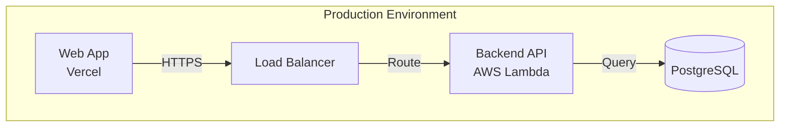

# Create System Architecture

## Prerequisites

**Required Documents**:
- ✅ PRD exists at `docs/prd.md`
- ⚪ Front-End Spec at `docs/front-end-spec.md` (optional)
- ⚠️ **Brownfield Mode**: `docs/existing-system-integration.md` (multi-repo) or `docs/existing-system-analysis.md` (single-repo)

**Project Configuration**:
- ✅ Project mode is `multi-repo` with role `product` in `core-config.yaml`

## Validation

```bash
# Check if PRD exists
if [ ! -f "docs/prd.md" ]; then
  echo "❌ ERROR: PRD not found at docs/prd.md"
  echo "👉 Action: Create PRD first using PM agent: @pm *create-doc prd"
  exit 1
fi

# Detect mode: Greenfield vs Brownfield
MODE="greenfield"
if [ -f "docs/existing-system-integration.md" ]; then
  MODE="brownfield-multi"
  echo "🔍 MODE DETECTED: Brownfield Multi-Repository Enhancement"
elif [ -f "docs/existing-system-analysis.md" ]; then
  MODE="brownfield-single"
  echo "🔍 MODE DETECTED: Brownfield Single-Repository Enhancement"
else
  echo "🔍 MODE DETECTED: Greenfield (New Project)"
fi

# Check project mode and role
PROJECT_MODE=$(grep "mode:" core-config.yaml | awk '{print $2}')
PROJECT_ROLE=$(grep -A 1 "multi_repo:" core-config.yaml | grep "role:" | awk '{print $2}')
if [ "$PROJECT_MODE" != "multi-repo" ] || [ "$PROJECT_ROLE" != "product" ]; then
  echo "⚠️ WARNING: Project mode is '$PROJECT_MODE' with role '$PROJECT_ROLE', expected mode='multi-repo' role='product'"
  echo "Continue? (y/n)"
  read -r response
  if [ "$response" != "y" ]; then exit 1; fi
fi

echo "✅ Prerequisites validated. Proceeding with $MODE system architecture generation..."
```

---

## Task Instructions

### Step 1: Load Context Documents and Detect Mode

**Step 1.1: Mode Detection**

- If `docs/existing-system-integration.md` exists → **Brownfield Multi-Repo Mode**
- If `docs/existing-system-analysis.md` exists → **Brownfield Single-Repo Mode**
- Otherwise → **Greenfield Mode**

**Step 1.2: Load Documents**

**All Modes**:
1. **PRD** (`docs/prd.md`) - REQUIRED
2. **Front-End Spec** (`docs/front-end-spec.md`) - OPTIONAL (if missing, extract UI/UX from PRD)

**Brownfield Multi-Repo Mode (Additional)**:
3. **Existing System Integration Analysis** (`docs/existing-system-integration.md`)

**Brownfield Single-Repo Mode (Additional)**:
3. **Existing System Analysis** (`docs/existing-system-analysis.md`)

**⚠️ CRITICAL - Document Scope Restriction (Brownfield Multi-Repo Mode ONLY)**:

**✅ ALLOWED - Read ONLY from Product Repository**:
- `docs/prd.md` ✅
- `docs/front-end-spec.md` ✅
- `docs/existing-system-integration.md` ✅

**❌ FORBIDDEN - DO NOT read from Implementation Repositories**:
- ❌ DO NOT read `../*/docs/existing-system-analysis.md`
- ❌ DO NOT read any files from `../` paths to implementation repos
- ❌ DO NOT scan implementation repository source code

**If `existing-system-integration.md` is missing or incomplete**:
- ✅ HALT execution immediately
- ✅ Instruct user: "Run `@architect *aggregate-system-analysis` first"

**Validation Check**:
```
Check core-config.yaml → project.multi_repo.role
If role != 'product': HALT with error "This task must run in Product repository"
```

**Step 1.3: Elicit User Confirmation**

**Greenfield**:
```
📖 I've loaded the PRD {{and_frontend_spec}}.

**Mode**: Greenfield (New Project)

**Main Functional Areas**:
- [List 3-5 main feature categories from PRD]

**Platforms Identified**:
- [List platforms: Backend API, Web App, iOS App, etc.]

Does this match your understanding?
```

**Brownfield Multi-Repo**:
```
📖 I've loaded the PRD, Front-End Spec, and Existing System Integration Analysis.

**Mode**: Brownfield Multi-Repository Enhancement

**Existing Repositories**:
- [List existing repos with tech stacks]

**New/Enhanced Functional Areas**:
- [List enhancements from PRD]

**Existing Constraints**:
- Technical Debt: [Key issues]
- Current Integration Patterns: [Auth, data formats]

Does this correctly capture your existing system and planned enhancements?
```

---

### Step 2: Identify Repository Topology

**Decision Matrix**:

| Requirement | Repository Needed |
|------------|------------------|
| Backend API functionality | ✅ `{project}-backend` |
| Web UI functionality | ✅ `{project}-web` |
| iOS app | ✅ `{project}-ios` |
| Android app | ✅ `{project}-android` |
| Cross-platform mobile | ✅ `{project}-mobile` |

**For Each Repository**:

1. **Repository Name**: `{project-name}-{type}`
2. **Repository Type**: backend | frontend | ios | android | mobile
3. **Primary Responsibility**: 1-2 sentences describing WHAT this repo does
4. **Technology Stack**: Language + Framework (high-level only)
5. **Deployment Platform**: AWS Lambda, Vercel, App Store, etc.
6. **Team Ownership**: Backend Team, Frontend Team, etc.

**Elicit User Confirmation**:
```
🗂️ **Proposed Repository Topology**:

| Repository Name | Type | Responsibility | Tech Stack | Platform | Team |
|----------------|------|----------------|------------|----------|------|
| {project}-backend | backend | [Responsibility] | [Tech] | [Platform] | Backend Team |
| {project}-web | frontend | [Responsibility] | [Tech] | [Platform] | Frontend Team |

**Total Repositories**: [N]

Does this topology make sense? Any repositories to add/remove/rename?
```

---

### Step 3: Define API Contracts Summary

**Step 3.1: Identify API Categories**

Group related endpoints into logical categories:
- **Authentication APIs**: Login, logout, token refresh
- **User Management APIs**: User CRUD, profiles
- **[Business Entity] APIs**: For each main entity in PRD

**For Each Category**:
1. **Category Name**
2. **Purpose**: 1 sentence
3. **Provider Repository**: Usually `{project}-backend`
4. **Consumer Repositories**: Which repos call these APIs
5. **Key Endpoints**: 3-10 main endpoints (method + path only)
   - Format: `POST /api/users`, `GET /api/products/:id`
6. **Authentication Requirement**: public | authenticated | admin-only
7. **Rate Limiting**: If applicable

**Step 3.2: Define API Versioning Strategy**

**Elicit from User**:
```
🔢 **API Versioning Strategy**

How should APIs be versioned?

Option 1: URL Path Versioning (e.g., `/api/v1/users`)
Option 2: Header Versioning (e.g., `Accept: application/vnd.myapp.v1+json`)
Option 3: No Versioning (breaking changes require new endpoints)

**Recommendation**: URL Path Versioning for simplicity

What's your preference?
```

---

### Step 4: Define Integration Strategy

**Step 4.1: Authentication & Authorization**

**Elicit from User**:
```
🔐 **Authentication & Authorization**

**Authentication Mechanism**:
- Option 1: JWT - Stateless, scalable
- Option 2: Session-based - Stateful, simpler
- Option 3: OAuth 2.0 - For third-party integrations

**Recommendation**: JWT for multi-platform projects

If JWT:
- **Token Format**: Bearer token in Authorization header
- **Token Storage**:
  - Web: HttpOnly cookies or localStorage
  - Mobile: Secure Keychain/KeyStore
- **Token Lifetime**: Access token (15min), Refresh token (7 days)

**Authorization Pattern**:
- RBAC (Role-Based Access Control)
- ABAC (Attribute-Based Access Control)
- Simple: Authenticated vs Unauthenticated

What's your preference?
```

**Step 4.2: Data Format Standards**

**Elicit from User**:
```
📄 **Data Format Standards**

**API Data Format**: JSON (standard)
**Date/Time Format**: ISO 8601 (e.g., "2025-01-14T10:30:00Z")
**Timezone Handling**: All dates in UTC

**Pagination Style**:
- Option 1: Offset-based (`?offset=20&limit=10`)
- Option 2: Cursor-based (`?cursor=abc123&limit=10`) - Better for large datasets
- Option 3: Page-based (`?page=3&per_page=10`)

**Field Naming Convention**:
- camelCase: `firstName`, `createdAt`
- snake_case: `first_name`, `created_at`
- PascalCase: `FirstName`, `CreatedAt`

Your preference?
```

**Step 4.3: Error Handling Standard**

```markdown
### Error Handling Standard

All APIs MUST return errors in this standard format:

```json
{
  "error": {
    "code": "VALIDATION_ERROR",
    "message": "Invalid email format",
    "details": { "field": "email", "value": "invalid-email" },
    "timestamp": "2025-01-14T10:30:00Z",
    "request_id": "uuid-1234-5678"
  }
}
```

**HTTP Status Code Usage**:
- `200 OK`: Success
- `201 Created`: Resource created
- `400 Bad Request`: Validation error
- `401 Unauthorized`: Missing/invalid auth token
- `403 Forbidden`: Insufficient permissions
- `404 Not Found`: Resource not found
- `429 Too Many Requests`: Rate limit exceeded
- `500 Internal Server Error`: Unexpected error
```

**Step 4.4: Logging & Monitoring**

**Elicit from User**:
```
📊 **Logging & Monitoring**

**Logging Platform**: CloudWatch, Stackdriver, Datadog, Sentry
**Log Format**: JSON structured logging
**Log Levels**: DEBUG, INFO, WARN, ERROR, FATAL

**Monitoring Platform**: Prometheus + Grafana, Datadog, New Relic
**Distributed Tracing**: OpenTelemetry, Jaeger, AWS X-Ray

Your preferences?
```

---

### Step 5: Define Deployment Architecture

**Step 5.1: Deployment Targets Table**

| Repository | Platform | Dev URL | Staging URL | Production URL |
|-----------|----------|---------|-------------|----------------|
| `{project}-backend` | AWS Lambda | `https://dev-api.{domain}` | `https://staging-api.{domain}` | `https://api.{domain}` |
| `{project}-web` | Vercel | `https://dev.{domain}` | `https://staging.{domain}` | `https://{domain}` |

**Step 5.2: CI/CD Strategy**

**Elicit from User**:
```
🚀 **CI/CD Strategy**

**CI/CD Platform**: GitHub Actions, CircleCI, GitLab CI, Jenkins

**Deployment Triggers**:
- **Dev Environment**: On push to `develop` branch
- **Staging Environment**: On push to `staging` branch
- **Production Environment**: On push to `main` branch + manual approval

**Build & Test**:
- Run unit tests on every commit
- Run integration tests before deployment
- Quality gates: Coverage > 80%, no critical vulnerabilities

Your preferences?
```

**Step 5.3: Infrastructure Diagram**



---

### Step 6: Define Cross-Cutting Concerns

**Step 6.1: Security Requirements**

**Elicit from User**:
```
🔒 **Security Requirements**

**Data Encryption**:
- In Transit: TLS 1.3
- At Rest: AES-256

**Compliance Standards**: GDPR, HIPAA, PCI-DSS, SOC 2 (select applicable)

**Security Scanning**:
- Dependency scanning: Dependabot, Snyk
- SAST: SonarQube, Checkmarx
- DAST: OWASP ZAP

**Secrets Management**: AWS Secrets Manager, HashiCorp Vault

Your security requirements?
```

**Step 6.2: Performance Requirements**

**Elicit from User**:
```
⚡ **Performance Requirements**

**Response Time SLAs**:
- API Endpoints: < 200ms (p95), < 500ms (p99)
- Web Page Load: < 2 seconds
- Mobile App Launch: < 1 second

**Throughput Targets**: 1000 requests/second per endpoint
**Concurrent Users**: 10,000 simultaneous users
**Availability Target**: 99.9% uptime

Your performance requirements?
```

**Step 6.3: Observability Strategy**

**Elicit from User**:
```
👀 **Observability Strategy**

**Logging**:
- Platform: CloudWatch, Datadog, Splunk
- Retention: 30 days (standard), 90 days (compliance)

**Monitoring**:
- Platform: Prometheus + Grafana, Datadog, New Relic
- Key Metrics: Request rate, error rate, latency, CPU/memory

**Tracing**:
- Platform: OpenTelemetry + Jaeger, AWS X-Ray
- Sampling Rate: 1% (production), 100% (dev/staging)

**Alerting**:
- Channels: PagerDuty, Slack, email
- Severity: Critical (immediate), High (15min), Medium (1hr), Low (24hr)

Your observability preferences?
```

---

### Step 7: Generate System Architecture Document

**Step 7.1: Prepare Output Directory**

```bash
mkdir -p docs/architecture

PROJECT_MODE=$(grep "mode:" core-config.yaml | awk '{print $2}')
PROJECT_ROLE=$(grep -A 2 "multi_repo:" core-config.yaml | grep "role:" | awk '{print $2}')

if [ "$PROJECT_MODE" = "multi-repo" ] && [ "$PROJECT_ROLE" = "product" ]; then
  OUTPUT_PATH="docs/system-architecture.md"
else
  OUTPUT_PATH="docs/architecture.md"
fi
```

**Step 7.2: Render Template**

Use `system-architecture-tmpl.yaml` template. Fill all sections with information from Steps 1-6.

**Step 7.3: Add Metadata**

```yaml
---
document_type: system-architecture
version: 1.0.0
last_updated: {{current_date}}
status: draft
project_name: {{project_name}}
repositories: {{repository_count}}
---
```

**Step 7.4: Update core-config.yaml**

```bash
if [ "$PROJECT_MODE" = "multi-repo" ] && [ "$PROJECT_ROLE" = "product" ]; then
  sed -i.bak 's|architectureFile:.*|architectureFile: docs/system-architecture.md|' core-config.yaml
  sed -i.bak 's|architectureSharded:.*|architectureSharded: false|' core-config.yaml
  sed -i.bak 's|architectureShardedLocation:.*|architectureShardedLocation: docs/system-architecture|' core-config.yaml
  echo "✅ Updated core-config.yaml: architectureFile → docs/system-architecture.md"
else
  sed -i.bak 's|architectureFile:.*|architectureFile: docs/architecture.md|' core-config.yaml
  sed -i.bak 's|architectureSharded:.*|architectureSharded: false|' core-config.yaml
  sed -i.bak 's|architectureShardedLocation:.*|architectureShardedLocation: docs/architecture|' core-config.yaml
  echo "✅ Updated core-config.yaml: architectureFile → docs/architecture.md"
fi

rm -f core-config.yaml.bak
```

---

### Step 8: Create Repository Topology Diagram

```mermaid
graph TB
    subgraph "Frontend Repositories"
        WEB[{{project}}-web<br/>React + Next.js]
        IOS[{{project}}-ios<br/>Swift + SwiftUI]
    end

    subgraph "Backend Repositories"
        API[{{project}}-backend<br/>Node.js + Express]
        DB[(PostgreSQL)]
    end

    WEB -->|REST API| API
    IOS -->|REST API| API
    API -->|SQL| DB
```

---

### Step 9: Validate and Finalize

**Validation Checklist**:
- [ ] All repositories from PRD covered
- [ ] API contract summary includes all major features
- [ ] Integration strategy complete and consistent
- [ ] Deployment architecture feasible
- [ ] Cross-cutting concerns comprehensive
- [ ] Diagrams accurate
- [ ] Document follows template structure

**Final Elicitation**:
```
📋 **System Architecture Document Review**

I've generated a complete system architecture document covering:
✅ Repository Topology ([N] repositories)
✅ API Contracts Summary ([M] API categories)
✅ Integration Strategy
✅ Deployment Architecture
✅ Cross-Cutting Concerns

**Key Decisions Made**:
- Authentication: [JWT/Session/OAuth]
- API Versioning: [URL Path/Header/None]
- Deployment: [Platform choices]

Ready to see the document?
```

---

### Step 10: Output Handoff

```
✅ SYSTEM ARCHITECTURE COMPLETE

📄 Generated Document: {{OUTPUT_PATH}}

📦 Repository Topology ([N] repositories):
  - [backend] {{project}}-backend ({{tech_stack}})
  - [frontend] {{project}}-web ({{tech_stack}})

🔗 API Contracts Summary:
  - Authentication APIs ([M] endpoints)
  - User Management APIs ([M] endpoints)

🚀 Deployment Architecture:
  - Backend: [Platform]
  - Frontend: [Platform]

🔐 Cross-Cutting Concerns:
  - Security: [Auth mechanism], [Compliance]
  - Performance: [Response SLA], [Availability]
  - Observability: [Logging], [Monitoring], [Tracing]

---

📋 **NEXT STEPS**:

**Step 4 (Next)**: Shard System Documents
  ```bash
  @po *shard
  ```

**Step 5**: Create & Shard Implementation Architectures
  - Configure product repo link in each implementation repo
  - Create implementation architecture: `@architect *create-backend-architecture`
  - Shard architecture: `@po *shard`

**Step 6**: Create Stories & Implement
  ```bash
  @sm *create-next-story
  @dev *implement {story_id}
  @qa *review {story_id}
  ```

🎉 **System architecture is now the single source of truth!**
```

---

## Error Handling

**If PRD is missing**:
```
❌ ERROR: PRD not found at docs/prd.md

@pm *create-doc prd

After PRD is ready: @architect *create-system-architecture
```

**If project type is not product-planning**:
```
⚠️ WARNING: Project type is '{{project_type}}', expected 'product-planning'

If this is a Product repo, update core-config.yaml:
project:
  type: product-planning

If this is an implementation repo:
- Use @architect *create-backend-architecture (for backend)
- Use @architect *create-frontend-architecture (for frontend)
```

## Related Tasks

- **Prerequisites**: `pm-create-prd.md`, `ux-create-front-end-spec.md`
- **Next Steps**: `create-backend-architecture.md`, `create-frontend-architecture.md`
- **Brownfield Alternative**: `aggregate-system-architecture.md`
