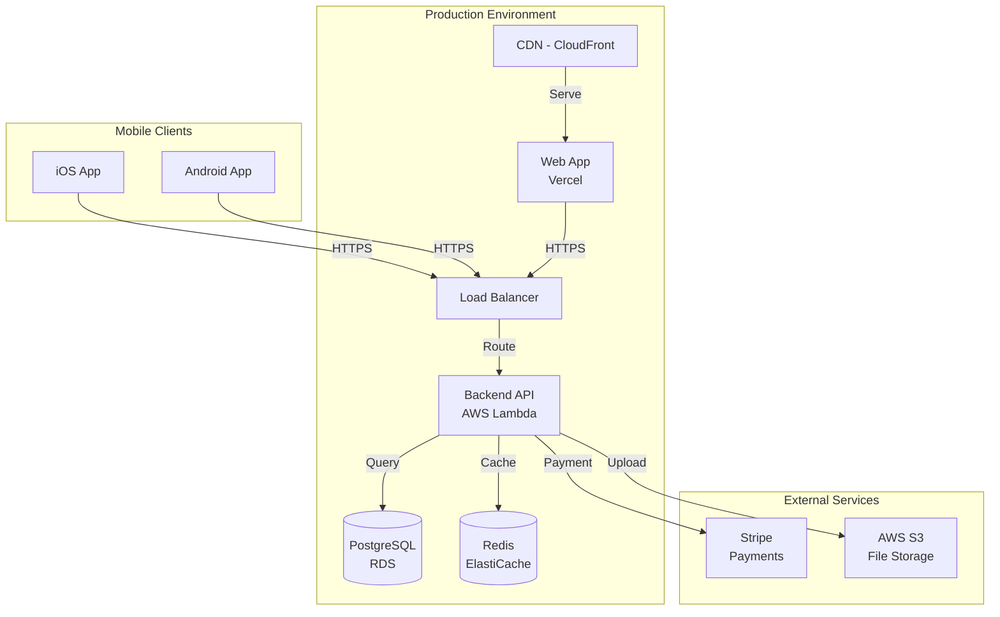

# Create System Architecture

## Purpose

Generate a **system-level architecture document** for multi-repository projects. This document coordinates multiple implementation repositories by defining:

- **Repository Topology**: Which repositories exist and their responsibilities
- **API Contracts Summary**: High-level API categories and key endpoints
- **Integration Strategy**: How repositories communicate and coordinate
- **Deployment Architecture**: Where and how each repository deploys
- **Cross-Cutting Concerns**: System-wide requirements (security, performance, observability)

**IMPORTANT**: This is NOT a detailed implementation architecture. It's a coordination document that:
- ✅ Defines WHAT repositories exist and HOW they integrate
- ❌ Does NOT include component designs, database schemas, or code patterns (those belong in each repo's detailed architecture)

**MODE DETECTION**: This task supports both Greenfield and Brownfield projects:
- **Greenfield Mode**: New project from scratch, architecture guides new implementation
- **Brownfield Mode**: Enhancement of existing system, architecture incorporates existing constraints + improvements

## Prerequisites

**Required Documents**:
- ✅ PRD exists at `docs/prd.md`
- ✅ Front-End Spec exists at `docs/front-end-spec.md` (if UI components are involved)
- ⚠️ **Brownfield Mode** (if applicable): `docs/existing-system-integration.md` (multi-repo) or `docs/existing-system-analysis.md` (single-repo)

**Project Configuration**:
- ✅ Project type is `product-planning` in `core-config.yaml`
- ✅ Running in Product repository (not implementation repo)

**Recommended Environment**:
- 🌐 **Web interface** (e.g., claude.ai/code with Gemini 1M+ tokens) - Recommended for comprehensive context
- 💻 IDE (Claude Code, Cursor, etc.) - Acceptable but may hit context limits

## Validation

Before starting, validate prerequisites and detect mode:

```bash
# Check if PRD exists
if [ ! -f "docs/prd.md" ]; then
  echo "❌ ERROR: PRD not found at docs/prd.md"
  echo "👉 Action: Create PRD first using PM agent: @pm *create-doc prd"
  exit 1
fi

# Detect mode: Greenfield vs Brownfield
MODE="greenfield"
if [ -f "docs/existing-system-integration.md" ]; then
  MODE="brownfield-multi"
  echo "🔍 MODE DETECTED: Brownfield Multi-Repository Enhancement"
  echo "   Analysis source: docs/existing-system-integration.md"
elif [ -f "docs/existing-system-analysis.md" ]; then
  MODE="brownfield-single"
  echo "🔍 MODE DETECTED: Brownfield Single-Repository Enhancement"
  echo "   Analysis source: docs/existing-system-analysis.md"
else
  echo "🔍 MODE DETECTED: Greenfield (New Project)"
fi

# Check project type
PROJECT_TYPE=$(grep "type:" core-config.yaml | awk '{print $2}')
if [ "$PROJECT_TYPE" != "product-planning" ]; then
  echo "⚠️ WARNING: Project type is '$PROJECT_TYPE', expected 'product-planning'"
  echo "This task should run in Product repository, not implementation repo"
  echo "Continue? (y/n)"
  read -r response
  if [ "$response" != "y" ]; then exit 1; fi
fi

echo "✅ Prerequisites validated. Proceeding with $MODE system architecture generation..."
```

---

## Task Instructions

### Step 1: Load Context Documents and Detect Mode

Load and analyze documents based on detected mode:

**Step 1.1: Mode Detection**

Check which analysis document exists to determine mode:
- If `docs/existing-system-integration.md` exists → **Brownfield Multi-Repo Mode**
- If `docs/existing-system-analysis.md` exists → **Brownfield Single-Repo Mode**
- Otherwise → **Greenfield Mode**

**Step 1.2: Load Documents**

**All Modes**:
1. **PRD** (`docs/prd.md`)
   - Functional requirements
   - Technical assumptions
   - Epic and Story list
2. **Front-End Spec** (`docs/front-end-spec.md`) (if exists)
   - UI/UX requirements
   - Platform scope
   - Design system

**Brownfield Multi-Repo Mode (Additional)**:
3. **Existing System Integration Analysis** (`docs/existing-system-integration.md`)
   - Repository Topology (existing repos)
   - Cross-Repository API Contracts (existing APIs)
   - Integration Patterns (current auth, data formats)
   - Technical Debt (system-level issues)

**Brownfield Single-Repo Mode (Additional)**:
3. **Existing System Analysis** (`docs/existing-system-analysis.md`)
   - Tech Stack (current technologies)
   - Technical Debt (known issues)
   - Coding Standards (current practices)

**Step 1.3: Analysis Focus**

**Greenfield Mode**:
- What are the main functional areas?
- What platforms are needed?
- What's the expected scale?

**Brownfield Mode**:
- What are the main functional areas? (NEW features from PRD)
- What platforms exist? (from analysis document)
- What constraints must be respected? (from technical debt)
- What improvements should be incorporated? (from recommendations)

**Elicit User Confirmation**:

**Greenfield**:
```
📖 I've loaded the PRD and Front-End Spec. Based on my analysis:

**Mode**: Greenfield (New Project)

**Main Functional Areas**:
- [List 3-5 main feature categories from PRD]

**Platforms Identified**:
- [List platforms: Backend API, Web App, iOS App, etc.]

**Third-Party Services**:
- [List external dependencies]

Does this match your understanding?
```

**Brownfield Multi-Repo**:
```
📖 I've loaded the PRD, Front-End Spec, and Existing System Integration Analysis.

**Mode**: Brownfield Multi-Repository Enhancement

**Existing Repositories** (from integration analysis):
- [List existing repos with their current tech stacks]

**New/Enhanced Functional Areas** (from PRD):
- [List enhancements to be implemented]

**Existing Constraints** (from integration analysis):
- Technical Debt: [Key issues to address]
- Current Integration Patterns: [Auth, data formats]
- API Alignment: [Current state]

**Enhancement Strategy**:
- Architecture will incorporate existing constraints
- Will define IMPROVEMENTS to current practices
- Will maintain compatibility where necessary

Does this analysis correctly capture your existing system and planned enhancements?
```

---

### Step 2: Identify Repository Topology

Based on requirements analysis, determine what repositories are needed.

**Decision Matrix**:

| Requirement | Repository Needed | Rationale |
|------------|------------------|-----------|
| Backend API functionality | ✅ `{project}-backend` | API endpoints, business logic, data persistence |
| Web UI functionality | ✅ `{project}-web` | Web frontend (React, Vue, Angular, etc.) |
| iOS app | ✅ `{project}-ios` | Native iOS app (Swift/SwiftUI) |
| Android app | ✅ `{project}-android` | Native Android app (Kotlin/Jetpack Compose) |
| Cross-platform mobile | ✅ `{project}-mobile` | Flutter/React Native app (instead of separate ios/android) |
| Shared libraries | ⚠️ `{project}-shared` | Only if significant shared code across repos |
| Admin dashboard | ⚠️ `{project}-admin` | Only if admin UI differs significantly from main web app |

**For Each Identified Repository**:

1. **Repository Name**: Follow naming convention `{project-name}-{type}`
   - Examples: `my-ecommerce-backend`, `my-ecommerce-web`, `my-ecommerce-ios`

2. **Repository Type**: backend | frontend | ios | android | mobile | shared | admin

3. **Primary Responsibility**: 1-2 sentences describing WHAT this repo does
   - ✅ Good: "Provides REST API for user management, product catalog, and order processing"
   - ❌ Too detailed: "Implements UserController with GET/POST/PUT/DELETE endpoints using Express middleware..."

4. **Technology Stack** (high-level only):
   - Backend: Language + Framework (e.g., "Node.js + Express", "Java + Spring Boot")
   - Frontend: Framework + UI Library (e.g., "React + Next.js + Tailwind CSS")
   - Mobile: Language + Framework (e.g., "Swift + SwiftUI", "Kotlin + Jetpack Compose")

5. **Deployment Platform**:
   - Backend: AWS Lambda, Google Cloud Run, Heroku, etc.
   - Frontend: Vercel, Netlify, AWS S3 + CloudFront, etc.
   - Mobile: App Store, Google Play, TestFlight, etc.

6. **Team Ownership**:
   - Backend Team, Frontend Team, Mobile Team, Full-Stack Team, etc.

**Elicit User Confirmation**:
```
🗂️ **Proposed Repository Topology**:

| Repository Name | Type | Responsibility | Tech Stack | Platform | Team |
|----------------|------|----------------|------------|----------|------|
| {project}-backend | backend | [Responsibility] | [Tech] | [Platform] | Backend Team |
| {project}-web | frontend | [Responsibility] | [Tech] | [Platform] | Frontend Team |
| {project}-ios | ios | [Responsibility] | [Tech] | App Store | Mobile Team |

**Total Repositories**: [N]

Does this topology make sense? Any repositories to add/remove/rename?
```

**User Feedback Loop**: Adjust topology based on user input before proceeding.

---

### Step 3: Define API Contracts Summary

Based on PRD features and identified repositories, define high-level API contracts.

**Step 3.1: Identify API Categories**

Group related endpoints into logical categories based on PRD features:

**Example Categories**:
- **Authentication APIs**: Login, logout, token refresh, password reset
- **User Management APIs**: User CRUD, profile management, preferences
- **[Business Entity] APIs**: For each main entity in PRD (Products, Orders, Customers, etc.)
- **Integration APIs**: Third-party service integrations
- **Admin APIs**: Admin-only management endpoints (if admin features exist)

**For Each Category**:
1. **Category Name**: Clear, descriptive name
2. **Purpose**: 1 sentence describing what this category does
3. **Provider Repository**: Usually `{project}-backend`
4. **Consumer Repositories**: Which repos call these APIs (web, ios, android, admin)
5. **Key Endpoints**: List 3-10 main endpoints (method + path only, no request/response details)
   - Format: `POST /api/users`, `GET /api/products/:id`, `DELETE /api/orders/:id`
6. **Authentication Requirement**: public | authenticated | admin-only
7. **Rate Limiting**: If applicable (e.g., "100 requests/minute per user")

**Example**:
```markdown
### User Management APIs

**Purpose**: Manage user accounts and profiles
**Provider**: `my-ecommerce-backend`
**Consumers**: `my-ecommerce-web`, `my-ecommerce-ios`

**Key Endpoints**:
- `POST /api/users` - Create new user account
- `GET /api/users/:id` - Get user profile
- `PUT /api/users/:id` - Update user profile
- `DELETE /api/users/:id` - Delete user account
- `GET /api/users/:id/orders` - Get user's order history

**Authentication**: authenticated (except POST /api/users which is public for registration)
**Rate Limiting**: 100 requests/minute per user
```

**IMPORTANT**: This is a SUMMARY only. Detailed request/response schemas belong in `api-contracts.md` (a separate document created by Architect later).

**Step 3.2: Define API Versioning Strategy**

**Elicit from User**:
```
🔢 **API Versioning Strategy**

How should APIs be versioned?

Option 1: URL Path Versioning (e.g., `/api/v1/users`, `/api/v2/users`)
Option 2: Header Versioning (e.g., `Accept: application/vnd.myapp.v1+json`)
Option 3: No Versioning (breaking changes require new endpoints)

**Recommendation**: URL Path Versioning for simplicity

**Breaking Change Policy**: How are breaking changes handled?
- Maintain N versions simultaneously?
- Deprecation timeline? (e.g., 6 months notice)

What's your preference?
```

---

### Step 4: Define Integration Strategy

Specify HOW repositories communicate and coordinate. This ensures consistency across all teams.

**Step 4.1: Authentication & Authorization**

**Elicit from User**:
```
🔐 **Authentication & Authorization**

**Authentication Mechanism**:
- Option 1: JWT (JSON Web Tokens) - Stateless, scalable
- Option 2: Session-based - Stateful, simpler
- Option 3: OAuth 2.0 - For third-party integrations
- Option 4: Other (please specify)

**Recommendation**: JWT for multi-platform projects (Web + Mobile)

If JWT:
- **Token Format**: Bearer token in Authorization header
- **Token Storage**:
  - Web: HttpOnly cookies or localStorage
  - Mobile: Secure Keychain (iOS) / KeyStore (Android)
- **Token Lifetime**: Access token (15min), Refresh token (7 days)
- **Refresh Strategy**: Automatic refresh before expiration

**Authorization Pattern**:
- RBAC (Role-Based Access Control): Users have roles (admin, user, guest)
- ABAC (Attribute-Based Access Control): Permissions based on attributes
- Simple: Authenticated vs Unauthenticated

What's your preference?
```

**Output Template**:
```markdown
### Authentication & Authorization

**Authentication Mechanism**: JWT (JSON Web Tokens)
**Token Format**: Bearer token in Authorization header
**Token Storage**:
- Web: HttpOnly cookies
- Mobile: Secure Keychain (iOS) / KeyStore (Android)
**Token Lifetime**: Access token (15 minutes), Refresh token (7 days)
**Refresh Strategy**: Automatic silent refresh before access token expiration

**Authorization Pattern**: RBAC (Role-Based Access Control)
**Roles**: admin, user, guest
**Permission Model**: Each endpoint requires specific role(s)

**Implementation Notes**:
- Backend implements `/api/auth/login`, `/api/auth/refresh`, `/api/auth/logout` endpoints
- Backend validates JWT on all protected endpoints
- Frontend/Mobile store tokens securely and attach to all API requests
- Frontend/Mobile handle token refresh automatically
```

**Step 4.2: Data Format Standards**

**Elicit from User**:
```
📄 **Data Format Standards**

**API Data Format**: JSON (standard), Protocol Buffers (high performance), XML (legacy)
**Date/Time Format**: ISO 8601 (e.g., "2025-01-14T10:30:00Z"), Unix timestamp (e.g., 1736853000)
**Timezone Handling**: All dates in UTC, client converts to local

**Pagination Style**:
- Option 1: Offset-based (`?offset=20&limit=10`)
- Option 2: Cursor-based (`?cursor=abc123&limit=10`) - Better for large datasets
- Option 3: Page-based (`?page=3&per_page=10`)

**Field Naming Convention**:
- camelCase (JavaScript standard): `firstName`, `createdAt`
- snake_case (Python/Ruby standard): `first_name`, `created_at`
- PascalCase (C# standard): `FirstName`, `CreatedAt`

**Recommendation**: JSON + ISO 8601 + Cursor-based pagination + camelCase (for JavaScript ecosystem)

Your preference?
```

**Step 4.3: Error Handling Standard**

Define standard error response format:

```markdown
### Error Handling Standard

All APIs MUST return errors in this standard format:

```json
{
  "error": {
    "code": "VALIDATION_ERROR",
    "message": "Invalid email format",
    "details": {
      "field": "email",
      "value": "invalid-email"
    },
    "timestamp": "2025-01-14T10:30:00Z",
    "request_id": "uuid-1234-5678"
  }
}
```

**HTTP Status Code Usage**:
- `200 OK`: Success
- `201 Created`: Resource created
- `204 No Content`: Success with no response body
- `400 Bad Request`: Validation error, malformed request
- `401 Unauthorized`: Missing or invalid authentication token
- `403 Forbidden`: Valid token but insufficient permissions
- `404 Not Found`: Resource not found
- `409 Conflict`: Resource conflict (e.g., duplicate email)
- `429 Too Many Requests`: Rate limit exceeded
- `500 Internal Server Error`: Unexpected server error
- `503 Service Unavailable`: Service temporarily unavailable

**Error Code Taxonomy**:
- `VALIDATION_ERROR`: Input validation failed
- `AUTHENTICATION_ERROR`: Auth token missing/invalid/expired
- `AUTHORIZATION_ERROR`: Insufficient permissions
- `NOT_FOUND`: Resource not found
- `CONFLICT`: Resource conflict
- `RATE_LIMIT_EXCEEDED`: Too many requests
- `INTERNAL_ERROR`: Unexpected server error
```

**Step 4.4: Logging & Monitoring**

**Elicit from User**:
```
📊 **Logging & Monitoring**

**Logging Platform**:
- CloudWatch (AWS), Stackdriver (GCP), Azure Monitor, Datadog, LogRocket, Sentry

**Log Format**: JSON structured logging
**Log Levels**: DEBUG, INFO, WARN, ERROR, FATAL

**Monitoring Platform**:
- Prometheus + Grafana, Datadog, New Relic, Application Insights

**Distributed Tracing**:
- OpenTelemetry, Jaeger, Zipkin, AWS X-Ray

Your preferences?
```

---

### Step 5: Define Deployment Architecture

Outline WHERE and HOW each repository deploys.

**Step 5.1: Deployment Targets Table**

Create a table of deployment targets for each repository:

| Repository | Platform | Dev URL | Staging URL | Production URL |
|-----------|----------|---------|-------------|----------------|
| `{project}-backend` | AWS Lambda | `https://dev-api.{domain}` | `https://staging-api.{domain}` | `https://api.{domain}` |
| `{project}-web` | Vercel | `https://dev.{domain}` | `https://staging.{domain}` | `https://{domain}` |
| `{project}-ios` | TestFlight | TestFlight Beta | TestFlight Beta | App Store |

**Step 5.2: CI/CD Strategy**

**Elicit from User**:
```
🚀 **CI/CD Strategy**

**CI/CD Platform**: GitHub Actions, CircleCI, GitLab CI, Jenkins, AWS CodePipeline

**Deployment Triggers**:
- **Dev Environment**: On push to `develop` branch
- **Staging Environment**: On push to `staging` branch or manual trigger
- **Production Environment**: On push to `main` branch + manual approval

**Environment Promotion Strategy**:
- Option 1: Branch-based (develop → staging → main)
- Option 2: Tag-based (tag triggers deployment)
- Option 3: Manual promotion with approval gates

**Build & Test**:
- Run unit tests on every commit
- Run integration tests before deployment
- Quality gates: Code coverage > 80%, no critical security vulnerabilities

Your preferences?
```

**Step 5.3: Infrastructure Diagram**

Create a Mermaid diagram showing deployment architecture:



---

### Step 6: Define Cross-Cutting Concerns

Specify system-wide requirements affecting all repositories.

**Step 6.1: Security Requirements**

**Elicit from User**:
```
🔒 **Security Requirements**

**Data Encryption**:
- In Transit: TLS 1.3 for all API communication
- At Rest: AES-256 for database and file storage

**Compliance Standards**: GDPR, HIPAA, PCI-DSS, SOC 2 (select applicable)

**Security Scanning**:
- Dependency scanning: Dependabot, Snyk, npm audit
- SAST (Static Application Security Testing): SonarQube, Checkmarx
- DAST (Dynamic Application Security Testing): OWASP ZAP
- Container scanning: Trivy, Clair (if using containers)

**Secrets Management**:
- AWS Secrets Manager, HashiCorp Vault, Azure Key Vault, environment variables

**Security Headers** (for web APIs):
- Strict-Transport-Security
- Content-Security-Policy
- X-Frame-Options
- X-Content-Type-Options

Your security requirements?
```

**Step 6.2: Performance Requirements**

**Elicit from User**:
```
⚡ **Performance Requirements**

**Response Time SLAs**:
- API Endpoints: < 200ms (p95), < 500ms (p99)
- Web Page Load: < 2 seconds (First Contentful Paint)
- Mobile App Launch: < 1 second (cold start)

**Throughput Targets**: 1000 requests/second per API endpoint

**Concurrent Users**: 10,000 simultaneous users

**Availability Target**: 99.9% uptime (8.76 hours downtime/year)

**Performance Monitoring**:
- Tool: Datadog, New Relic, Application Insights
- Metrics: Response time, throughput, error rate, resource utilization

Your performance requirements?
```

**Step 6.3: Observability Strategy**

Define the **Three Pillars of Observability**:

1. **Logging**: Structured logs for debugging
2. **Monitoring**: Metrics and dashboards for health visibility
3. **Tracing**: Distributed traces for request flow analysis

**Elicit from User**:
```
👀 **Observability Strategy**

**Logging**:
- Platform: CloudWatch, Datadog, Splunk
- Retention: 30 days (standard), 90 days (compliance)

**Monitoring**:
- Platform: Prometheus + Grafana, Datadog, New Relic
- Key Metrics: Request rate, error rate, latency, CPU/memory usage
- Dashboards: Service health, API performance, business metrics

**Tracing**:
- Platform: OpenTelemetry + Jaeger, AWS X-Ray, Datadog APM
- Sampling Rate: 1% (production), 100% (dev/staging)
- Trace Propagation: W3C Trace Context standard

**Alerting**:
- Channels: PagerDuty, Slack, email
- Severity Levels: Critical (immediate), High (15min), Medium (1 hour), Low (24 hours)
- On-Call Rotation: 24/7 on-call for critical services

Your observability preferences?
```

---

### Step 7: Generate System Architecture Document

Now that all information is collected, generate the complete document using the `system-architecture-tmpl.yaml` template.

**Step 7.1: Prepare Output Directory**

```bash
# Ensure architecture directory exists
mkdir -p docs/architecture

# Set output path
OUTPUT_PATH="docs/architecture/system-architecture.md"
```

**Step 7.2: Render Template**

Use the `system-architecture-tmpl.yaml` template to generate the document. Fill in all sections with the information collected in Steps 1-6:

- **Introduction**: Project overview from PRD
- **Repository Topology**: Repository list and relationship diagram
- **API Contracts Summary**: API categories and versioning strategy
- **Integration Strategy**: Auth, data standards, error handling, logging
- **Deployment Architecture**: Deployment targets, CI/CD, infrastructure diagram
- **Cross-Cutting Concerns**: Security, performance, observability

**Step 7.3: Add Metadata**

```yaml
---
document_type: system-architecture
version: 1.0.0
last_updated: {{current_date}}
status: draft
project_name: {{project_name}}
repositories: {{repository_count}}
---
```

---

### Step 8: Create Repository Topology Diagram

Generate a Mermaid diagram showing repository relationships:

**Template**:
```mermaid
graph TB
    subgraph "Frontend Repositories"
        WEB[{{project}}-web<br/>React + Next.js]
        IOS[{{project}}-ios<br/>Swift + SwiftUI]
        ANDROID[{{project}}-android<br/>Kotlin + Jetpack Compose]
    end

    subgraph "Backend Repositories"
        API[{{project}}-backend<br/>Node.js + Express]
        DB[(PostgreSQL<br/>Database)]
        CACHE[(Redis<br/>Cache)]
    end

    subgraph "External Services"
        STRIPE[Stripe<br/>Payments]
        S3[AWS S3<br/>Storage]
        SENDGRID[SendGrid<br/>Email]
    end

    WEB -->|REST API| API
    IOS -->|REST API| API
    ANDROID -->|REST API| API
    API -->|SQL| DB
    API -->|Cache| CACHE
    API -->|Payment| STRIPE
    API -->|File Upload| S3
    API -->|Email| SENDGRID
```

**Customization**: Adjust based on actual repository topology and external services.

---

### Step 9: Validate and Finalize

Perform final validation before presenting to user.

**Validation Checklist**:
- [ ] All repositories from PRD requirements are covered
- [ ] API contract summary includes all major features from PRD
- [ ] Integration strategy is complete and consistent
- [ ] Deployment architecture is feasible and scalable
- [ ] Cross-cutting concerns are comprehensive
- [ ] Diagrams are accurate and clear
- [ ] Document follows template structure
- [ ] No implementation details leaked into system-level doc (if yes, move to repo-level docs)

**Final Elicitation**:
```
📋 **System Architecture Document Review**

I've generated a complete system architecture document covering:
✅ Repository Topology ([N] repositories)
✅ API Contracts Summary ([M] API categories)
✅ Integration Strategy (Auth, Data Standards, Error Handling)
✅ Deployment Architecture ([Platform1], [Platform2], ...)
✅ Cross-Cutting Concerns (Security, Performance, Observability)

**Key Decisions Made**:
- Authentication: [JWT/Session/OAuth]
- API Versioning: [URL Path/Header/None]
- Deployment: [Platform choices]
- Monitoring: [Tool choices]

**Next Steps**:
1. Review the document (I'll present it below)
2. Confirm or request changes
3. Once approved, teams can create implementation repositories
4. Architect will generate detailed architectures for each repo

Does this sound good? Ready to see the document?
```

---

### Step 10: Output Handoff

Present the completed system architecture document and provide next steps.

**Success Output**:
```
✅ SYSTEM ARCHITECTURE COMPLETE

📄 Generated Document: docs/architecture/system-architecture.md

📦 Repository Topology ([N] repositories):
  - [backend] {{project}}-backend ({{tech_stack}})
  - [frontend] {{project}}-web ({{tech_stack}})
  - [ios] {{project}}-ios ({{tech_stack}})
  - [android] {{project}}-android ({{tech_stack}})

🔗 API Contracts Summary:
  - Authentication APIs ([M] endpoints)
  - User Management APIs ([M] endpoints)
  - [Business Entity] APIs ([M] endpoints)
  - [Category] APIs ([M] endpoints)

🚀 Deployment Architecture:
  - Backend: [Platform]
  - Frontend: [Platform]
  - Mobile: App Store + Google Play

🔐 Cross-Cutting Concerns:
  - Security: [Auth mechanism], [Compliance standards]
  - Performance: [Response SLA], [Availability target]
  - Observability: [Logging], [Monitoring], [Tracing]

---

📋 **NEXT STEPS**:

1. **PO: Review and Approve System Architecture**
   - Validate repository topology matches PRD
   - Confirm API categories cover all features
   - Approve deployment strategy

2. **PM: Update PRD (if needed)**
   - Add repository assignments to each Story
   - Ensure Epic mapping aligns with repo topology

3. **Teams: Create Implementation Repositories**
   - Set up repository structure
   - Configure CI/CD pipelines
   - Reference system-architecture.md in each repo

4. **Architect: Generate Detailed Architectures**

   **In Backend Repository**:
   ```bash
   cd {{project}}-backend
   # Configure: project.type = backend
   #            product_repo.path = ../{{project}}-product
   @architect *create-backend-architecture
   # Output: docs/architecture.md (detailed backend architecture)
   ```

   **In Frontend Repository**:
   ```bash
   cd {{project}}-web
   # Configure: project.type = frontend
   #            product_repo.path = ../{{project}}-product
   @architect *create-frontend-architecture
   # Output: docs/architecture.md (detailed frontend architecture)
   ```

   **In Mobile Repositories**:
   ```bash
   cd {{project}}-ios
   @architect *create-mobile-architecture
   # Output: docs/architecture.md (detailed iOS architecture)

   cd {{project}}-android
   @architect *create-mobile-architecture
   # Output: docs/architecture.md (detailed Android architecture)
   ```

5. **SM: Begin Story Creation**
   - Stories will reference both system-architecture.md and repo-level architecture.md
   - Cross-repo dependencies tracked via Epic YAML

---

🎉 **System architecture is now the single source of truth for multi-repo coordination!**

All implementation repositories will reference this document to ensure alignment.
```

---

## Notes for Agent Execution

- **Context Management**: This task requires significant context (PRD + Front-End Spec + user interactions). Recommend using **Web interface with large context window** (e.g., claude.ai/code with Gemini 1.5 Pro or Opus 3.5).

- **Iterative Refinement**: This is NOT a one-shot generation. Expect 3-5 rounds of user feedback and refinement, especially for:
  - Repository topology (add/remove/rename repos)
  - API categories (group/split endpoints)
  - Technology choices (platform, tools, frameworks)

- **Avoid Over-Specification**: Keep descriptions high-level. Resist the urge to dive into implementation details. If you find yourself describing component architectures, database schemas, or code patterns, **STOP** - those belong in implementation repo architectures.

- **Diagram Quality**: Mermaid diagrams should be clear and readable. Test them before presenting to user. Use subgraphs to group related components.

- **Validation is Key**: Always validate with user at decision points. Don't assume - ask!

## Success Criteria

- ✅ System architecture document exists at `docs/architecture/system-architecture.md`
- ✅ All repositories identified and documented in Repository Topology
- ✅ API categories cover all PRD functional requirements
- ✅ Integration strategy is complete (auth, data, errors, logging)
- ✅ Deployment architecture is clearly defined
- ✅ Cross-cutting concerns comprehensively addressed
- ✅ Diagrams are accurate and helpful
- ✅ User has approved the document
- ✅ Next steps are clear for all teams

## Error Handling

**If PRD is missing**:
```
❌ ERROR: PRD not found at docs/prd.md

System architecture requires a PRD to understand requirements.
Please create PRD first using PM agent:

@pm *create-doc prd

After PRD is ready, return here and run:
@architect *create-system-architecture
```

**If project type is not product-planning**:
```
⚠️ WARNING: Project type is '{{project_type}}', expected 'product-planning'

This task should run in a Product repository, not an implementation repository.

If this is a Product repo, update core-config.yaml:
project:
  type: product-planning

If this is an implementation repo (backend/frontend/ios/android):
- Use @architect *create-backend-architecture (for backend)
- Use @architect *create-frontend-architecture (for frontend)
- Use @architect *create-mobile-architecture (for mobile)

Those tasks will generate detailed implementation architectures.
```

**If user context is limited (IDE)**:
```
⚠️ WARNING: This task requires significant context (PRD + Front-End Spec + interactions).

Recommendations:
1. ✅ Best: Use Web interface (claude.ai/code) with large context model
2. ⚠️ Acceptable: Use IDE but expect multiple rounds of context reloading
3. ❌ Not recommended: Generate offline without user interaction

Proceed with current environment? (y/n)
```

## Related Tasks

- **Prerequisites**: `pm-create-prd.md`, `ux-create-front-end-spec.md`
- **Next Steps**: `create-backend-architecture.md`, `create-frontend-architecture.md`, `create-mobile-architecture.md`
- **Brownfield Alternative**: `aggregate-system-architecture.md` (for existing projects)

## Version History

| Version | Date | Changes | Author |
|---------|------|---------|--------|
| 1.0.0 | 2025-01-14 | Initial creation | Orchestrix Team |
